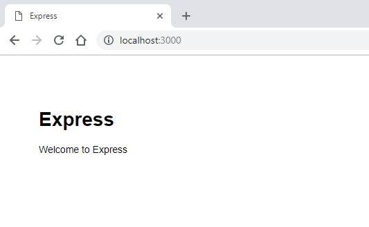

# Tutorial: Node.js for Beginners

If you're brand new to using Node.js, this guide will help you to get started with some basics.

- [Try using Node.js in Visual Studio Code](#try-nodejs-with-visual-studio-code)
- [Create your first Node.js web app using Express](#create-your-first-nodejs-web-app-using-express)
- [Try using a Node.js module](#try-using-a-nodejs-module)

## Prerequisites

- Installing on Node.js on [Windows](./nodejs-on-windows.md) or on [Windows Subsystem for Linux](./nodejs-on-wsl.md)

## Try NodeJS with Visual Studio Code

If you have not yet installed Visual Studio Code, return to the prerequisite section above and follow the installation steps linked for Windows or WSL.

1. Open your command line and create a new directory: `mkdir HelloNode`, then enter the directory: `cd HelloNode`

2. Create a JavaScript file named "app.js" with a variable named "msg" inside: `echo var msg > app.js`

3. Open the directory and your app.js file in VS Code using the command: `code .`

4. Add a simple string variable ("Hello World"), then send the contents of the string to your console by entering this in your "app.js" file:

    ```js
    var msg = 'Hello World';
    console.log(msg);
    ```

5. To run your "app.js" file with Node.js. Open your terminal right inside VS Code by selecting **View** > **Terminal** (or select Ctrl+`, using the backtick character). If you need to change the default terminal, select the dropdown menu and choose **Select Default Shell**.

6. In the terminal, enter: `node app.js`. You should see the output: "Hello World".

> [!NOTE]
> Notice that when you type `console` in your 'app.js' file, VS Code displays supported options related to the [`console`](https://developer.mozilla.org/docs/Web/API/Console) object for you to choose from using IntelliSense. Try experimenting with Intellisense using other [JavaScript objects](https://developer.mozilla.org/docs/Web/JavaScript/Reference/Global_Objects).

## Create your first NodeJS web app using Express

Express is a minimal, flexible, and streamlined Node.js framework that makes it easier to develop a web app that can handle multiple types of requests, like GET, PUT, POST, and DELETE. Express comes with an application generator that will automatically create a file architecture for your app.

To create a project with Express.js:

1. Open your command line (Command Prompt, Powershell, or whatever you prefer).
2. Create a new project folder: `mkdir ExpressProjects` and enter that directory: `cd ExpressProjects`
3. Use Express to create a HelloWorld project template: `npx express-generator HelloWorld --view=pug`

    >[!NOTE]
    > We are using the `npx` command here to execute the Express.js Node package without actually installing it (or by temporarily installing it depending on how you want to think of it). If you try to use the `express` command or check the version of Express installed using: `express --version`, you will receive a response that Express cannot be found. If you want to globally install Express to use over and over again, use: `npm install -g express-generator`. You can view a list of the packages that have been installed by npm using `npm list`. They'll be listed by depth (the number of nested directories deep). Packages that you installed will be at depth 0. That package's dependencies will be at depth 1, further dependencies at depth 2, and so on. To learn more, see [Difference between npx and npm?](https://stackoverflow.com/questions/50605219/difference-between-npx-and-npm) on StackOverflow.

4. Examine the files and folders that Express included by opening the project in VS Code, with: `code .`

   The files that Express generates will create a web app that uses an architecture that can appear a little overwhelming at first. You'll see in your VS Code **Explorer** window (Ctrl+Shift+E to view) that the following files and folders have been generated:

   - `bin`. Contains the executable file that starts your app. It fires up a server (on port 3000 if no alternative is supplied) and sets up basic error handling. 
   - `public`. Contains all the publicly accessed files, including JavaScript files, CSS stylesheets, font files, images, and any other assets that people need when they connect to your website.
   - `routes`. Contains all the route handlers for the application. Two files, `index.js` and `users.js`, are automatically generated in this folder to serve as examples of how to separate out your application’s route configuration.
   - `views`. Contains the files used by your template engine. Express is configured to look here for a matching view when the render method is called. The default template engine is Jade, but Jade has been deprecated in favor of Pug, so we used the `--view` flag to change the view (template) engine. You can see the `--view` flag options, and others, by using `express --help`.
   - `app.js`. The starting point of your app. It loads everything and begins serving user requests. It's basically the glue that holds all the parts together.
   - `package.json`. Contains the project description, scripts manager, and app manifest. Its main purpose is to track your app's dependencies and their respective versions.

5. You now need to install the dependencies that Express uses in order to build and run your HelloWorld Express app (the packages used for tasks like running the server, as defined in the `package.json` file). Inside VS Code, open your terminal by selecting **View** > **Terminal** (or select Ctrl+`, using the backtick character), be sure that you're still in the 'HelloWorld' project directory. Install the Express package dependencies with:

    ```bash
    npm install
    ```

6. At this point you have the framework set up for a multiple-page web app that has access to a large variety of APIs and HTTP utility methods and middleware, making it easier to create a robust API. Start the Express app on a virtual server by entering:

    ```bash
    npx cross-env DEBUG=HelloWorld:* npm start
    ```

    > [!TIP]
    > The `DEBUG=myapp:*` part of the command above means you are telling Node.js that you want to turn on logging for debugging purposes. Remember to replace 'myapp' with your app name. You can find your app name in the `package.json` file under the "name" property. Using `npx cross-env` sets the `DEBUG` environment variable in any terminal, but you can also set it with your terminal specific way. The `npm start` command is telling npm to run the scripts in your `package.json` file.

7. You can now view the running app by opening a web browser and going to: **localhost:3000**

   

8. Now that your HelloWorld Express app is running locally in your browser, try making a change by opening the 'views' folder in your project directory and selecting the 'index.pug' file. Once open, change `h1= title` to `h1= "Hello World!"` and selecting **Save** (Ctrl+S). View your change by refreshing the **localhost:3000** URL on your web browser.

9. To stop running your Express app, in your terminal, enter: **Ctrl+C**

## Try using a Node.js module

Node.js has tools to help you develop server-side web apps, some built in and many more available via npm. These modules can help with many tasks:

|Tool               |Used for                                                                                                  |
|:----------------- |:---------------------------------------------------------------------------------------------------------|
|gm, sharp          |Image manipulation, including editing, resizing, compression, and so on, directly in your JavaScript code |
|PDFKit             |PDF generation                                                                                            |
|validator.js       |String validation                                                                                         |
|imagemin, UglifyJS2|Minification                                                                                              |
|spritesmith        |Sprite sheet generation                                                                                   |
|winston            |Logging                                                                                                  |
|commander.js       |Creating command-line applications                                                                       |

Let's use the built-in OS module to get some information about your computer's operating system:

1) In your command line, open the Node.js CLI. You'll see the `>` prompt letting you know you're using Node.js after entering: `node`

2) To identify the operating system you are currently using (which should return a response letting you know that you're on Windows), enter: `os.platform()`

3) To check your CPU's architecture, enter: `os.arch()`

4) To view the CPUs available on your system, enter: `os.cpus()`

5) Leave the Node.js CLI by entering `.exit` or by selecting Ctrl+C twice.

   > [!TIP]
   > You can use the Node.js OS module to do things like check the platform and return a platform-specific variable: Win32/.bat for Windows development, darwin/.sh for Mac/unix, Linux, SunOS, and so on (for example, `var isWin = process.platform === "win32";`).
