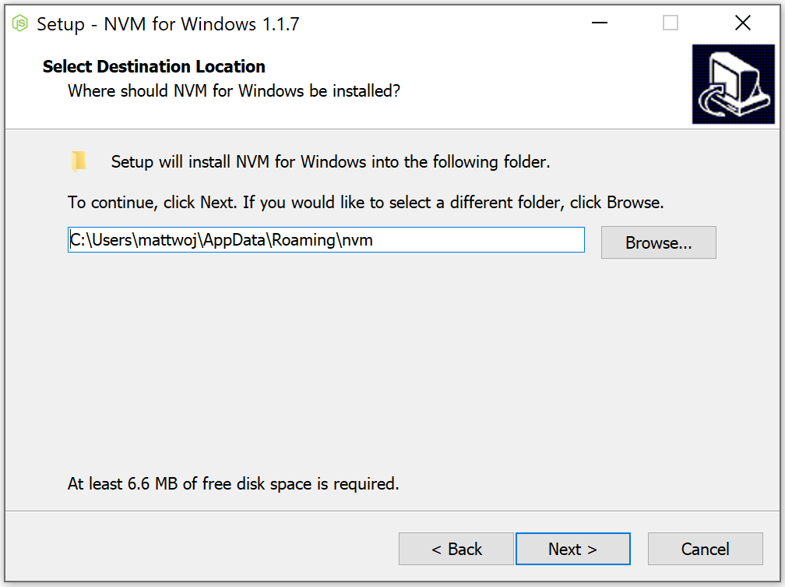
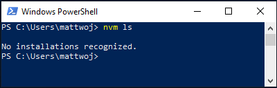
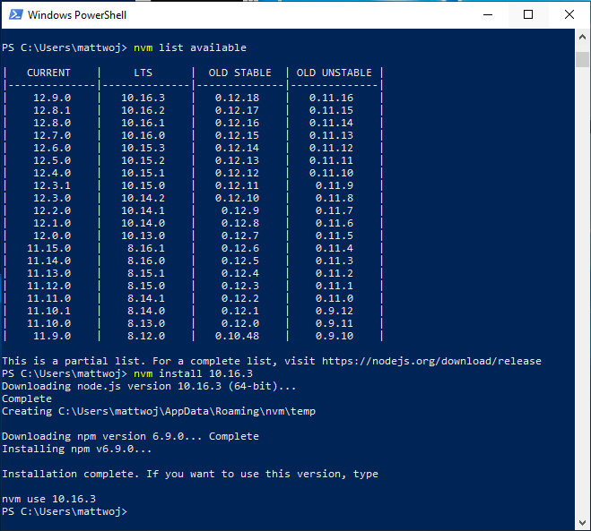
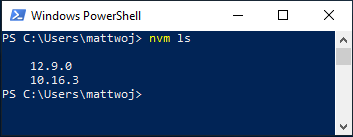

# Install NodeJS on Windows

If you are new to developing with Node.js and want to get up and running quickly so that you can learn, follow the steps below to install Node.js directly on Windows.

> [!NOTE]
> If you are using Node.js professionally, find performance speed and system call compatibility important, want to run [Docker containers](../docker/overview.md) that leverage Linux workspaces and avoid having to maintain both Linux and Windows build scripts, or just prefer using a Bash command line, then [install Node.js on Windows Subsystem for Linux](./nodejs-on-wsl.md) (more specifically, WSL 2).

## Install nvm-windows, node.js, and npm

Besides choosing whether to install on Windows or WSL, there are additional choices to make when installing Node.js. We recommend using a version manager as versions change very quickly. You will likely need to switch between multiple Node.js versions based on the needs of different projects you're working on. Node Version Manager, more commonly called nvm, is the most popular way to install multiple versions of Node.js, but is only available for Mac/Linux and not supported on Windows. Instead, we recommend installing nvm-windows and then using it to install Node.js and Node Package Manager (npm). There are [alternative version managers](#alternative-version-managers) to consider as well covered in the next section.

> [!IMPORTANT]
> It is always recommended to remove any existing installations of Node.js or npm from your operating system before installing a version manager as the different types of installation can lead to strange and confusing conflicts. This includes deleting any existing nodejs installation directories (e.g., "C:\Program Files\nodejs") that might remain. NVM's generated symlink will not overwrite an existing (even empty) installation directory. For help with removing previous installations, see [How to completely remove node.js from Windows](https://stackoverflow.com/questions/20711240/how-to-completely-remove-node-js-from-windows).)

> [!WARNING]
> NVM is designed to be installed per-user, and invoked per-shell. It is not designed for shared developer boxes or build servers with multiple build agents. NVM works by using a symbolic link. Using nvm in shared scenarios creates a problem because that link points to a user's app data folder -- so if user x runs `nvm use lts`, the link will point node for the entire box to their app data folder. If user y runs node or npm, they will be directed to run files under x's user account and in the case of `npm -g`, they will be modifying x's files, which by default is not allowed. So nvm is only prescribed for one developer box. This goes for build servers too. If two build agents are on the same vm/box, they can compete and cause odd behavior in the builds. 

1. Follow the install instructions on the [windows-nvm repository](https://github.com/coreybutler/nvm-windows#installation--upgrades). We recommend using the installer, but if you have a more advanced understanding of your needs, you may want to consider the manual installation. The installer will point you to the [releases page](https://github.com/coreybutler/nvm-windows/releases) for the most recent version.
2. Download the **nvm-setup.zip** file for the most recent release.
3. Once downloaded, open the zip file, then open the **nvm-setup.exe** file.
4. The Setup-NVM-for-Windows installation wizard will walk you through the setup steps, including choosing the directory where both nvm-windows and Node.js will be installed.

    

5. Once the installation is complete. Open PowerShell (recommend opening with elevated Admin permissions) and try using windows-nvm to list which versions of Node are currently installed (should be none at this point): `nvm ls`

    

6. Install the current release of Node.js (for testing the newest feature improvements, but more likely to have issues than the LTS version): `nvm install latest`

7. Install the latest stable LTS release of Node.js (recommended) by first looking up what the current LTS version number is with: `nvm list available`, then installing the LTS version number with: `nvm install <version>` (replacing `<version>` with the number, ie: `nvm install 12.14.0`).

    

8. List what versions of Node are installed: `nvm ls` ...now you should see the two versions that you just installed listed.

    

9. After installing the Node.js version numbers you need, select the version that you would like to use by entering: `nvm use <version>` (replacing `<version>` with the number, ie: `nvm use 12.9.0`).

10. To change the version of Node.js you would like to use for a project, create a new project directory `mkdir NodeTest`, and enter the directory `cd NodeTest`, then enter `nvm use <version>` replacing `<version>` with the version number you'd like to use (ie v10.16.3`).

11. Verify which version of npm is installed with: `npm --version`, this version number will automatically change to whichever npm version is associated with your current version of Node.js.

### Alternative version managers

While windows-nvm is currently the most popular version manager for node, there are alternatives to consider:

- [nvs](https://github.com/jasongin/nvs) (Node Version Switcher) is a cross-platform `nvm` alternative with the ability to [integrate with VS Code](https://github.com/jasongin/nvs/blob/master/doc/VSCODE.md).

- [Volta](https://github.com/volta-cli/volta#installing-volta) is a new version manager from the LinkedIn team that claims improved speed and cross-platform support.

To install Volta as your version manager (rather than windows-nvm), go to the **Windows Installation** section of their [Getting Started guide](https://docs.volta.sh/guide/getting-started), then download and run their Windows installer, following the setup instructions.

> [!IMPORTANT]
> You must ensure that [Developer Mode](/windows/uwp/get-started/enable-your-device-for-development#accessing-settings-for-developers) is enabled on your Windows machine before installing Volta.

To learn more about using Volta to install multiple versions of Node.js on Windows, see the [Volta Docs](https://docs.volta.sh/guide/understanding#managing-your-toolchain).

## Install Visual Studio Code

We recommend you [install Visual Studio Code](https://code.visualstudio.com) for developing with Node.js on Windows. For help, see [Node.js tutorial in Visual Studio Code](https://code.visualstudio.com/docs/nodejs/nodejs-tutorial).

### Alternative code editors

If you prefer to use a code editor or IDE other than Visual Studio Code, the following are also good options for your Node.js development environment:

- [WebStorm](https://www.jetbrains.com/webstorm/download/#section=windows)
- [Sublime Text](https://www.sublimetext.com/3)
- [Atom](https://atom.io/)
- [Brackets](http://brackets.io/)
- [Notepad++](https://notepad-plus-plus.org/)

## Install Git

If you plan to collaborate with others, or host your project on an open-source site (like GitHub), VS Code supports [version control with Git](https://code.visualstudio.com/docs/editor/versioncontrol#_git-support). The Source Control tab in VS Code tracks all of your changes and has common Git commands (add, commit, push, pull) built right into the UI. You first need to install Git to power the Source Control panel.

1. Download and install Git for Windows from [the git-scm website](https://git-scm.com/download/win).

2. An Install Wizard is included that will ask you a series of questions about settings for your Git installation. We recommend using all of the default settings, unless you have a specific reason for changing something.

3. If you've never worked with Git before, [GitHub Guides](https://guides.github.com/) can help you get started.

4. We recommend adding a [.gitignore file](https://help.github.com/en/articles/ignoring-files) to your Node projects. Here is [GitHub's default gitignore template for Node.js](https://github.com/github/gitignore/blob/master/Node.gitignore).

## Use Windows Subsystem for Linux for production

Using Node.js directly on Windows is great for learning and experimenting with what you can do. Once you are ready to build production-ready web apps, which are typically deployed to a Linux-based server, we recommend using Windows Subsystem for Linux version 2 (WSL 2) for developing Node.js web apps. Many Node.js packages and frameworks are created with a *nix environment in mind and most Node.js apps are deployed on Linux, so developing on WSL ensures consistency between your development and production environments. To set up a WSL dev environment, see [Set up your Node.js development environment with WSL 2](./nodejs-on-wsl.md).

> [!NOTE]
> If you are in the (somewhat rare) situation of needing to host a Node.js app on a Windows server, the most common scenario seems to be [using a reverse proxy](https://medium.com/intrinsic/why-should-i-use-a-reverse-proxy-if-node-js-is-production-ready-5a079408b2ca). There are two ways to do this: 1) [using iisnode](https://harveywilliams.net/blog/installing-iisnode) or [directly](https://dev.to/petereysermans/hosting-a-node-js-application-on-windows-with-iis-as-reverse-proxy-397b). We do not maintain these resources and recommend [using Linux servers to host your Node.js apps](/azure/app-service/app-service-web-get-started-nodejs).
