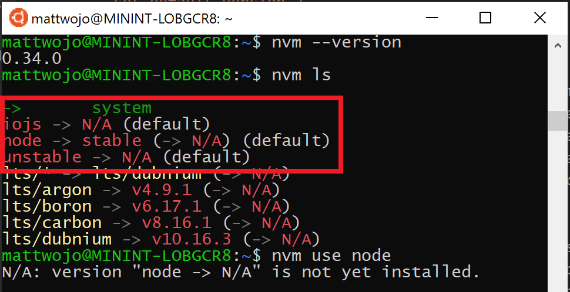
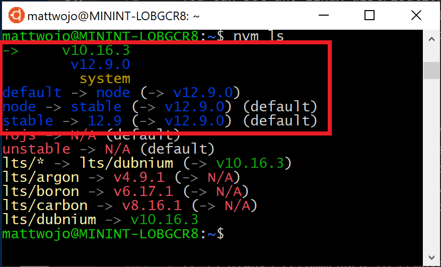
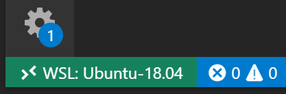

# Install Node.js on Windows Subsystem for Linux (WSL2)

If you prefer using Node.js in a Linux environment, find performance speed and system call compatibility important, want to run [Docker containers](/windows/wsl/tutorials/wsl-containers) that leverage Linux workspaces and avoid having to maintain both Linux and Windows build scripts, or just prefer using a Bash command line, then you want to install Node.js on the Windows Subsystem for Linux (more specifically, WSL 2).

Using Windows Subsystem for Linux (WSL), might also enable you to install your preferred Linux distribution (Ubuntu is our default) so that you can have consistency between your development environment (where you write code) and production environment (the server where your code is deployed).

> [!NOTE]
> If you are new to developing with Node.js and want to get up and running quickly so that you can learn, [install Node.js on Windows](./nodejs-on-windows.md). This recommendation also applies if you plan to use a Windows Server production environment.

## Install WSL 2

WSL 2 is the most recent version available for Windows and we recommend it for professional Node.js development workflows. To enable and install WSL 2, follow the steps in the [WSL install documentation](/windows/wsl/install-win10). These steps will include choosing a Linux distribution (for example, Ubuntu).

Once you have installed WSL 2 and a Linux distribution, open the Linux distribution (it can be found in your Windows start menu) and check the version and codename using the command: `lsb_release -dc`.

We recommend updating your Linux distribution regularly, including immediately after you install, to ensure you have the most recent packages. Windows doesn't automatically handle this update. To update your distribution, use the command: `sudo apt update && sudo apt upgrade`.  

## Install Windows Terminal (optional)

Windows Terminal is an improved command line shell that allows you to run multiple tabs so that you can quickly switch between Linux command lines, Windows Command Prompt, PowerShell, Azure CLI, or whatever you prefer to use. You can also create custom key bindings (shortcut keys for opening or closing tabs, copy+paste, etc.), use the search feature, customize your terminal with themes (color schemes, font styles and sizes, background image/blur/transparency), and more. [Learn more in the Windows Terminal docs](/windows/terminal).

[Install Windows Terminal using the Microsoft Store](https://www.microsoft.com/store/apps/9n0dx20hk701): By installing via the store, updates are handled automatically.

## Install nvm, node.js, and npm

Besides choosing whether to install on Windows or WSL, there are additional choices to make when installing Node.js. We recommend using a version manager as versions change very quickly. You will likely need to switch between multiple versions of Node.js based on the needs of different projects you're working on. Node Version Manager, more commonly called nvm, is the most popular way to install multiple versions of Node.js. We will walk through the steps to install nvm and then use it to install Node.js and Node Package Manager (npm). There are [alternative version managers](#alternative-version-managers) to consider as well covered in the next section.

> [!IMPORTANT]
> It is always recommended to remove any existing installations of Node.js or npm from your operating system before installing a version manager as the different types of installation can lead to strange and confusing conflicts. For example, the version of Node that can be installed with Ubuntu's `apt-get` command is currently outdated. For help with removing previous installations, see [How to remove nodejs from ubuntu](https://askubuntu.com/questions/786015/how-to-remove-nodejs-from-ubuntu-16-04).)

For the most current information on installing NVM, see [Installing and Updating in the NVM repo on GitHub](https://github.com/nvm-sh/nvm?tab=readme-ov-file#installing-and-updating).

1. Open your Ubuntu command line (or distribution of your choice).
1. Install cURL (a tool used for downloading content from the internet in the command-line) with: `sudo apt-get install curl`
1. Install nvm, with: `curl -o- https://raw.githubusercontent.com/nvm-sh/nvm/master/install.sh | bash`

    > [!NOTE]
    > Installing a newer version of NVM using cURL will replace the older one, leaving the version of Node you've used NVM to install intact. For more information, see the [GitHub project page for the latest release information on NVM](https://github.com/nvm-sh/nvm).

1. To verify installation, enter: `command -v nvm` ...this should return 'nvm', if you receive 'command not found' or no response at all, close your current terminal, reopen it, and try again. [Learn more in the nvm github repo](https://github.com/nvm-sh/nvm).
1. List which versions of Node are currently installed (should be none at this point): `nvm ls`

    

1. Install both the current and stable LTS versions of Node.js. In a later step, you'll learn how to switch between active versions of Node.js with an `nvm` command.

    - Install the current stable LTS release of Node.js (recommended for production applications): `nvm install --lts`
    - Install the current release of Node.js (for testing latest Node.js features and improvements, but more likely to have issues): `nvm install node`

1. List what versions of Node are installed: `nvm ls` ...now you should see the two versions that you just installed listed.

    

1. Verify that Node.js is installed and the currently default version with: `node --version`. Then verify that you have npm as well, with: `npm --version` (You can also use `which node` or `which npm` to see the path used for the default versions).
1. To change the version of Node.js you would like to use for a project, create a new project directory `mkdir NodeTest`, and enter the directory `cd NodeTest`, then enter `nvm use node` to switch to the Current version, or `nvm use --lts` to switch to the LTS version. You can also use the specific number for any additional versions you've installed, like `nvm use v8.2.1`. (To list all of the versions of Node.js available, use the command: `nvm ls-remote`).

If you are using NVM to install Node.js and NPM, you should not need to use the SUDO command to install new packages.

## Alternative version managers

While nvm is currently the most popular version manager for node, there are a few alternatives to consider:

- [n](https://www.npmjs.com/package/n#installation) is a long-standing `nvm` alternative that accomplishes the same thing with slightly different commands and is installed via `npm` rather than a bash script.
- [fnm](https://github.com/Schniz/fnm#using-a-script) is a newer version manager, claiming to be much faster than `nvm`. (It also uses [Azure Pipelines](/azure/devops/pipelines/get-started/what-is-azure-pipelines).)
- [Volta](https://github.com/volta-cli/volta#installing-volta) is a new version manager from the LinkedIn team that claims improved speed and cross-platform support.
- [asdf-vm](https://asdf-vm.com/#/core-manage-asdf-vm) is a single CLI for multiple languages, like ike gvm, nvm, rbenv & pyenv (and more) all in one.
- [nvs](https://github.com/jasongin/nvs) (Node Version Switcher) is a cross-platform `nvm` alternative with the ability to [integrate with VS Code](https://github.com/jasongin/nvs/blob/master/doc/VSCODE.md).

## Install Visual Studio Code

We recommend using Visual Studio Code with the [Remote-development extension pack](https://marketplace.visualstudio.com/items?itemName=ms-vscode-remote.vscode-remote-extensionpack) for Node.js projects. This splits VS Code into a “client-server” architecture, with the client (the VS Code user interface) running on your Windows operating system and the server (your code, Git, plugins, etc) running "remotely" on your WSL Linux distribution.

> [!NOTE]
> This “remote” scenario is a bit different than you may be accustomed to. WSL supports an actual Linux distribution where your project code is running, separately from your Windows operating system, but still on your local machine. The Remote-WSL extension connects with your Linux subsystem as if it were a remote server, though it’s not running in the cloud… it’s still running on your local machine in the WSL environment that you enabled to run alongside Windows.

- Linux-based Intellisense and linting is supported.
- Your project will automatically build in Linux.
- You can use all your extensions running on Linux ([ES Lint, NPM Intellisense, ES6 snippets, etc.](https://marketplace.visualstudio.com/items?itemName=waderyan.nodejs-extension-pack)).

Other code editors, like IntelliJ, Sublime Text, Brackets, etc. will also work with a WSL 2 Node.js development environment, but may not have the same sort of remote  features that VS Code offers. These code editors may run into trouble accessing the WSL shared network location (\\wsl$\Ubuntu\home\) and will try to build your Linux files using Windows tools, which likely not what you want. The Remote-WSL Extension in VS Code handles this compatibility for you, with other IDEs you may need to set up an X server. [Support for running GUI apps in WSL](https://twitter.com/craigaloewen/status/1308452901266751488?lang=en) (like a code editor IDE) is coming soon.

Terminal-based text editors (vim, emacs, nano) are also helpful for making quick changes from right inside your console. The article, [Emacs, Nano, or Vim: Choose your Terminal-Based Text Editor Wisely](https://medium.com/linode-cube/emacs-nano-or-vim-choose-your-terminal-based-text-editor-wisely-8f3826c92a68) does a nice job explaining some differences and a bit about how to use each.

To install VS Code and the Remote-WSL Extension:

1. [Download and install VS Code for Windows](https://code.visualstudio.com). VS Code is also available for Linux, but Windows Subsystem for Linux does not support GUI apps, so we need to install it on Windows. Not to worry, you'll still be able to integrate with your Linux command line and tools using the Remote - WSL Extension.

2. Install the [Remote - WSL Extension](https://marketplace.visualstudio.com/items?itemName=ms-vscode-remote.remote-wsl) on VS Code. This allows you to use WSL as your integrated development environment and will handle compatibility and pathing for you. [Learn more](https://code.visualstudio.com/docs/remote/remote-overview).

> [!IMPORTANT]
> If you already have VS Code installed, you need to ensure that you have the [1.35 May release](https://code.visualstudio.com/updates/v1_35) or later in order to install the [Remote - WSL Extension](https://marketplace.visualstudio.com/items?itemName=ms-vscode-remote.remote-wsl). We do not recommend using WSL in VS Code without the Remote-WSL extension as you will lose support for auto-complete, debugging, linting, etc. Fun fact: This WSL extension is installed in $HOME/.vscode-server/extensions.

### Helpful VS Code Extensions

While VS Code comes with many features for Node.js development out of the box, there are some helpful extensions to consider installing available in the [Node.js Extension Pack](https://marketplace.visualstudio.com/items?itemName=waderyan.nodejs-extension-pack). Install them all or pick and choose which seem the most useful to you.

To install the Node.js extension pack:

1. Open the **Extensions** window (Ctrl+Shift+X) in VS Code.

    The Extensions window is now divided into three sections (because you installed the Remote-WSL extension).
    - "Local - Installed": The extensions installed for use with your Windows operating system.
    - "WSL:Ubuntu-18.04-Installed": The extensions installed for use with your Ubuntu operating system (WSL).
    - "Recommended": Extensions recommended by VS Code based on the file types in your current project.

    

2. In the search box at the top of the Extensions window, enter: **Node Extension Pack** (or the name of whatever extension you are looking for). The extension will be installed for either your Local or WSL instances of VS Code depending on where you have the current project opened. You can tell by selecting the remote link in the bottom-left corner of your VS Code window (in green). It will either give you the option to open or close a remote connection. Install your Node.js extensions in the "WSL:Ubuntu-18.04" environment.

    

A few additional extensions you may want to consider include:

- [JavaScript Debugger](https://marketplace.visualstudio.com/items?itemName=ms-vscode.js-debug): Once you finish developing on the server side with Node.js, you'll need to develop and test the client side. This extension is a DAP-based JavaScript debugger. It debugs Node.js, Chrome, Edge, WebView2, VS Code extensions, and more.
- [Keymaps from other editors](https://marketplace.visualstudio.com/search?target=VSCode&category=Keymaps&sortBy=Downloads): These extensions can help your environment feel right at home if you're transitioning from another text editor (like Atom, Sublime, Vim, eMacs, Notepad++, etc).
- [Settings Sync](https://marketplace.visualstudio.com/items?itemName=Shan.code-settings-sync): Enables you to synchronize your VS Code settings across different installations using GitHub. If you work on different machines, this helps keep your environment consistent across them.

## Set up Git (optional)

To set up Git for a Node.js project on WSL, see the article [Get started using Git on Windows Subsystem for Linux](/windows/wsl/tutorials/wsl-git) in the WSL documentation.
