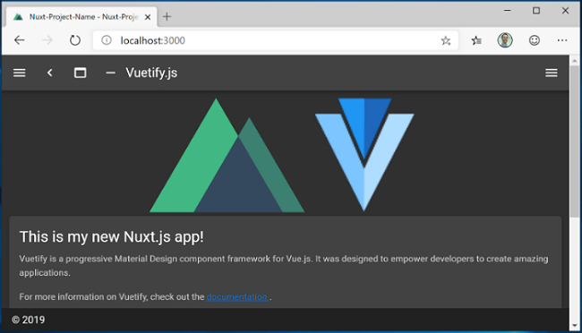

# Get started with Nuxt.js on Windows

A guide to help you install the Nuxt.js web framework and get up and running on Windows.

Nuxt.js is a framework for creating server-rendered JavaScript apps based on Vue.js, Node.js, Webpack and Babel.js. It was inspired by Next.js. It is basically a project boilerplate for Vue. Just like Next.js, it is crafted with attention to best practices and allows you to create "universal" web apps in a simple, consistent way, with hardly any configuration. These "universal" server-rendered web apps are also sometimes called “isomorphic”, meaning that code is shared between the client and server.

To learn more about Vue, see the [Vue overview](./vue-overview.md) page.

## Prerequisites

This guide assumes that you've already completed the steps to set up your Node.js development environment, including:

- [Install Windows Subsystem for Linux (WSL)](/windows/wsl/install-win10), including a Linux distribution (like Ubuntu) and make sure it is running in WSL 2 mode. You can check this by opening PowerShell and entering: `wsl -l -v`
- [Install Node.js on WSL 2](./nodejs-on-wsl.md): This includes a version manager, package manager, Visual Studio Code, and the Remote Development extension.

We recommend using the Windows Subsystem for Linux when working with NodeJS apps for better performance speed, system call compatibility, and for parody when running Linux servers or Docker containers.

> [!IMPORTANT]
> Installing a Linux distribution with WSL will create a directory for storing files: `\\wsl\Ubuntu-20.04` (substitute Ubuntu-20.04 with whatever Linux distribution you're using). To open this directory in Windows File Explorer, open your WSL command line, select your home directory using `cd ~`, then enter the command `explorer.exe .` Be careful not to install NodeJS or store files that you will be working with on the mounted C drive (`/mnt/c/Users/yourname$`). Doing so will significantly slow down your install and build times.

## Install Nuxt.js

To install Nuxt.js, you will need to answer a series of questions about what sort of integrated server-side framework, UI framework, testing framework, mode, modules, and linter you would like to install:

1. Open a WSL command line (ie. Ubuntu).

2. Create a new project folder: `mkdir NuxtProjects` and enter that directory: `cd NuxtProjects`.

3. Install Nuxt.js and create a project (replacing 'my-nuxt-app' with whatever you'd like to call your app): `npm create nuxt-app my-nuxt-app`

4. The Nuxt.js installer will now ask you the following questions:
    - Project Name: my-nuxtjs-app
    - Project description: Description of my Nuxt.js app.
    - Author name: I use my GitHub alias.
    - Choose the package manager: Yarn or **Npm** - we use NPM for our examples.
    - Choose UI framework: None, Ant Design Vue, Bootstrap Vue, etc. Let's choose **Vuetify** for this example, but the Vue Community created a nice [summary comparing these UI frameworks](https://vue-community.org/guide/ecosystem/ui-libraries.html#summary-tldr) to help you choose the best fit for your project.
    - Choose custom server frameworks: None, AdonisJs, Express, Fastify, etc. Let's choose **None** for this example, but you can find a [2019-2020 server framework comparison](https://dev.to/santypk4/introducing-the-best-10-node-js-frameworks-for-2019-and-2020-mcm) on the Dev.to site.
    - Choose Nuxt.js modules (use spacebar to select modules or just enter if you don't want any): Axios (for simplifying HTTP requests) or [PWA support](https://pwa.nuxtjs.org/) (for adding a service-worker, manifest.json file, etc). Let's not add a module for this example.
    - Choose linting tools: **ESLint**, Prettier, Lint staged files. Let's choose **ESLint** (a tool for analyzing your code and warning you of potential errors).
    - Choose a test framework: **None**, Jest, AVA. Let's choose **None** as we won't cover testing in this quickstart.
    - Choose rendering mode: **Universal (SSR)** or Single Page App (SPA). Let's choose **Universal (SSR)** for our example, but the [Nuxt.js docs](https://nuxtjs.org/guide#server-rendered-universal-ssr-) point out some of the differences -- SSR requiring a Node.js server running to server-render your app and SPA for static hosting.
    - Choose development tools: **jsconfig.json** (recommended for VS Code so Intellisense code completion works)

5. Once your project is created, `cd my-nuxtjs-app` to enter your Nuxt.js project directory, then enter `code .` to open the project in the VS Code WSL-Remote environment.

    

6. There are 3 commands you need to know once Nuxt.js is installed:

    - `npm run dev` for running a development instance with hot-reloading, file watching and task re-running.
    - `npm run build` for compiling your project.
    - `npm start` for starting your app in production mode.

    Open the WSL terminal integrated in VS Code (**View > Terminal**). Make sure that the terminal path is pointed to your project directory (ie. `~/NuxtProjects/my-nuxt-app$`). Then try running a development instance of your new Nuxt.js app using: `npm run dev`

7. The local development server will start (displaying some kind of cool progress bars for the client and server compiles). Once your project is done building, your terminal will display "Compiled successfully" along with how much time it took to compile. Point your web browser to `http://localhost:3000` to open your new Nuxt.js app.

    

8. Open the `pages/index.vue` file in your VS Code editor. Find the page title `<v-card-title class="headline">Welcome to the Vuetify + Nuxt.js template</v-card-title>` and change it to `<v-card-title class="headline">This is my new Nuxt.js app!</v-card-title>`. With your web browser still open to localhost:3000, save your change and notice the hot-reloading feature automatically compile and update your change in the browser.

9. Let's see how Nuxt.js handles errors. Remove the `</v-card-title>` closing tag so that your title code now looks like this: `<v-card-title class="headline">This is my new Nuxt.js app!`. Save this change and notice that a compiling error will display in your browser, and in your terminal, letting your know that a closing tag for `<v-card-title>` is missing, along with the line numbers where the error can be found in your code. Replace the `</v-card-title>` closing tag, save, and the page will reload.

You can use VS Code's debugger with your Nuxt.js app by selecting the F5 key, or by going to **View > Debug** (Ctrl+Shift+D) and **View > Debug Console** (Ctrl+Shift+Y) in the menu bar. If you select the gear icon in the Debug window, a launch configuration (`launch.json`) file will be created for you to save debugging setup details. To learn more, see [VS Code Debugging](https://code.visualstudio.com/docs/nodejs/nodejs-debugging).

To learn more about Nuxt.js, see the  [Nuxt.js guide](https://nuxtjs.org/guide).
