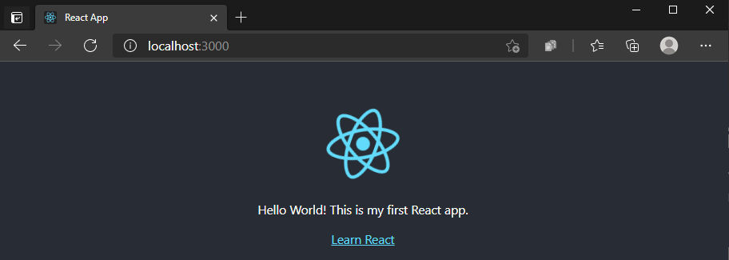
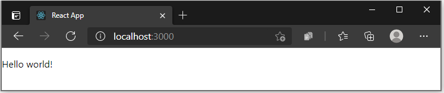
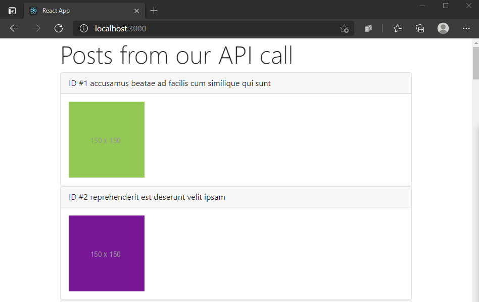

# Tutorial: React on Windows for beginners

If you're brand new to using React, this guide will help you to get started with some basics.

- [A few basic terms and concepts](#a-few-basic-terms-and-concepts)
- [Try using React in Visual Studio Code](#try-using-react-in-visual-studio-code)
- [Try using React with an API](#try-using-react-with-an-api)

## Prerequisites

- [Install React on Windows](./react-on-windows.md)
- [Install React on Windows Subsystem for Linux](./react-on-wsl.md)
- [Install VS Code](https://code.visualstudio.com/download). We recommend installing VS Code on Windows, regardless of whether you plan to use React on Windows or WSL.

## A few basic terms and concepts

React is a JavaScript library for building user interfaces.

- It is [open-source](https://github.com/facebook/react), meaning that you can contribute to it by filing issues or pull requests. *(Just like [these docs](/contribute/)!)*

- It is [declarative](https://en.wikipedia.org/wiki/Declarative_programming), meaning that you write the code that you want and React takes that declared code and performs all of the JavaScript/DOM steps to get the desired result.

- It is [component-based](https://en.wikipedia.org/wiki/Component-based_software_engineering), meaning that applications are created using prefabricated and reusable independent code modules that manage their own state and can be glued together using the React framework, making it possible to pass data through your app while keeping state out of the DOM.

- The React motto is "Learn once, write anywhere." The intention is for [code reuse](https://en.wikipedia.org/wiki/Code_reuse) and not making assumptions about how you will use React UI with other technologies, but to make components reusable without the need to rewrite existing code.

- [JSX](https://react.dev/learn/writing-markup-with-jsx) is a syntax extension for JavaScript written to be used with React that looks like HTML, but is actually a JavaScript file that needs to be compiled, or translated into regular JavaScript.

- [Virtual DOM](https://reactjs.org/docs/faq-internals.html): [DOM](https://en.wikipedia.org/wiki/Document_Object_Model) stands for Document Object Model and represents the UI of your app. Every time the state of your app's UI changes, the DOM gets updated to represent the change. When a DOM is frequently updating, performance becomes slow. A Virtual DOM is only a visual representation of the DOM, so when the state of the app changes, the virtual DOM is updated rather than the real DOM, reducing the performance cost. It's a *representation* of a DOM object, like a lightweight copy.

- *Views*: are what the user sees rendered in the browser. In React, view is related to the concept of [rendering elements](https://reactjs.org/docs/rendering-elements.html) that you want a user to see on their screen.

- [State](https://react.dev/learn/state-a-components-memory): refers to the data stored by different views. The state will typically rely on who the user is and what the user is doing. For example, signing into a website may show your user profile (view) with your name (state). The state data will change based on the user, but the view will remain the same. State is used to achieve most of the user interactivity with the application.

- [Component Props](https://react.dev/learn/passing-props-to-a-component): is a way for parent component to pass some information as a value or data(including objects, arrays, and functions) to its child components. Props are read-only and cannot be updated by the child component.

## Try using React in Visual Studio Code

There are many ways to create an application with React (see the [React Overview](./react-overview.md) for examples). This tutorial will walk through how to use [vite](https://vitejs.dev/) to fast-forward the set up for a functioning React app so that you can see it running and focus on experimenting with the code, not yet concerning yourself with the build tools.

1. Use vite on Windows or WSL (see the [prerequisites above](#prerequisites)) to create a new project: `npm create vite@latest hello-world -- --template react`

2. Change directories so that you're inside the folder for your new app: `cd hello-world`, install the dependencies: `npm install` and then start your local development server: `npm run dev`

    Your new React Hello World app will compile and open your default web browser to show that it's running on `http://localhost:5173`.

3. Stop running your React app (Ctrl+c) and open it's code files in VS Code by entering: `code .`

4. Find the src/App.jsx file and find the header section that reads:

    ```JavaScript
    <p>Edit <code>src/App.jsx</code> and save to test HMR</p>
    ```

    Change it to read:

    ```JavaScript
    <p>Hello World! This is my first React app.</p>
    ```

5. Open your terminal window and start your local development server: `npm run dev` or you can use the integrated VS Code terminal (Ctrl + \`) and start your development server from there.

    

 Throughout the development of your React app you can keep your local development server running and all the changes will immediately be rendered at `http://localhost:5173` in your browser.

## Application file structure

The intial file structure looks like

```markdown
hello-world
├── node_modules 
├── README.md 
├── index.html
├── package-lock.json
├── package.json
├── public
│   └── vite.svg
├── src
│   ├── App.css
│   ├── App.jsx
│   ├── assets
│   │   └── react.svg
│   ├── index.css
│   └── main.jsx
└── vite.config.js
```

For starters, these are the important files and folders you need to know. 

`index.html` is the file in which Vite injects your code from `src` folder for your browser to run it. This file should not be edited except to change the title of your React application.

The `src` folder is where the source code of your React application lives. This is the place where you create your custom components, CSS files and other code files you need to build your application. These files are processed by Vite's build tools to parse and build them to create your final React project.

The `public` folder contains all your static files that will be served directly to your browser. These files are not processed by Vite.

## Try using React with an API

Using the same Hello World! app that you built with React and updated with Visual Studio Code, let's try adding an API call to display some data.

1. Lets start fresh. We will remove almost all the boilerplate code provided by Vite and keep only our code from the previous step. 

    Your App.jsx file should now look like this:

    ```JavaScript
    import "./App.css";

    function App() {
      return (
        <>
          <p>Hello world! This is my first React app.</p>
        </>
      );
    }

    export default App;
    ```

    

2. Next, let's set a local state where we can save data from an API. A state is where we can store data to be used in the view.

    To add a local state, we need to first import the [useState](https://react.dev/reference/react/useState) React Hook that lets you add state variable to your component.

    We also need to initialize the local state. The `useState` returns an array of two values; current state and a `set` function. We will call our current state as `posts` initialised as an empty array that we can fill with post data later from our API using the `setPosts` function.

    Your App.jsx file should now look like this:

    ```JavaScript
    import { useState } from "react";
    import "./App.css";

    function App() {
      const [posts, setPosts] = useState([]);

      return (
        <>
          <p>Hello world! This is my first React app.</p>
        </>
      );
    }

    export default App;
    ```

3. To call an API with data for us to use in our React app, we will use the .fetch JavaScript method. The API we will call is [JSONPlaceholder](https://jsonplaceholder.typicode.com/guide/), a free API for testing and prototyping that serves up fake placeholder data in JSON format.
  
    We use the [useEffect](https://react.dev/reference/react/useEffect) React Hook to update the `posts` state by using the [set function](https://react.dev/reference/react/useState#setstate).

    ```Javascript
    import { useState, useEffect } from "react";
    import "./App.css";

    function App() {
      const [posts, setPosts] = useState([]);

      useEffect(() => {
        const url = "https://jsonplaceholder.typicode.com/albums/1/photos";
        fetch(url)
          .then((response) => response.json())
          .then((data) => setPosts(data));
      }, []);

      return (
        <>
          <p>Hello world! This is my first React app.</p>
        </>
      );
    }

    export default App;
    ```

4. Let's take a look at what sort of data the API has saved in our `posts` state. Below is some of the contents of the [fake JSON API file](https://jsonplaceholder.typicode.com/albums/1/photos). We can see the format the data is listed in, using the categories: "albumId", "id", "title", "url", and "thumbnailUrl".

    ```json
    [
      {
        "albumId": 1,
        "id": 1,
        "title": "accusamus beatae ad facilis cum similique qui sunt",
        "url": "https://via.placeholder.com/600/92c952",
        "thumbnailUrl": "https://via.placeholder.com/150/92c952"
      },
      {
        "albumId": 1,
        "id": 2,
        "title": "reprehenderit est deserunt velit ipsam",
        "url": "https://via.placeholder.com/600/771796",
        "thumbnailUrl": "https://via.placeholder.com/150/771796"
      }
    ]
    ```

5. To display the API data, we will now need to add a bit of JSX code inside the rendered `return()` statement. We will use the [`map()`](https://react.dev/learn/rendering-lists) method to display our data from the `posts` object that we stored it in as keys. Each post will display a header with "ID #" and then the post.id key value + post.title key value from our JSON data. Followed by the body displaying the image based on the thumbnailUrl key value.

    ```javascript
    // rest of the code 
      return (
        <article>
          <h1>Posts from our API call</h1>
          {posts.map((post) => (
            <article key={post.id}>
              <h2>ID #{post.id} {post.title}</h2>
              
            </article>
          ))}
        </article>
      );
    }

    export default App;
    ```
    

## Additional resources

- The [official React docs](https://react.dev/) offer all of the latest, up-to-date information on React
- [Microsoft Edge Add-ons for React Developer Tools](https://microsoftedge.microsoft.com/addons/detail/react-developer-tools/gpphkfbcpidddadnkolkpfckpihlkkil): Adds two tabs to your Microsoft Edge dev tools to help with your React development: Components and Profiler.
- The [React learning path](/training/paths/react/) contains online course modules to help you get started with the basics.