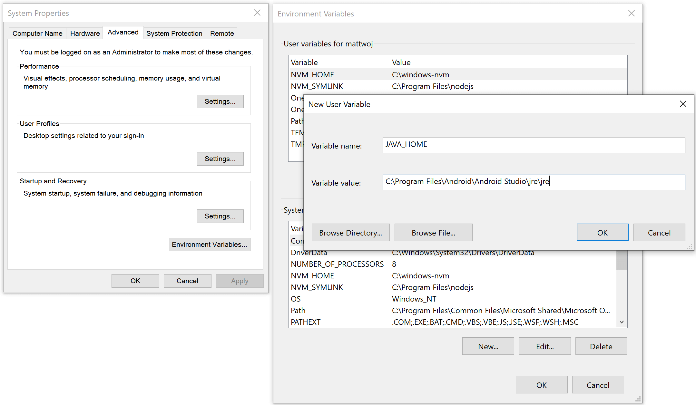
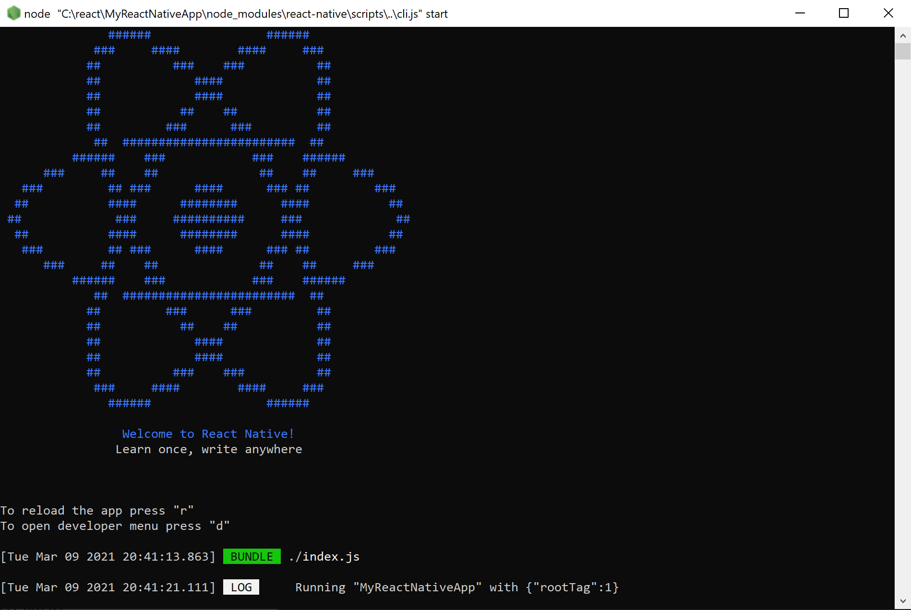
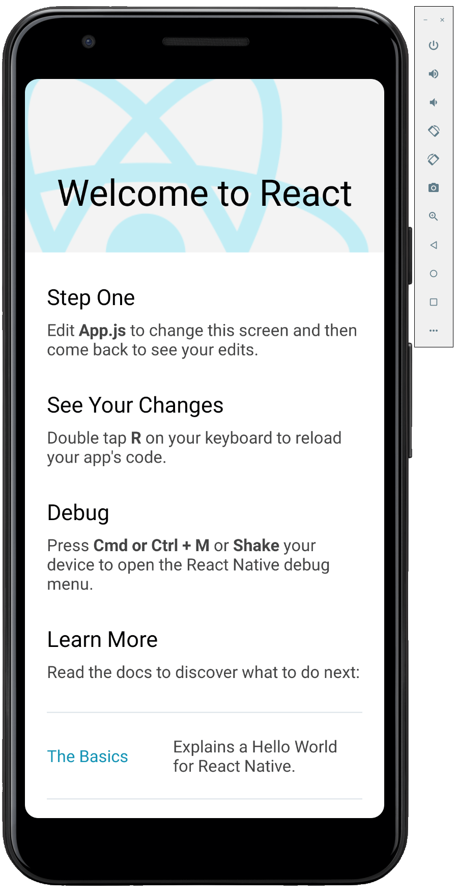
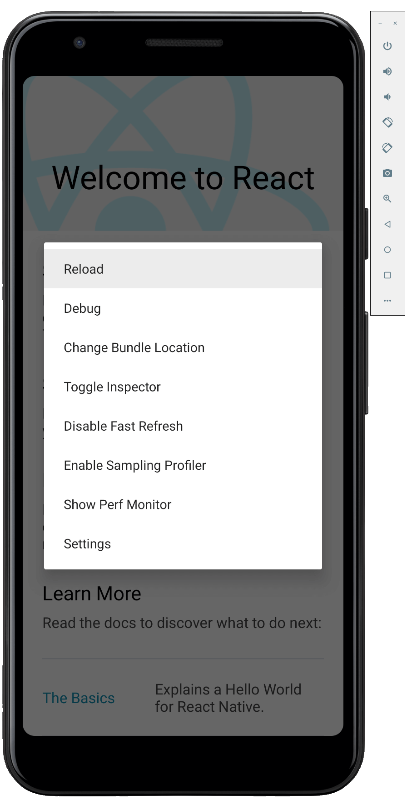

# Get started developing for Android using React Native

This guide will help you to get started using React Native on Windows to create a cross-platform app that will work on Android devices.

## Overview

React Native is an [open-source](https://github.com/facebook/react-native) mobile application framework created by Facebook. It is used to develop applications for Android, iOS, Web and UWP (Windows) providing native UI controls and full access to the native platform. Working with React Native requires an understanding of JavaScript fundamentals.

## Get started with React Native by installing required tools

1. [Install Visual Studio Code](https://code.visualstudio.com) (or your code editor of choice).

2. [Install Android Studio for Windows](https://developer.android.com/studio). Android Studio installs the latest Android SDK by default. React Native requires Android 6.0 (Marshmallow) SDK or later. We recommend using the latest SDK.

3. Create environment variable paths for the Java SDK and Android SDK:
    - In the Windows search menu, enter: "Edit the system environment variables", this will open the **System Properties** window.
    - Choose **Environment Variables...** and then choose **New...** under **User variables**.
    - Enter the Variable name and value (path). The default paths for the Java and Android SDKs are as follows. If you've chosen a specific location to install the Java and Android SDKs, be sure to update the variable paths accordingly.
        - JAVA_HOME: C:\Program Files\Android\Android Studio\jre\jre
        - ANDROID_HOME: C:\Users\username\AppData\Local\Android\Sdk

    

4. [Install NodeJS for Windows](https://nodejs.org/en/) You may want to consider using [Node Version Manager (nvm) for Windows](https://github.com/coreybutler/nvm-windows#node-version-manager-nvm-for-windows) if you will be working with multiple projects and version of NodeJS. We recommend installing the latest LTS version for new projects.

> [!NOTE]
> You may also want to consider installing and using the [Windows Terminal](https://www.microsoft.com/p/windows-terminal-preview/9n0dx20hk701?activetab=pivot:overviewtab) for working with your preferred command-line interface (CLI), as well as, [Git for version control](https://git-scm.com/downloads). The [Java JDK](https://www.oracle.com/java/technologies/javase-downloads.html) comes packaged with Android Studio v2.2+, but if you need to update your JDK separately from Android Studio, use the [Windows x64 Installer](https://www.oracle.com/java/technologies/javase-jdk14-downloads.html).

## Create a new project with React Native

1. Use [npx](https://www.npmjs.com/package/npx), the package runner tool that is installed with **npm** to create a new React Native project.  from the Windows Command Prompt, PowerShell, [Windows Terminal](https://www.microsoft.com/p/windows-terminal-preview/9n0dx20hk701?activetab=pivot:overviewtab), or the integrated terminal in VS Code (View > Integrated Terminal).

    ```powershell
    npx react-native init MyReactNativeApp
    ```

2. Open your new "MyReactNativeApp" directory:

    ```powershell
    cd MyReactNativeApp
    ```

3. If you want to run your project on a hardware Android device, connect the device to your computer with a USB cable.

4. If you want to run your project on an Android emulator, you shouldn't need to take any action as Android Studio installs with a default emulator installed. If you want to run your app on the emulator for a particular device. Click on the **AVD Manager** button in the toolbar.

    .

5. To run your project, enter the following command. This will open a new console window displaying Node Metro Bundler.

     ```powershell
    npx react-native run-android
    ```

    

    

    > [!NOTE]
    > If you are using a new install of Android Studio and haven't yet done any other Android development, you may get errors at the command line when you run the app about accepting licenses for the Android SDK. Such as "Warning: License for package Android SDK Platform 29 not accepted." To resolve this, you can click the **SDK Manager** button in Android Studio . Or, you can list and accept the licenses with the following command, making sure to use the path to the SDK location on your machine.

    ```powershell
    C:\Users\[User Name]\AppData\Local\Android\Sdk\tools\bin\sdkmanager --licenses
    ```

6. To modify the app, open the `MyReactNativeApp` project directory in the IDE of your choice. We recommend VS Code or Android Studio. 

7. The project template created by `react-native init` uses a main page named `App.js`. This page is pre-populated with a lot of useful links to information about React Native development. Add some text to the first **Text** element, like the "HELLO WORLD!" string shown below.

    ```javascript
    <Text style={styles.sectionDescription}>
      Edit <Text style={styles.highlight}>App.js</Text> to change this
      screen and then come back to see your edits. HELLO WORLD!
    </Text>
    ```

8. Reload the app to show the changes you made. There are several ways to do this.
    - In the Metro Bundler console window, type "r".
    - In the Android device emulator, double tap "r" on your keyboard.
    - On a hardware android device, shake the device to bring up the React Native debug menu and select `Reload'.
    

## Additional resources

- [Develop Dual-screen apps for Android and get the Surface Duo device SDK](/dual-screen/android/)

- [Add Windows Defender exclusions to improve performance](../../android/defender-settings.md)

- [Enable Virtualization support to improve Emulator performance](../../android/emulator.md#enable-virtualization-support)