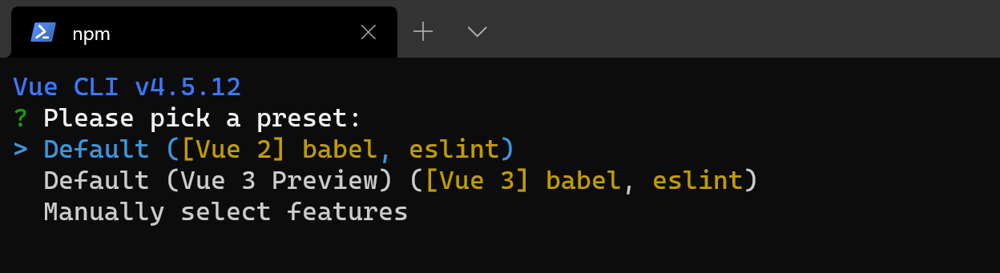
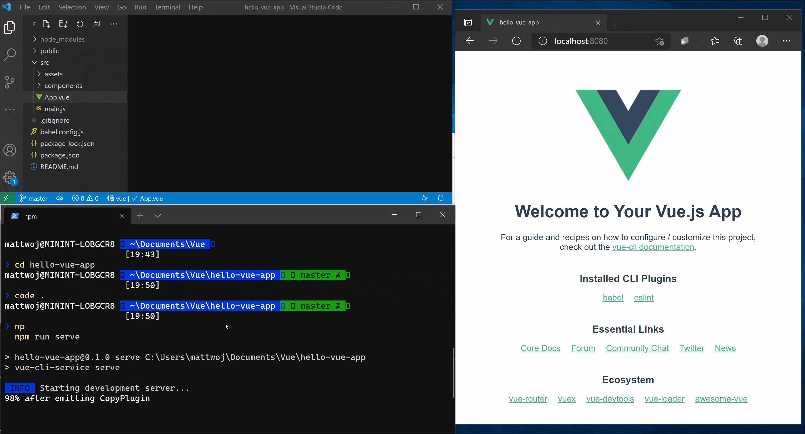

# Tutorial: Vue.js for Beginners

If you're brand new to using Vue.js, this guide will help you to get started with some basics.

- [Try the Vue.js HelloWorld code sandbox](https://codesandbox.io/s/github/vuejs/vuejs.org/tree/master/src/v2/examples/vue-20-hello-world)
- [Try using Node.js in Visual Studio Code](#try-nodejs-with-visual-studio-code)

## Prerequisites

- You must first install Vue.js on [Windows](./vue-on-windows.md) or on [Windows Subsystem for Linux](./vue-on-wsl.md).

## Try NodeJS with Visual Studio Code

If you don't already have it, [install VS Code](https://code.visualstudio.com/download). We recommend installing VS Code on Windows, regardless of whether you plan to use Vue on Windows or WSL.

1. Open your command line and create a new directory: `mkdir HelloVue`, then enter the directory: `cd HelloVue`

2. Install the Vue CLI: `npm install -g @vue/cli`

3. Create your Vue app: `vue create hello-vue-app`

    You'll need to choose whether to use [Vue 2  or Vue 3 Preview](https://v3.vuejs.org/guide/migration/introduction.html#overview), or manually select the features you want.

    

4. Open the directory of your new hello-vue-app: `cd hello-vue-app`

5. Try running you new Vue app in your web browser: `npm run serve`

    You should see "Welcome to your Vue.js App" on http://localhost:8080 in your browser. You can press `Ctrl+C` to stop the vue-cli-service server.

    > [!NOTE]
    > If using WSL (with Ubuntu or your favorite Linux distribution) for this tutorial, you'll need to make sure that you have the [Remote - WSL Extension](https://marketplace.visualstudio.com/items?itemName=ms-vscode-remote.remote-wsl) installed for the best experience running and editing your code with VS remote server.

6. Try updating the welcome message by opening your Vue app's source code in VS Code, enter: `code .`

7. VS Code will launch and display your Vue application in the File Explorer. Run your app in the terminal again with `npm run serve` and have your web browser open to the localhost so that you can see the Vue page welcome page displayed. Find the `App.vue` file in VS Code. Try changing "Welcome to your Vue.js App" to "Welcome to the Jungle!". You will see your Vue app "hot reload" as soon as you save your change.

    

## Additional resources

- [Using Vue in Visual Studio Code](https://code.visualstudio.com/docs/nodejs/vuejs-tutorial): Find more about using Vue with VS Code, including the Vetur extension that provides Vue syntax highlighting, IntelliSense, debugging support, and more.

- [Vue.js docs](https://vuejs.org/v2/guide/#What-is-Vue-js)

- [Vue comparison with other frameworks like React or Angular](https://vuejs.org/v2/guide/comparison.html)

- [Vue.js overview](./vue-overview.md)

- [Take your first steps with Vue.js](/training/paths/vue-first-steps/) learning path
