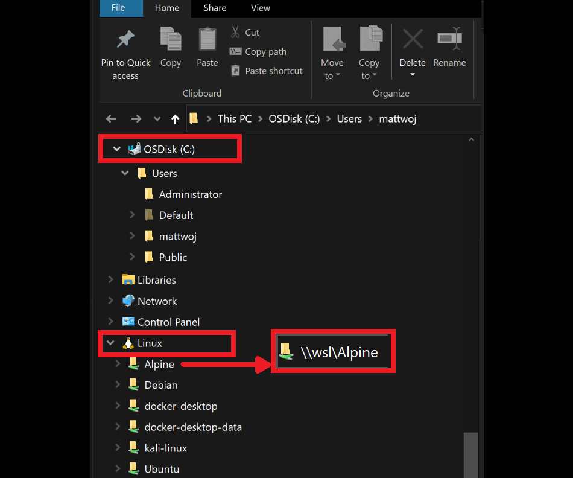

# Should I install on Windows or Windows Subsystem for Linux?

The first decision you will need to make when getting started with JavaScript on Windows 10 is whether to install your chosen framework directly on Windows or on the Windows Subsystem for Linux (WSL). If you're not familiar with WSL, it enables you to run a Linux distribution of your choice and use a BASH command line right from your Windows 10 machine. [Learn more about WSL](/windows/wsl/about).

## Install on Windows

If you are new to developing with JavaScript and just want to learn some of the basics of working with Node.js, React, or Angular, you can get up and running most quickly by installing directly on Windows. These frameworks will work just fine on Windows, but there may be cases in which even a beginner may want to consider installing on WSL. For example, if you prefer to use a Bash command line in order to follow instructions from a tutorial written for MacOS or Linux users and don't want to go through the trouble of translating the commands or installers into the Windows equivalent.

## Install on Windows Subsystem for Linux

When working with JavaScript-based frameworks in a professional capacity, we recommend WSL as it currently supports better performance speed, system call compatibility, and alignment between your local development environment and deployment environment (which is often a Linux server). WSL enables you to leverage Linux workspaces and avoid having to maintain both Linux and Windows build scripts. Running [Docker containers](/windows/wsl/tutorials/wsl-containers) is often a better experience via WSL as well. Specifically, WSL 2 (the updated version) will typically work best with JavaScript frameworks.

> [!IMPORTANT]
> Installing a Linux distribution with WSL will create a directory for storing files: `\\wsl\Ubuntu-20.04` (substitute Ubuntu-20.04 with whatever Linux distribution you're using). To open this directory in Windows File Explorer: Open your WSL command line, select your home directory using `cd ~`, then enter the command `explorer.exe .` **Be careful not to save your tools and files in different file systems!** If you are working in a Linux distribution, install your tools (NodeJS, package managers, etc) on your `\\wsl\` drive... **NOT** on your mounted C drive (`/mnt/c/Users/yourname$`). Doing so will work, but will significantly slow down your install and build times and may cause confusion.

