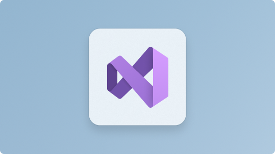
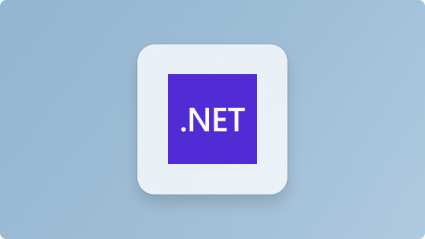

# More tools and resources

The following tools and resources can help you get started with Windows development. You can also check out the [Windows Dev Center](https://developer.microsoft.com/windows/) for more resources, including documentation, samples, and SDKs.

## More for developers

:::row:::
    :::column:::
        
        **[VS Code](https://code.visualstudio.com/docs)** 
        A lightweight source code editor with built-in support for JavaScript, TypeScript, Node.js, a rich ecosystem of extensions (C++, C#, Java, Python, PHP, Go) and runtimes (such as .NET and Unity). 
        [Install VS Code](https://code.visualstudio.com/download)
    :::column-end:::
    :::column:::
        
        **[Visual Studio](/visualstudio/windows/)** 
        An integrated development environment that you can use to edit, debug, build code, and publish apps, including compilers, intellisense code completion, and many more features. 
        [Install Visual Studio](/visualstudio/install/install-visual-studio)
    :::column-end:::
    :::column:::
        
        **[Azure](/azure/guides/developer/azure-developer-guide)** 
        A complete cloud platform to host your existing apps and streamline new development. Azure services integrate everything you need to develop, test, deploy, and manage your apps. 
        [Set up an Azure account](https://azure.microsoft.com/free/)
    :::column-end:::
    :::column:::
        
        **[.NET](/dotnet/standard/get-started/)** 
        An open source development platform with tools and libraries for building any type of app, including web, mobile, desktop, gaming, IoT, cloud, and microservices. 
        [Install .NET](https://dotnet.microsoft.com/download)
    :::column-end:::
:::row-end:::

 

## Run Windows and Linux

Windows Subsystem for Linux (WSL) allows developers to run a Linux operating system right alongside Windows. Both share the same hard drive (and can access each other’s files), the clipboard supports copy-and-paste between the two naturally, there's no need for dual-booting. WSL enables you to use BASH and will provide the kind of environment most familiar to Mac users.

Learn more in the [WSL docs](/windows/wsl).

> [!VIDEO https://learn.microsoft.com/shows/One-Dev-Minute/What-can-I-do-with-WSL--One-Dev-Question/player?format=ny]

You can also use Windows Terminal to open all of your favorite command line tools in the same window with multiple tabs, or in multiple panes, whether that's PowerShell, Windows Command Prompt, Ubuntu, Debian, Azure CLI, Oh-my-Zsh, Git Bash, or all of the above.

Learn more in the [Windows Terminal docs](/windows/terminal).

> [!VIDEO https://learn.microsoft.com/shows/One-Dev-Minute/What-are-the-main-features-of-the-new-Terminal--One-Dev-Question/player?format=ny]

## Transitioning between Mac and Windows

Check out our [guide to transitioning between a Mac and Windows](./mac-to-windows.md) (or Windows Subsystem for Linux) development environment. It can help you map the difference between:

- [Keyboard shortcuts](./mac-to-windows.md#keyboard-shortcuts)
- [Trackpad shortcuts](./mac-to-windows.md#trackpad-shortcuts)
- [Terminal and shell tools](./mac-to-windows.md#command-line-shells-and-terminals)
- [Apps and utilities](./mac-to-windows.md#apps-and-utilities)

## Game development documentation

- [Microsoft's Game Dev documentation](/gaming/)

