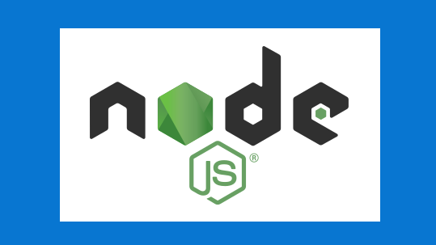
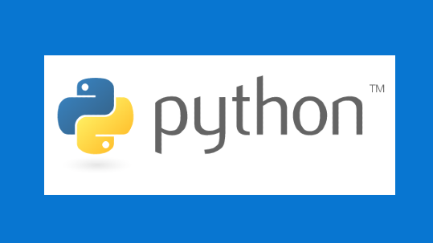
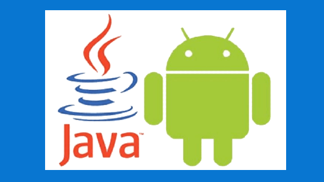
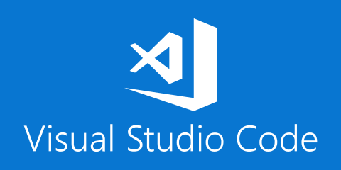
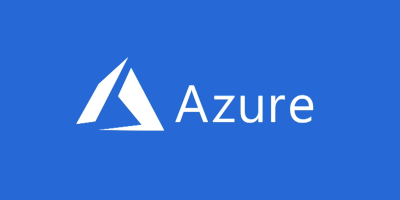

# Set up your Windows 10 development environment

This guide will help you get started with installing and setting up the languages and tools you need to develop on Windows or Windows Subsystem for Linux.

## Developer paths

:::row:::
    :::column:::
        
        **[Get started with NodeJS](https://docs.microsoft.com/windows/nodejs)** 
        Install NodeJS and get your development environment setup on Windows or Windows Subsystem for Linux.
    :::column-end:::
    :::column:::
        
        **[Get started with Python](https://docs.microsoft.com/windows/python)** 
        Install Python and get your development environment setup on Windows or Windows Subsystem for Linux.
    :::column-end:::
    :::column:::
        
        **[Get started with Android](https://docs.microsoft.com/windows/android)** 
        Install Android Studio, or choose to use a cross-platform solution like Xamarin, React, or Cordova (Ionic/PhoneGap), and get your development environment setup on Windows.
    :::column-end:::
    :::column:::
        
        **[Get started with C#](https://docs.microsoft.com/dotnet/csharp/)** 
        [Install C# support for Visual Studio Code](https://code.visualstudio.com/docs/languages/csharp) and get your development environment setup on Windows.
    :::column-end:::
:::row-end:::

## Developer tools

:::row:::
    :::column:::
        
        **[Windows Subsystem for Linux](https://docs.microsoft.com/windows/wsl/)** 
        Use your favorite Linux distribution fully integrated with Windows (no more need for dual-boot).
    :::column-end:::
    :::column:::
        
        **[Windows Terminal](https://docs.microsoft.com/windows/terminal/)** 
        Customize your terminal environment to work with multiple command line shells.
    :::column-end:::
    :::column:::
        
        **[Windows Package Manager](https://docs.microsoft.com/windows/package-manager/)** 
        Use the comprehensive package manager solution that consists of a command line tool and set of services for installing applications on Windows 10.
    :::column-end:::
    :::column:::
        
        **[Windows PowerToys](https://github.com/microsoft/PowerToys)** 
        A set of utilities for power users to tune and streamline their Windows experience for greater productivity.
    :::column-end:::
:::row-end:::

## Developer platforms

:::row:::
    :::column:::
        
        **[VS Code](https://code.visualstudio.com/docs)** 
        [Install VS Code](https://code.visualstudio.com/download), a lightweight but powerful source code editor with built-in support for JavaScript, TypeScript, Node.js, a rich ecosystem of extensions (C++, C#, Java, Python, PHP, Go) and runtimes (such as .NET and Unity).
    :::column-end:::
    :::column:::
        
        **[Azure](https://docs.microsoft.com/azure/guides/developer/azure-developer-guide)** 
        [Set up an Azure account](https://azure.microsoft.com/free/) and try the complete cloud platform that can host your existing applications and streamline new application development.
    :::column-end:::
    :::column:::
        
        **[.NET](https://dotnet.microsoft.com/)** 
        [Install .NET](https://dotnet.microsoft.com/download), the developer platform with tools and libraries for building any type of app, including web, mobile, desktop, gaming, IoT, cloud, and microservices.
    :::column-end:::
    :::column:::
        
        **[PowerShell](https://docs.microsoft.com/powershell/)** 
        [Install PowerShell](https://docs.microsoft.com/powershell/scripting/install/installing-powershell?view=powershell-7), the cross-platform task automation and configuration management framework, consisting of a command-line shell and scripting language.
    :::column-end:::
:::row-end:::

 

---

 

## Developer tips

What are the top tips users need to know about?

* Adding Windows Defender exclusions?
* Guidance on where to store project files when working between Windows and WSL file systems?
* Other stuff to change that slows down or annoys devs using Windows 10?

## Transitioning between Mac and Windows

Read our [guide to transitioning between between a Mac and Windows](https://docs.microsoft.com/windows/dev-environment/mac-to-windows) (or Windows Subsystem for Linux) development environment, including [keyboard shortcuts](https://docs.microsoft.com/windows/dev-environment/mac-to-windows#keyboard-shortcuts), [trackpad shortcuts](https://docs.microsoft.com/windows/dev-environment/mac-to-windows#trackpad-shortcuts), [terminal and shell equivalents](https://docs.microsoft.com/windows/dev-environment/mac-to-windows#terminal-and-shell), and [equivalent apps and utilities](https://docs.microsoft.com/windows/dev-environment/mac-to-windows#apps-and-utilities).

## Additional resources

* [Microsoft Edge web browser docs](https://docs.microsoft.com/microsoft-edge/)
* [Try WebHint to improve your website](https://webhint.io/)
* [Check out Microsoft Graph](https://docs.microsoft.com/graph/)
* [Microsoft's Game Stack documentation](https://docs.microsoft.com/gaming/)