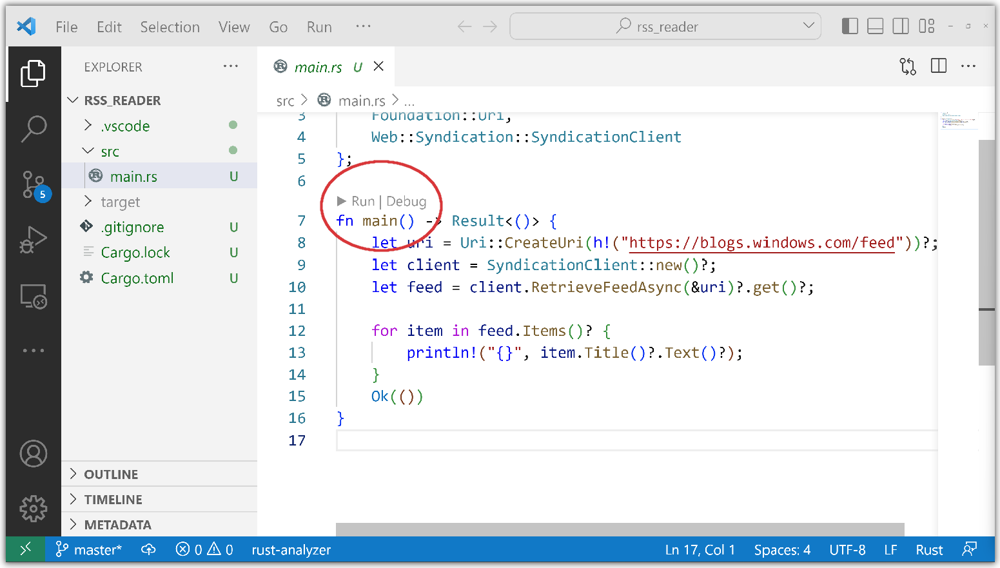

# RSS reader tutorial (Rust for Windows with VS Code)

The previous topic introduced [Rust for Windows, and the windows crate](rust-for-windows.md).

Now let's try out Rust for Windows by writing a simple console app that downloads the titles of blog posts from a Really Simple Syndication (RSS) feed.

1. Launch a command prompt (`cmd.exe`), and `cd` to a folder where you want to keep your Rust projects.

2. Using Cargo, create a new Rust project named *rss_reader*, and `cd` to the newly-created folder:

    ```console
    > cargo new rss_reader
    >     Created binary (application) `rss_reader` package
    > cd rss_reader
    ```

3. Then open the *rss_reader* project in VS Code.

    ```console
    code .
    ```

4. Let's implement the main *rss_reader* project. First, open the `Cargo.toml` file at the root of the project. A `Cargo.toml` file is a text file that describes a Rust project, including any dependencies it has.

    Add a dependency on the *windows* crate, as shown in the listing below. The *windows* crate is large. To keep build times fast, we'll select just the `Foundation_Collections` and `Web_Syndication` features that we need for this code.

    ```toml
    # Cargo.toml
    ...

    [dependencies.windows] 
    version = "0.43.0"
    features = [
        "Foundation_Collections",
        "Web_Syndication",
    ]
    ```

5. Then, open the *rss_reader* project's `src/main.rs` source code file. There you'll find the Cargo default "Hello, world!" code. Add the following **use** statement to the beginning of `main.rs`:

    ```rust
    // src\main.rs
    use windows::{
        core::*,
        Foundation::Uri,
        Web::Syndication::SyndicationClient
    };

    fn main() {
        println!("Hello, world!");
    }
    ```

    The **use** declaration shortens the path to the types that we'll be using. There's the **Uri** type that we mentioned earlier.

6. To create a new [**Uri**](/uwp/api/windows.foundation.uri), replace Cargo's default **main** function with this:

    ```rust
    // src\main.rs
    ...

    fn main() -> Result<()> {
        let uri = Uri::CreateUri(h!("https://blogs.windows.com/feed"))?;

        Ok(())
    }
    ```

    Notice that the return type of the **main** function is a **Result**, from **windows::core::**. That will make things easier, as it's common to deal with errors from operating system (OS) APIs. **windows::core::Result** helps us with error propagation, and concise error handling.

    You can see the question-mark operator at the end of the line of code. To save on typing, we do that to use Rust's error-propagation and short-circuiting logic. That means we don't have to do a bunch of manual error handling for this simple example. For more info about this feature of Rust, see [The ? operator for easier error handling](https://doc.rust-lang.org/edition-guide/rust-2018/error-handling-and-panics/the-question-mark-operator-for-easier-error-handling.html).

    Also notice the **h!** macro from the *windows* crate. We use that to construct an **HSTRING** reference from a Rust string literal. The WinRT API uses **HSTRING** extensively for string values.

7. To download the RSS feed, we'll create a new **SyndicationClient**.

    ```rust
    // src\main.rs
    ...

    fn main() -> windows::core::Result<()> {
        let uri = Uri::CreateUri(h!("https://blogs.windows.com/feed"))?;
        let client = SyndicationClient::new()?;

        Ok(())
    }
    ```

    The **new** function is a Rust constructor. All objects in the *windows* crate follow the Rust convention and name their constructors **new**.

8. Now we can use the **SyndicationClient** to retrieve the feed.

    ```rust
    // src\main.rs
    ...

    fn main() -> windows::core::Result<()> {
        let uri = Uri::CreateUri(h!("https://blogs.windows.com/feed"))?;
        let client = SyndicationClient::new()?;
        let feed = client.RetrieveFeedAsync(&uri)?.get()?;

        Ok(())
    }
    ```

    Because [**RetrieveFeedAsync**](/uwp/api/windows.web.syndication.syndicationclient.retrievefeedasync) is an asynchronous API, we use the blocking **get** function to keep the example simple. Alternatively, we could use the `await` operator within an `async` function to cooperatively wait for the results. A more complex app with a graphical user interface will frequently use `async`.

9. Now we can iterate over the resulting items, and let's print out just the titles. You'll also see a few extra lines of code below to set a user-agent header, since some RSS feeds require that.

    ```rust
    // src\main.rs
    ...

    fn main() -> windows::core::Result<()> {
        let uri = Uri::CreateUri(h!("https://blogs.windows.com/feed"))?;
        let client = SyndicationClient::new()?;

        client.SetRequestHeader(
            h!("User-Agent"),
            h!("Mozilla/5.0 (compatible; MSIE 10.0; Windows NT 6.2; WOW64; Trident/6.0)"),
        )?;

        let feed = client.RetrieveFeedAsync(&uri)?.get()?;

        for item in feed.Items()? {
            println!("{}", item.Title()?.Text()?);
        }

        Ok(())
    }
    ```

10. Now let's confirm that we can build and run by clicking **Run** > **Run Without Debugging** (or pressing **Ctrl+F5**). If you see any unexpected messages, then make sure you've successfully completed the [Hello, world! tutorial (Rust with VS Code)](/windows/dev-environment/rust/setup#hello-world-tutorial-rust-with-vs-code).

    There are also **Debug** and **Run** commands embedded inside the text editor. Alternatively, from a command prompt in the `rss_reader` folder, type `cargo run`, which will build and then run the program.

    

    Down in the VS Code **Terminal** pane, you can see that Cargo successfully downloads and compiles the **windows** crate, caching the results, and using them to make subsequent builds complete in less time. It then builds the sample, and runs it, displaying a list of blog post titles.

    

That's as simple as it is to program Rust for Windows. Under the hood, however, a lot of love goes into building the tooling so that Rust can both parse `.winmd` files based on [ECMA-335](https://www.ecma-international.org/publications-and-standards/standards/ecma-335/) (Common Language Infrastructure, or CLI), and also faithfully honor the COM-based application binary interface (ABI) at run-time with both safety and efficiency in mind.

## Showing a message box

We did say that Rust for Windows lets you call any Windows API (past, present, and future). So in this section we'll show a couple of Windows message boxes.

1. Just like we did for the RSS project, at the command prompt `cd` to the folder with your Rust projects.

2. Create a new project named *message_box*, and open it in VS Code:

    ```console
    > cargo new message_box
    >     Created binary (application) `message_box` package
    > cd message_box
    > code .
    ```

2. In VS Code, open the `Cargo.toml`, and add the Windows dependencies for this project:

   ```rust
    # message_box\Cargo.toml
    ...

    [dependencies.windows]
    version = "0.43.0"
    features = [
        "Win32_Foundation",
        "Win32_UI_WindowsAndMessaging",
    ]
    ```

3. Now open the project's `src/main.rs` file, and add the `use` declarations with the new namespaces (as shown below). And finally add code to call the [**MessageBoxA**](/windows/win32/api/winuser/nf-winuser-messageboxa) and [**MessageBoxW**](/windows/win32/api/winuser/nf-winuser-messageboxw) functions. The Windows API docs are mainly written with C/C++ in mind, so it's useful to compare the API docs to the docs for the Rust projections in the *windows* crate: [**MessageBoxA** (Rust)](https://microsoft.github.io/windows-docs-rs/doc/windows/Win32/UI/WindowsAndMessaging/fn.MessageBoxA.html) and [**MessageBoxW** (Rust)](https://microsoft.github.io/windows-docs-rs/doc/windows/Win32/UI/WindowsAndMessaging/fn.MessageBoxW.html).

    ```rust
    // src\main.rs
    use windows::{
        core::*,
        Win32::UI::WindowsAndMessaging::*
    };

    fn main() {
        unsafe {
            MessageBoxA(None, s!("Ansi"), s!("World"), MB_OK);
            MessageBoxW(None, w!("Wide"), w!("World"), MB_OK);
        }
    }
    ```

    As you can see, we must use these Win32 APIs in an `unsafe` block (see [Unsafe blocks](https://doc.rust-lang.org/reference/unsafe-blocks.html)). Also note the **s!** and **w!** macros, which create **LPCSTR** and **LPCWSTR** arguments from Rust UTF-8 string literals; much like we created an **HSTRING** with the **h!** macro for *rss_reader*. Rust is natively Unicode with UTF-8 strings, so using the wide Unicode (W-suffix) Windows APIs is preferred over the ANSI (A-suffix) APIs. This can be important if you use non-English text in your code.

This time when you build and run, Rust displays two Windows message boxes.

## Related

* [Rust for Windows, and the windows crate](rust-for-windows.md)
* [ECMA-335](https://www.ecma-international.org/publications-and-standards/standards/ecma-335/)
* [The ? operator for easier error handling](https://doc.rust-lang.org/edition-guide/rust-2018/error-handling-and-panics/the-question-mark-operator-for-easier-error-handling.html)
* [Unsafe blocks](https://doc.rust-lang.org/reference/unsafe-blocks.html)
