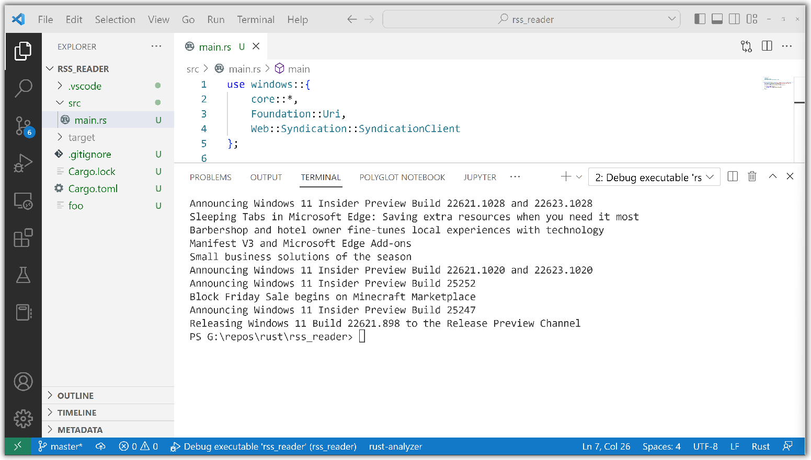

# RSS reader tutorial (Rust for Windows with VS Code)

The previous topic introduced [Rust for Windows, and the windows crate](rust-for-windows.md).

Now let's try out Rust for Windows by writing a simple app that downloads the titles of blog posts from a Really Simple Syndication (RSS) feed.

1. Launch a command prompt (`cmd.exe`), and `cd` to a folder where you want to keep your Rust projects.

2. Then, via Cargo, create a new Rust project named *rss_reader*, and `cd` into the project's newly-created folder.

    ```console
    cargo new rss_reader
    cd rss_reader
    ```

3. Now&mdash;again via Cargo&mdash;we're going to create a new sub-project named *bindings*. As you can see in the command below, this new project is a library, and it's going to serve as the medium through which we bind to the Windows APIs that we want to call. At build time, the *bindings* library sub-project will build into a *crate* (which is Rust's term for a binary or a library). We'll be consuming that crate from within the *rss_reader* project, as we'll see.

    ```console
    cargo new --lib bindings
    ```

    Making *bindings* a nested crate means that when we build *rss_reader*, *bindings* will be able to cache the results of any bindings we import.

4. Then open the *rss_reader* project in VS Code.

    ```console
    code .
    ```

5. Let's work on the *bindings* library first.

    In VS Code's Explorer, open the `bindings` > `Cargo.toml` file.

    

    A `Cargo.toml` file is a text file that describes a Rust project, including any dependencies it has.

    Right now, the `dependencies` section is empty. So now edit that section (and also add a `[build-dependencies]` section) so that it looks like this.

    ```toml
    # bindings\Cargo.toml
    ...

    [dependencies]
    windows="0.9.1"

    [build-dependencies]
    windows="0.9.1"
    ```

    We've just added a dependency on the *windows* crate, both for the *bindings* library and for its build script. That allows Cargo to download, build, and cache Windows support as a package. Set the version number to whatever the latest version is&mdash;you'll be able to see that on the web page for [the windows crate](https://crates.io/crates/windows).

6. Now we can add the build script itself; this is where we'll generate the bindings that we'll ultimately rely on. In VS Code, right-click the *bindings* folder, and click **New File**. Type in the name *build.rs*, and press **Enter**. Edit `build.rs` to look like this.

    ```rust
    // bindings\build.rs
    fn main() {
        windows::build!(
            Windows::Foundation::Collections::IVector,
            Windows::Foundation::{IAsyncOperationWithProgress, Uri},

            Windows::Web::Syndication::{
                ISyndicationText, RetrievalProgress, SyndicationClient, SyndicationFeed, SyndicationItem,
            },
        );
    }
    ```

    The `windows::build!` macro takes care of resolving any dependencies in the form of `.winmd` files, and generating bindings for selected types directly from metadata. We *could* have asked for an entire namespace (with `Windows::Web::Syndication::*`). But here we're asking for bindings to be generated only for the particular types we specify (such as [**SyndicationClient**](/uwp/api/windows.web.syndication.syndicationclient)). In this way, you can import as little or as much as you need, and avoid waiting for code to be generated and compiled for things that you'll never need.
   
    As well as the types that we'll be using explicitly, we also specify all of their dependencies. For example, we'll be using a method of **SyndicationClient** that expects a parameter of type [**Uri**](/uwp/api/windows.foundation.uri). So in the *build* macro we also include the definition for **Windows::Foundation::Uri** so that we can call that method. Other types are part of the **windows** crate itself. For example, **windows::Result** (which we'll see in use soon) is defined by the *windows* crate, so it's always available. Note the lower-case **windows** in **windows::Result**, as compared to the Pascal-cased namespace and type names for Windows types.

7. Open the `bindings` > `src` > `lib.rs` source code file. To include the bindings generated in the previous step, replace the default code that you'll find in `lib.rs` with the following.

    ```rust
    // bindings\src\lib.rs
    windows::include_bindings!();
    ```

    The `windows::include_bindings!` macro includes the source code that was generated in the previous step by the build script. Now, any time you need access to additional APIs, just list them in the build script (`build.rs`).

8. Let's now implement the main *rss_reader* project. First, open the `Cargo.toml` file at the root of the project, and add the following dependency on the inner *bindings* crate, along with a dependency on the *windows* crate.

    ```toml
    # Cargo.toml
    ...

    [dependencies] 
    bindings = { path = "bindings" }
    windows = "0.9.1"
    ```

9. Finally, open the *rss_reader* project's `src` > `main.rs` source code file. In there is the simple code that outputs a *Hello, world!* message. Add this code to the beginning of `main.rs`.

    ```rust
    // src\main.rs
    use bindings::{ 
        Windows::Foundation::Uri,
        Windows::Web::Syndication::SyndicationClient,
    };

    fn main() {
        println!("Hello, world!");
    }
    ```

    The `use` declaration shortens the path to the types that we'll be using. There's the **Uri** type that we mentioned earlier.

10. To create a new [**Uri**](/uwp/api/windows.foundation.uri), add this code into the **main** function.

    ```rust
    // src\main.rs
    ...

    fn main() -> windows::Result<()> {
        let uri = Uri::CreateUri("https://blogs.windows.com/feed")?;

        Ok(())
    }
    ```

    Notice that we're using **windows::Result** as the return type of the **main** function. This will make things easier, as it's common to deal with errors from operating system (OS) APIs. **windows::Result** helps us with error propagation, and concise error handling.

    You can see the question-mark operator at the end of the line of code that creates a **Uri**. To save on typing, we do that to make use of Rust's error-propagation and short-circuiting logic. That means we don't have to do a bunch of manual error handling for this simple example. For more info about this feature of Rust, see [The ? operator for easier error handling](https://doc.rust-lang.org/edition-guide/rust-2018/error-handling-and-panics/the-question-mark-operator-for-easier-error-handling.html).

11. To download this RSS feed, we'll create a new **SyndicationClient** object.

    ```rust
    // src\main.rs
    ...

    fn main() -> windows::Result<()> {
        let uri = Uri::CreateUri("https://blogs.windows.com/feed")?;
        let client = SyndicationClient::new()?;

        Ok(())
    }
    ```

    The **new** function is Rust's equivalent of the default constructor.

12. Now we can use the **SyndicationClient** object to retrieve the feed.

    ```rust
    // src\main.rs
    ...

    fn main() -> windows::Result<()> {
        let uri = Uri::CreateUri("https://blogs.windows.com/feed")?;
        let client = SyndicationClient::new()?;
        let feed = client.RetrieveFeedAsync(uri)?.get()?;

        Ok(())
    }
    ```

    Because [**RetrieveFeedAsync**](/uwp/api/windows.web.syndication.syndicationclient.retrievefeedasync) is an asynchronous API, we can use the blocking **get** function (as shown above). Alternatively, we could use the `await` operator within an `async` function (to cooperatively wait for the results), much as you would do in C# or C++.

13. Now we can simply iterate over the resulting items, and let's print out just the titles.

    ```rust
    // src\main.rs
    ...

    fn main() -> windows::Result<()> {
        let uri = Uri::CreateUri("https://blogs.windows.com/feed")?;
        let client = SyndicationClient::new()?;
        let feed = client.RetrieveFeedAsync(uri)?.get()?;

        for item in feed.Items()? {
            println!("{}", item.Title()?.Text()?);
        }

        Ok(())
    }
    ```

14. Now let's confirm that we can build and run by clicking **Run** > **Run Without Debugging** (or pressing **Ctrl+F5**). There are also **Debug** and **Run** commands embedded inside the text editor. Alternatively, you can submit the command `cargo run` from the command prompt (`cd` into the `rss_reader` folder first), which will build and then run.

    

    Down in the **Terminal** pane, you can see that Cargo successfully downloads and compiles the **windows** crate, caching the results, and using them to make subsequent builds complete in less time. It then builds the sample, and runs it, displaying a list of blog post titles.

    

That's as simple as it is to program Rust for Windows. Under the hood, however, a lot of love goes into building the tooling so that Rust can both parse `.winmd` files based on [ECMA-335](https://www.ecma-international.org/publications-and-standards/standards/ecma-335/) (Common Language Infrastructure, or CLI) at compile time, and also faithfully honor the COM-based application binary interface (ABI) at run-time with both safety and efficiency in mind.

## Showing a message box

We did say that Rust for Windows lets you call any Windows API (past, present, and future). So in this section we'll add code to show a Windows message box to the user.

1. Open the `bindings` > `build.rs` source code file, and add to the generated bindings the function shown below.

    ```rust
    // bindings\build.rs
    fn main() {
        windows::build!(
            ...
            Windows::Win32::UI::WindowsAndMessaging::MessageBoxA,
        );
    }
    ```

2. Next, open the project's `src` > `main.rs` source code file, and update the `use` declaration with the new namespace, or module. And finally add code to call the [**MessageBoxA**](/windows/win32/api/winuser/nf-winuser-messageboxa) function (also see [**MessageBoxA**](https://microsoft.github.io/windows-docs-rs/doc/bindings/Windows/Win32/UI/WindowsAndMessaging/fn.MessageBoxA.html) in the [Rust documentation for the Windows API](https://microsoft.github.io/windows-docs-rs/doc/bindings/Windows/), which includes a link to [**MESSAGEBOX_STYLE**](https://microsoft.github.io/windows-docs-rs/doc/bindings/Windows/Win32/UI/WindowsAndMessaging/struct.MESSAGEBOX_STYLE.html)).

    ```rust
    // src\main.rs
    use bindings::{ 
        Windows::Foundation::Uri,
        Windows::Web::Syndication::SyndicationClient,
        Windows::Win32::UI::WindowsAndMessaging::*,
    };

    fn main() {
        ...

        unsafe {
            MessageBoxA(None, "Text", "Caption", MB_OK);
        }

        Ok(())
    }
    ```

    As you can see, we mark these older Win32 APIs as `unsafe` (see [Unsafe blocks](https://doc.rust-lang.org/reference/unsafe-blocks.html)).

This time when you build and run, Rust displays a Windows message box after listing the blog post titles.

## Related

* [Rust for Windows, and the windows crate](rust-for-windows.md)
* [ECMA-335](https://www.ecma-international.org/publications-and-standards/standards/ecma-335/)
* [The ? operator for easier error handling](https://doc.rust-lang.org/edition-guide/rust-2018/error-handling-and-panics/the-question-mark-operator-for-easier-error-handling.html)
* [Unsafe blocks](https://doc.rust-lang.org/reference/unsafe-blocks.html)
