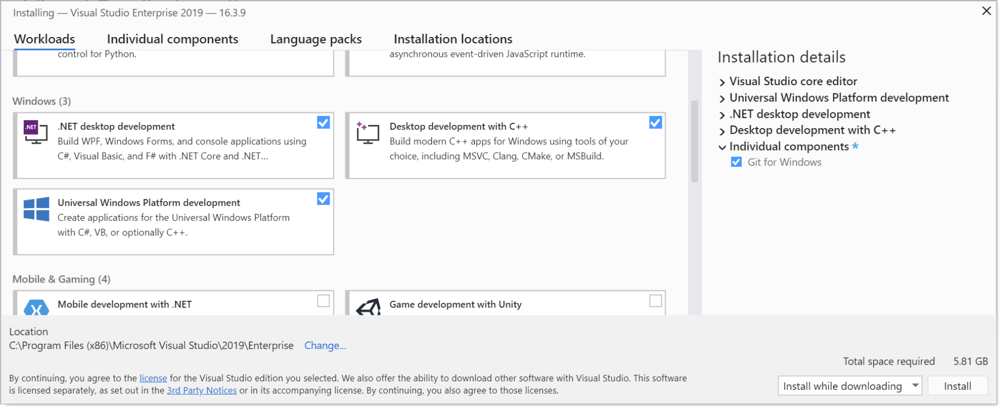

# Set up your dev environment on Windows for Rust

In the [Overview of developing on Windows with Rust](overview.md) topic, we introduced Rust and talked about what it is and what some of its main moving parts are. In this topic, we'll set up our development environment.

We recommend that you do your Rust development on Windows. However, if you plan to locally compile and test on Linux, then developing with Rust on the [Windows Subsystem for Linux (WSL)](/windows/wsl/about) is also an option.

## Install Visual Studio (recommended) or the Microsoft C++ Build Tools

On Windows, Rust requires certain C++ build tools.

You can either download the [Microsoft C++ Build Tools](https://visualstudio.microsoft.com/visual-cpp-build-tools/), or (recommended) you might prefer just to install [Microsoft Visual Studio](https://visualstudio.microsoft.com/downloads/).

> [!IMPORTANT]
> Use of the Microsoft C++ Build Tools, or Visual Studio Build Tools, requires a valid Visual Studio license (either Community, Pro, or Enterprise).

> [!NOTE]
> We'll be using Visual Studio Code as our integrated development environment (IDE) for Rust, and not Visual Studio. But you can still install Visual Studio without expense. A Community edition is available&mdash;it's free for students, open-source contributors, and individuals.

While installing Visual Studio, there are several Windows workloads that we recommend you select&mdash;**.NET desktop development**, **Desktop development with C++**, and **Universal Windows Platform development**. You might not think that you'll need all three, but it's likely enough that some dependency will arise where they're required that we feel it's just simpler to select all three.

New Rust projects default to using Git. So also add the individual component **Git for Windows** to the mix (use the search box to search for it by name).



## Install Rust

Next, [install Rust from the Rust website](https://www.rust-lang.org/tools/install). The website detects that you're running Windows, and it offers you 64- and 32-bit installers of the `rustup` tool for Windows, as well as instructions on installing Rust to the [Windows Subsystem for Linux (WSL)](/windows/wsl/about).

> [!TIP]
> Rust works very well on Windows; so there's no need for you to go the WSL route (unless you plan to locally compile and test on Linux). Since you have Windows, we recommend that you just run the `rustup` installer for 64-bit Windows. Also install the Microsoft C and C++ (MSVC) toolchain by running `rustup default stable-msvc`. You'll then be all set to write apps *for* Windows using Rust.

When the Rust installer is finished, you'll be ready to program with Rust. You won't have a convenient IDE yet (we'll cover that in the next section&mdash;[Install Visual Studio Code](#install-visual-studio-code)). And you're not yet set up to call Windows APIs. But you could launch a command prompt (`cmd.exe`), and perhaps issue the command `cargo --version`. If you see a version number printed, then that confirms that Rust installed correctly.

If you're curious about the use of the `cargo` keyword above, *Cargo* is the name of the tool in the Rust development environment that manages and builds your projects (more properly, *packages*) and their dependencies.

And if you really do want to dive in to some programming at this point (even without the convenience of an IDE), then you could read the [Hello, World!](https://doc.rust-lang.org/book/ch01-02-hello-world.html) chapter of The Rust Programming Language book on the Rust website.

## Install Visual Studio Code

By using Visual Studio Code (VS Code) as your text editor/integrated development environment (IDE), you can take advantage of language services such as code completion, syntax highlighting, formatting, and debugging.

VS Code also contains a [built-in terminal](https://code.visualstudio.com/docs/editor/integrated-terminal) that enables you to issue command-line arguments (to issue commands to Cargo, for example).

1. First, download and install [Visual Studio Code for Windows](https://code.visualstudio.com).

2. After you've installed VS Code, install the **rust-analyzer** *extension*. You can either install the [rust-analyzer extension from the Visual Studio Marketplace](https://marketplace.visualstudio.com/items?itemName=matklad.rust-analyzer), or you can open VS Code, and search for **rust-analyzer** in the extensions menu (Ctrl+Shift+X).

3. For debugging support, install the **CodeLLDB** extension. You can either install the [CodeLLDB extension from the Visual Studio Marketplace](https://marketplace.visualstudio.com/items?itemName=vadimcn.vscode-lldb), or you can open VS Code, and search for **CodeLLDB** in the extensions menu (Ctrl+Shift+X).

   > [!NOTE]
   > An alternative to the **CodeLLDB** extension for debugging support is the Microsoft **C/C++** extension. The **C/C++** extension doesn't integrate as well with the IDE as **CodeLLDB** does. But the **C/C++** extension provides superior debugging information. So you might want to have that standing by in case you need it.
   >
   > You can either install the [C/C++ extension from the Visual Studio Marketplace](https://marketplace.visualstudio.com/items?itemName=ms-vscode.cpptools), or you can open VS Code, and search for **C/C++** in the extensions menu (Ctrl+Shift+X).

4. If you want to open the terminal in VS Code, select **View** > **Terminal**, or alternatively use the shortcut **Ctrl+`** (using the backtick character). The default terminal is PowerShell.

## Hello, world! tutorial (Rust with VS Code)

Let's take Rust for a spin with a simple "Hello, world!" app.

1. First, launch a command prompt (`cmd.exe`), and `cd` to a folder where you want to keep your Rust projects.

2. Then ask Cargo to create a new Rust project for you with the following command.

   ```console
   cargo new first_rust_project
   ```

   The argument you pass to the `cargo new` command is the name of the project that you want Cargo to create. Here, the project name is *first_rust_project*. The recommendation is that you name your Rust projects using snake case (where words are lower-case, with each space replaced by an underscore).

   Cargo creates a project for you with the name that you supply. And in fact Cargo's new projects contain the source code for a very simple app that outputs a *Hello, world!* message, as we'll see. In addition to creating the *first_rust_project* project, Cargo has created a folder named *first_rust_project*, and has put the project's source code files in there.

3. So now `cd` into that folder, and then launch VS Code from within the context of that folder.

   ```console
   cd first_rust_project
   code .
   ```

4. In VS Code's Explorer, open the `src` > `main.rs` file, which is the Rust source code file that contains your app's entry point (a function named **main**). Here's what it looks like.

   ```rust
   // main.rs
   fn main() {
     println!("Hello, world!");
   }
   ```

   > [!NOTE]
   > When you open the first `.rs` file in VS Code, you'll get a notification saying that some Rust components aren't installed, and asking whether you want to install them. Click **Yes**, and VS Code will install the Rust language server.

   You can tell from glancing at the code in `main.rs` that **main** is a function definition, and that it prints the string "Hello, world!". For more details about the syntax, see [Anatomy of a Rust Program](https://doc.rust-lang.org/book/ch01-02-hello-world.html#anatomy-of-a-rust-program) on the Rust website.

5. Now let's try running the app under the debugger. Put a breakpoint on line 2, and click **Run** > **Start Debugging** (or press **F5**). There are also **Debug** and **Run** commands embedded inside the text editor.

   > [!NOTE]
   > When you run an app under the **CodeLLDB** extension and debugger for the first time, you'll see a dialog box saying "Cannot start debugging because no launch configuration has been provided". Click **OK** to see a second dialog box saying "Cargo.toml has been detected in this workspace. Would you like to generate launch configurations for its targets?". Click **Yes**. Then close the launch.json file and begin debugging again.

6. As you can see, the debugger breaks at line 2. Press **F5** to continue, and the app runs to completion. In the **Terminal** pane, you'll see the expected output "Hello, world!".

## Rust for Windows

Not only can you use Rust *on* Windows, you can also write apps *for* Windows using Rust. Via the *windows* crate, you can call any Windows API past, present, and future. There are more details about that, and code examples, in the [Rust for Windows, and the windows crate](rust-for-windows.md) topic.

## Related

* [Rust for Windows, and the windows crate](rust-for-windows.md)
* [Windows Subsystem for Linux (WSL)](/windows/wsl/about)
* [Microsoft C++ Build Tools](https://visualstudio.microsoft.com/visual-cpp-build-tools/)
* [Microsoft Visual Studio](https://visualstudio.microsoft.com/downloads/)
* [Visual Studio Code for Windows](https://code.visualstudio.com)
* [rust-analyzer extension](https://marketplace.visualstudio.com/items?itemName=matklad.rust-analyzer)
* [CodeLLDB extension](https://marketplace.visualstudio.com/items?itemName=vadimcn.vscode-lldb)
* [C/C++ extension](https://marketplace.visualstudio.com/items?itemName=ms-vscode.cpptools)
