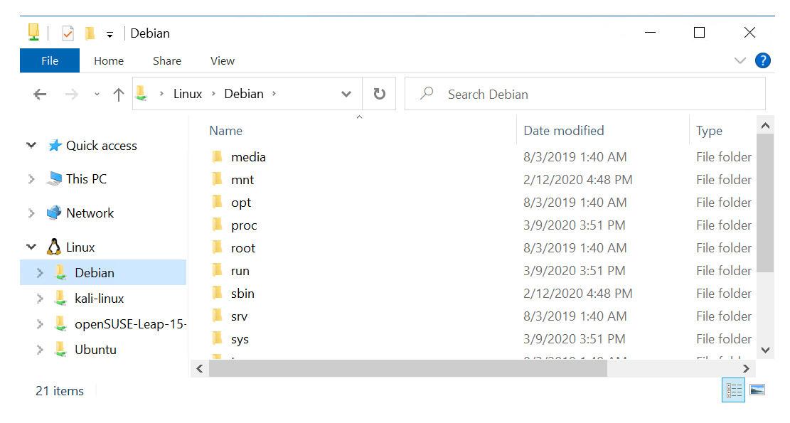

# Tips for improving performance and development workflows

We've gathered a few tips that we hope will help to make your workflow more efficient and enjoyable. Do you have additional tips to share? File a pull request, using the "Edit" button above, or an issue, using the "Feedback" button below and we may add it to the list.

## Use shortcuts to open a project in VS Code or Windows File Explorer

You can launch VS Code from your command line into the project that you have open by using the command: `code .` or open your project directory from the command line with Windows File Explorer using `explorer.exe .` from Windows or your WSL distribution. You may need to add the VS Code executable to your PATH environment variable if this doesn't work by default. Learn more about [Launching from the Command Line](https://code.visualstudio.com/docs/editor/command-line#_launching-from-command-line).



## Use the Credential Manager to your streamline authentication process

If you're using Git for version control and collaboration, you can streamline your authentication process by [setting up Git Credential Manager](/windows/wsl/tutorials/wsl-git#git-credential-manager-setup) to store your tokens in the Windows Credential Manager. We also recommend [adding a .gitignore file](/windows/wsl/tutorials/wsl-git#adding-a-git-ignore-file) to your project.

## Use WSL for testing your production pipeline before deploying to the cloud

The Windows Subsystem for Linux lets developers run a GNU/Linux environment -- including most command-line tools, utilities, and applications -- directly on Windows, unmodified, without the overhead of a traditional virtual machine or dualboot setup.

WSL targets a developer audience with the intent to be used as part of an inner development loop. Let's say that Sam is creating a CI/CD pipeline (Continuous Integration & Continuous Delivery) and wants to test it first on a local machine (laptop) before deploying it to the cloud. Sam can enable WSL (& WSL 2 to improve speed and performance), and then use a genuine Linux Ubuntu instance locally (on the laptop) with whatever Bash commands and tools they prefer. Once the development pipeline is verified locally, Sam can then push that CI/CD pipeline up to the cloud (ie Azure) by making it into a Docker container and pushing the container to a cloud instance where it runs on a production-ready Ubuntu VM.

For more ways to use WSL, check out this [Tabs vs Spaces episode on WSL 2](https://channel9.msdn.com/Shows/Tabs-vs-Spaces/WSL2-Code-faster-on-the-Windows-Subsystem-for-Linux).

## Improve performance speed for WSL by not crossing over file systems

If you're working with both Windows and Windows Subsystem for Linux, you have two file systems installed: NTSF (Windows) and WSL (your Linux distro). For fast performance, ensure that your project files are stored in the same system as the tools you're using. Learn more about [choosing the correct file system for faster performance](/windows/wsl/compare-versions#use-the-linux-file-system-for-faster-performance).

## Improve build speeds by adding Windows Defender exclusions

You can improve your build speed by updating your Windows Defender settings to add exclusions for project folders or file types that you trust enough to avoid scanning for security threats. Learn more about how to [Update Windows Defender settings to improve performance](../android/defender-settings.md).


## Launch all your command lines in Windows Terminal at once

* You can launch multiple command lines, like PowerShell, Ubuntu, and Azure CLI, all into a single window with multiple panes using [Windows Terminal Command Line Arguments](/windows/terminal/command-line-arguments?tabs=powershell#multiple-panes). After installing [Windows Terminal](/windows/terminal/get-started), [WSL/Ubuntu](/windows/wsl/install-win10), and [Azure CLI](/cli/azure/install-azure-cli?view=azure-cli-latest), enter this command in PowerShell to open a new multi-pane window with all three:

    ```powershell
    wt -p "Command Prompt" `; split-pane -p "Windows PowerShell" `; split-pane -H wsl.exe
    ```

## Share your tips

Do you have tips for to help other developers using Windows improve their workflow? Please [submit a pull request](https://github.com/MicrosoftDocs/windows-uwp/edit/docs/hub/dev-environment/overview.md) adding your tip to the page or [file an issue](https://github.com/MicrosoftDocs/windows-uwp/issues/new?title=&body=%0A%0A%5BEnter%20feedback%20here%5D%0A%0A%0A---%0A%23%23%23%23%20Document%20Details%0A%0A%E2%9A%A0%20*Do%20not%20edit%20this%20section.%20It%20is%20required%20for%20docs.microsoft.com%20%E2%9E%9F%20GitHub%20issue%20linking.*%0A%0A*%20ID%3A%207779352b-7b4e-dad8-7c1b-b9aba2c5e561%0A*%20Version%20Independent%20ID%3A%20a5b81b80-87a1-b6e2-8936-baf6c1a0b9c5%0A*%20Content%3A%20%5BSet%20up%20your%20Windows%2010%20development%20environment%5D(https%3A%2F%2Fdocs.microsoft.com%2Fen-us%2Fwindows%2Fdev-environment%2Foverview)%0A*%20Content%20Source%3A%20%5Bhub%2Fdev-environment%2Foverview.md%5D(https%3A%2F%2Fgithub.com%2FMicrosoftDocs%2Fwindows-uwp%2Fblob%2Fdocs%2Fhub%2Fdev-environment%2Foverview.md)%0A*%20Product%3A%20**dev-environment**%0A*%20Technology%3A%20**windows-nodejs**) if you'd like use to add a tip on a particular topic.

Do you have performance-related issues that you would like us to address? File it in the new [WinDev Issues repo](https://github.com/microsoft/windev).

Thank you developers. We're listening and trying to improve your experience!