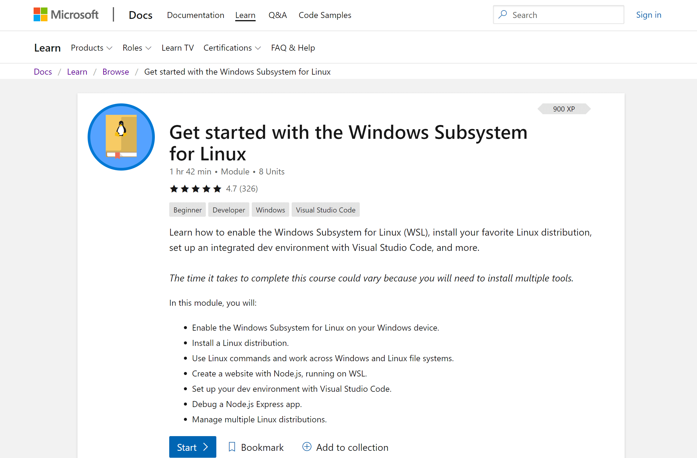

# Popular tutorials, courses, and code samples

We've listed a few tutorials, course, and code samples below to help you get started on some common development tasks and scenarios.

## Create a database

* [Create a MongoDB app with React and Azure Cosmos DB](https://docs.microsoft.com/azure/cosmos-db/tutorial-develop-mongodb-react)

* [Deploy a Python (Django) web app with PostgreSQL in Azure App Service](https://docs.microsoft.com/azure/app-service/containers/tutorial-python-postgresql-app?tabs=bash)

## Build an Android app

* [Build an Android dual-screen app with drag and drop capabilities](https://docs.microsoft.com/dual-screen/android/samples)

## Create a cross-platform app

* [Build a to-do list cross-platform app with Xamarin.Forms](https://docs.microsoft.com/samples/xamarin/xamarin-forms-samples/todo/)

* [Build a Xamarin.Android app that utilizes Google Play Services to demo the Google Maps API](https://docs.microsoft.com/samples/xamarin/xamarin-forms-samples/todo/)

## Get started with WSL

* [An introductory to Windows Subsystem for Linux](https://docs.microsoft.com/learn/modules/get-started-with-windows-subsystem-for-linux/)

## Build a web app or call an API

* [Build your first ASP.Net Core web app with Blazor](https://docs.microsoft.com/aspnet/core/tutorials/build-your-first-blazor-app?view=aspnetcore-3.1)

* [Call an ASP.NET Core Web API from a WPF application using Azure AD V2](https://docs.microsoft.com/samples/azure-samples/active-directory-dotnet-native-aspnetcore-v2/calling-an-aspnet-core-web-api-from-a-wpf-application-using-azure-ad-v2/?view=aspnetcore-3.1)

## Build a console app

* [Build a Java app with Microsoft Graph](https://docs.microsoft.com/graph/tutorials/java)

## Create a microservice

* [Create and deploy a cloud-native ASP.NET Core microservice](https://docs.microsoft.com/learn/modules/microservices-aspnet-core/?view=aspnetcore-3.1)

## Additional resources

* [Explore free online courses on Microsoft Learn](https://docs.microsoft.com/learn/browse/)

* [Explore online courses from Pluralsight](https://www.pluralsight.com/browse/software-development)
