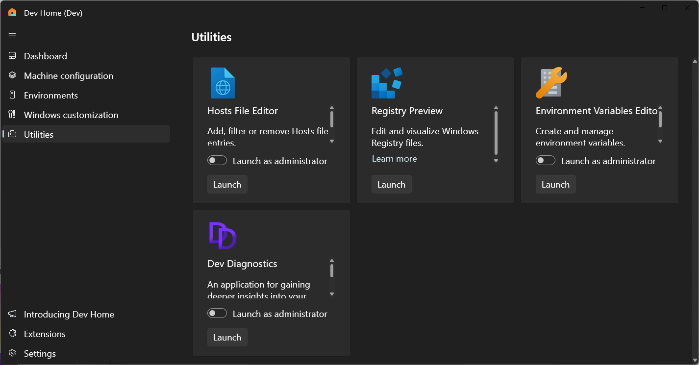
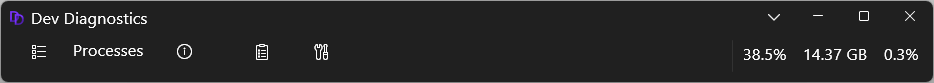
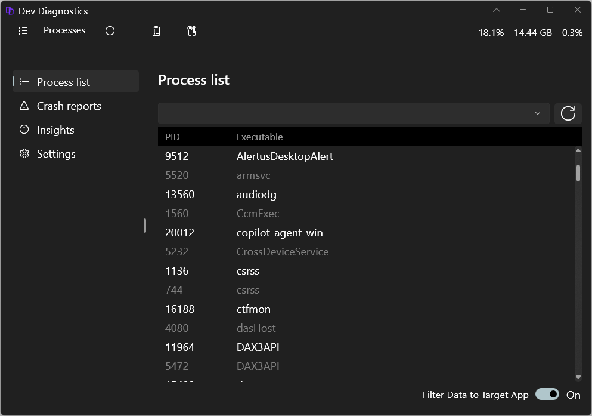
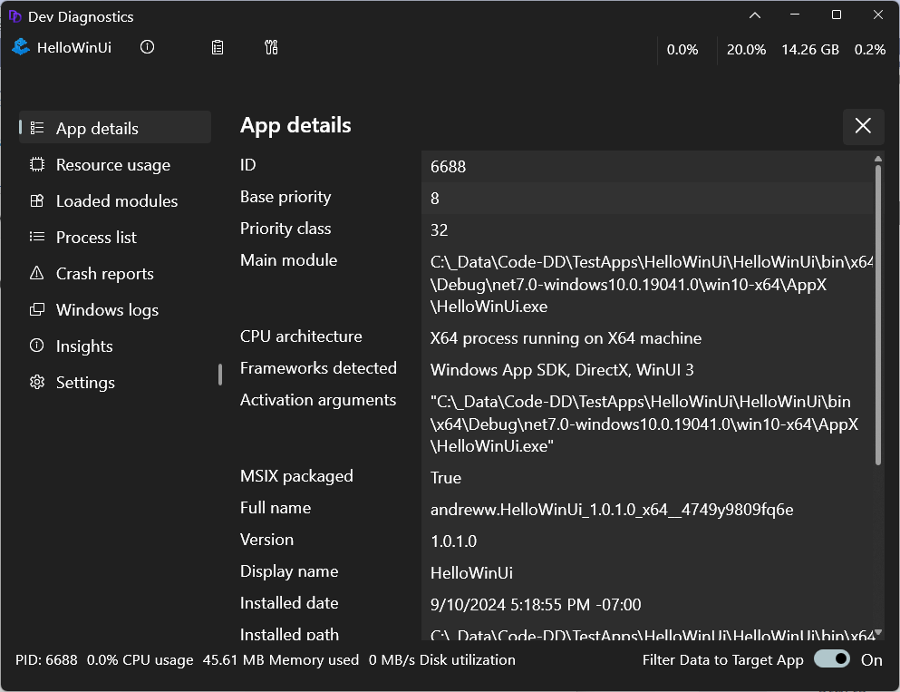
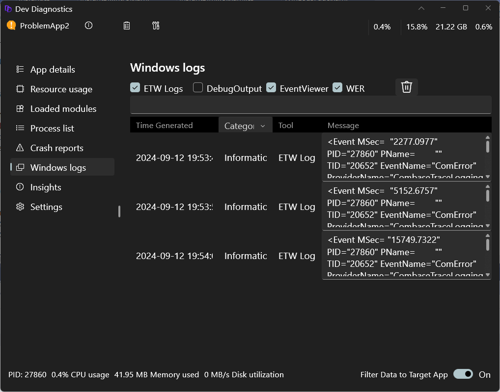
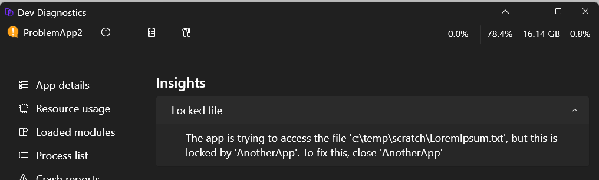
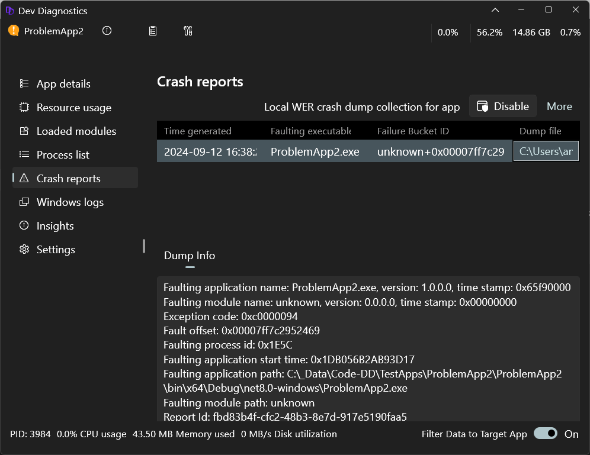
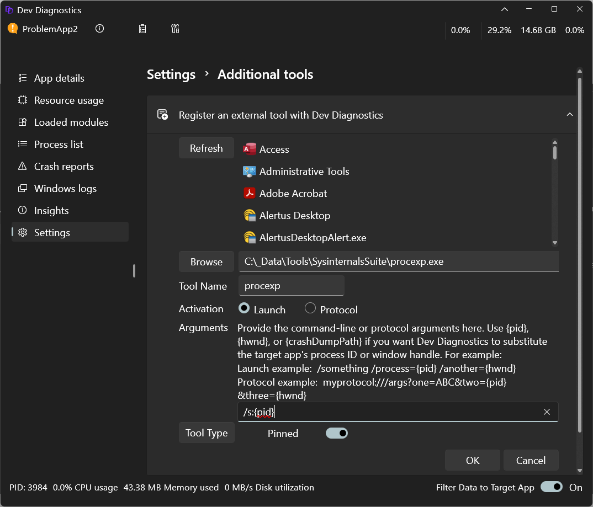
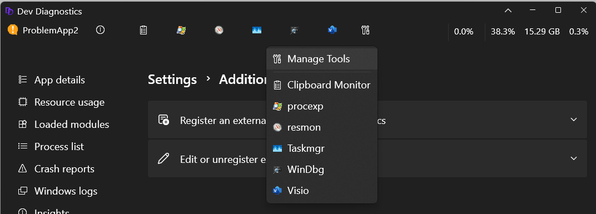
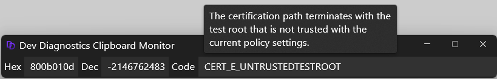

# Dev Diagnostics in Dev Home

Dev Diagnostics is an experimental feature in Windows Dev Home that enables you to "peek under the hood" of Windows to better understand how your app is working.

Dev Diagnostics enables you to:

- Gather data from a range of diagnostic tools and sources.
- Filter data for analysis of a specifically targeted Windows app.
- Analyze app data to identify performance and reliability issues.
- Incorporate any external diagnostic tools you want to use in a unified place.

## Enable the Dev Diagnostics feature

As this feature is currently experimental, you first need to open Dev Home and turn the feature on.

To enable Dev Diagnostics, navigate to **Settings -> Experimental Features -> Dev Diagnostics** and turn this feature on.

## Use Dev Diagnostics to monitor processes

Once enabled, launch **Dev Diagnostics** from the [Utilities](utilities.md) page in Dev Home.

Dev Diagnostics starts as a minimal toolbar, gathering a list of running processes and reporting key resources, including system-wide CPU, memory and disk usage.

Use the **Expand** button to expand the diagnostics window. The default shows a list of running processes.

## Track a Windows app with Dev Diagnostics

There are multiple ways to begin tracking your Windows app with Dev Diagnostics:

- Select the app from the list of **Processes**.

- Select and drag the **Finder tool** from the Dev Diagnostics toolbar onto the app window that you want to track.

- Use the Dev Diagnostics hotkey. To use the hotkey, ensure your target app is active in the foreground, then select the **Windows + F12** keys. This also works if the Dev Diagnostics window has been closed, preventing you from using the Finder tool. A startup task enables the hotkey to ensure that you can use the hotkey at any time, even if the Dev Diagnostics window is closed. If you disable the startup task, this will disable the hotkey.

Once the Windows app that you have selected to track with Dev Diagnostics has been analyzed, a data report will be produced that shows the process ID, loaded module list, windowing and application frameworks used, and package information.

## Stop tracking a Windows app with Dev Diagnostics

To stop tracking an app, select the **Detach** button on the **App details** page or right-click on the app name in the toolbar and select **Detach**.

You can begin tracking the same app or a different app at any time.

## Dev Diagnostics data sources

Dev Diagnostics gathers data from a wide range of sources, performs analysis on that data, and (in some cases) recommends improvements. The data gathered is specific to the app. Data includes:

- Events for that app from the Windows Event Log
- Crash dumps from Windows Error Reporting (WER)
- Debug output from the Windows app
- Reports from a small set of Event Tracing for Windows (ETW) providers

## Log diagnostic data and identify problems

You can select which data sources you want to track in the **Windows logs** page. As you work in the Windows app, you can reproduce steps for any problem scenarios and the related data will be reported in the log.

If Dev Diagnostics can identify the root cause of a problem and suggest solutions, it will add a numeric badge to the **Insights** button. The numeric badge will take you to the **Insights** page for more details.

In this example, the target app is failing to access a file because another app has the file locked.

## Crash dump analysis

The **Crash Reports** page reports any recent and ongoing crashes for the target app. Crash dumps are typically not stored on the local machine, but you can enable this behavior on the Crash Reports page.

When you select a dump file, you can choose a tool to analyze it. For example, Visual Studio or WinDbg. Dev Diagnostics will launch that tool and load the dump file.

## Dev Diagnostics tools

Dev Diagnostics doesn't replace existing developer tools, but offers a unified place to incorporate the diagnostic tools that you want to use.

To use an external tool with Dev Diagnostics, you must register the tool with Dev Diagnostics. You can register any app on your machine. There are two ways to do this, both start from the Dev Diagnostics settings page.

- Select **Settings** from the Dev Diagnostics toolbar.

- Select **Additional tools**, then select **Register an external tool with Dev Diagnostics**.

To register a new diagnostic tool in Windows Dev Home:

1. Expand the **Register...** section. Dev Diagnostics will fetch a list of all apps installed on your machine, both packaged and unpackaged. You can then select any app from that list. Alternatively, you can select a tool using the filesystem path by selecting **Browse** to bring up the file dialog and navigating to the tool that you would like to add. You can add any file type, including EXE, BAT, CMD or script.

2. Once you have selected a tool to add, select either the **Launch** or **Protocol** option to indicate how Dev Diagnostics should launch this tool.

3. (Optional) Provide command-line or protocol arguments. Dev Diagnostics recognizes two pre-defined variables **{pid}** and **{hwnd}**, including the curly braces. If you include either (or both) of these in your arguments, Dev Diagnostics will pass the target app's process ID or window handle into the tool when launched.

    Launch example: `/something /process={pid} /another={hwnd}`

    Protocol example: `myprotocol:///args?one=ABC&two={pid}&three={hwnd}`

4. To display a newly registered diagnostic tool in the Dev Diagnostics toolbar, find the new tool in the Dev Diagnostics **External Tools** menu and turn on the **Pinned** option. To unpin a tool from the toolbar without unregistering the tool, right-click and select **Unpin.**

    

You can unregister the diagnostic tool that you've added at any time by using the Dev Diagnostics Settings options or right-clicking the tool and selecting **Unregister**.

## Clipboard Monitoring

Dev Diagnostics includes a **Clipboard Monitoring** tool. This tool watches the clipboard for numeric values. If a number is added to the clipboard, the tool will perform an error-lookup to see if this number matches a known error code. If a match is found, the monitoring tool reports the meaning of the error code. The Clipboard Monitoring tool runs in a separate tool window, enabling you to view it while using other Dev Diagnostic features.

Learn more about [Dev Home Utilities](utilities.md).
