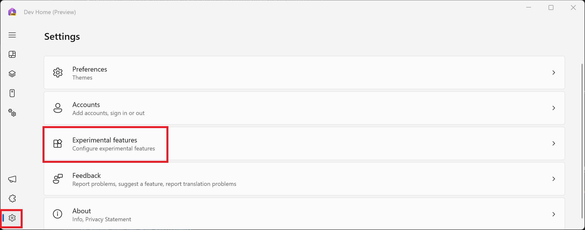
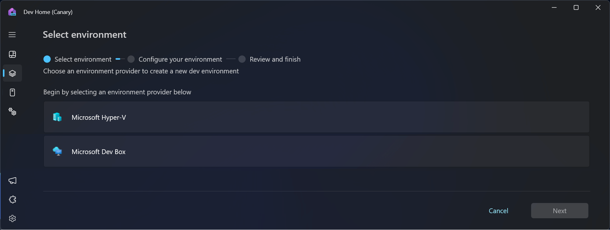

# Dev Home Environments

A virtual environment is a self-contained workspace that allows you to maintain separate dependencies and settings for different projects, effectively isolating them from each other. The type of virtual environments supported currently include:

- [Local Hyper-V virtual machine (VM)](/windows-server/virtualization/hyper-v/get-started/create-a-virtual-machine-in-hyper-v)
- [Microsoft Dev Box](/azure/dev-box/overview-what-is-microsoft-dev-box)
<!-- - A [Windows Sandbox](/windows/security/application-security/application-isolation/windows-sandbox/windows-sandbox-overview)
- A [Windows Subsystem for Linux (WSL) distribution](/windows/wsl/install) -->

**Dev Home Environments** can help you to centralize your interactions with these virtual or cloud environments in a single place.

- Create and configure virtual environments associated with GitHub repositories, apps, and packages.
- Perform quick actions such as launch, snapshot, start, stop, or pinning environments to Windows Start menu or taskbar.

## Get started with Environments in Dev Home

1. Ensure that you have the latest version of Dev Home by running the command: `winget upgrade Microsoft.DevHome`.
2. Enable the Environments features in the Dev Home Experimental settings (**Settings** > **Experimental features** > toggle to **On**).
3. Each type of virtual environment in Dev Home is supported by a Dev Home extension. To add a new environment, you must first ensure that the supporting extension is installed.
    - **Hyper-V extension**: Installed by default in Dev Home. By default, your local Hyper-V VMs will be visible on the Dev Home Environments page.
    - **Microsoft Dev Box**: To display Dev Box virtual environments, install the [Dev Home Azure extension](extensions.md#dev-home-azure-extension). Once installed, each Dev Box that you have set up on your Azure account will be visible on the Dev Home Environments page.
    <!-- - **WSL distributions**: To display Linux distributions installed with WSL, you can download and install the [Dev Home WSL Extension Preview](https://github.com/WhitewaterFoundry/devhome/releases). This `.msixbundle` is contributed by Whitewater Foundry.* -->

## Manage your Dev Home Environments

Each virtual environment that has been installed in Dev Home can display some key information:

1. The type of virtual environment (*such as Hyper-V VM, Microsoft Dev Box, more coming soon)*.

2. The name of the virtual environment instance *(whatever name you have chosen for the environment)*.

3. Status of the virtual environment: started, stopped, running.

4. Environment specific information, such as the project name for a Microsoft Dev Box, the vCPU usage, the RAM usage, the storage capacity, the uptime, or checkpoints.

Each virtual environment offers the following quick actions:

1. **Launch**: Connect to or launch the environment.

    - Microsoft Dev Box will launch in the web browser by default. To launch the Dev Box in the new Windows App RDP client, install [Windows App](https://www.microsoft.com/store/productId/9N1F85V9T8BN) from Microsoft Store.

2. **Start** or **Stop**: Select the drop-drown arrow beside the Launch button to find the start and stop actions.

3. **Delete**, **Restart**, **Pin to taskbar**: Select the 3-dots above the Launch button to delete, restart, or pin this virtual environment to the Windows Taskbar.

    - The "Pin to Taskbar" and "Pin to Start menu" actions will not appear unless [Windows App](https://www.microsoft.com/store/productId/9N1F85V9T8BN) is installed from Microsoft Store.

4. **Sync**: Select the **Sync** button on the top of the Dev Home Environments window if your virtual environment has been installed, but is not displayed. For example, if you have Dev Home open and simultaneously delete a Hyper-V VM outside of Dev Home, or create a new Microsoft Dev Box in the Azure portal, these changes may not be reflected in Dev Home until you select **Sync** or Dev Home relaunches.

## Create a new virtual environment using Dev Home

To create a new virtual environment:

1. Select **Create Environment** in the Environments or Machine Configuration window of Dev Home.

2. Select the type of environment you would like to create (only supported and installed environment types will be available).

3. Each environment can have different creation parameters, such as name, pool, project, image, and more. These specifications depend on the environment type.
    - For Hyper-V VMs, currently quick-creation images are supported. Custom images (.iso, .vhd, .vhdx) for VM creation are not yet supported, but are in development.

## Create a WinGet Configuration file for your Dev Home Environment

If your virtual environment has Dev Home installed, you can launch the environment and use the Machine Configuration local setup tool.

Alternatively, you can remotely configure your environment:

1. On the Machine Configuration page in Dev Home, select **Configure an environment**.

2. Choose your existing environment to configure.

3. Select repositories to clone.

4. Select apps to install.

5. Review your configuration. Once complete, the virtual environment will be configured with your selected resources. You may be asked to enter user credentials for the specific environment to apply these changes.

## Build a Dev Home Environment Extension

If there is a type of virtual environment that you regularly use that is currently unsupported by Dev Home, you can build your own Dev Home Environment Extension to display the virtual environment in Dev Home.

To build an environment extension, see our guidance and API documentation on GitHub: [Developer environments in Dev Home](https://github.com/microsoft/devhome/blob/main/docs/extensions/environments/readme.md).
