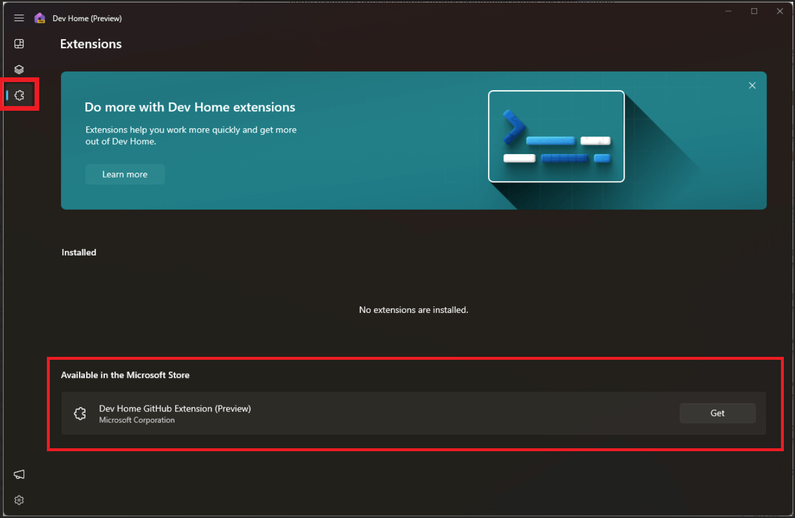
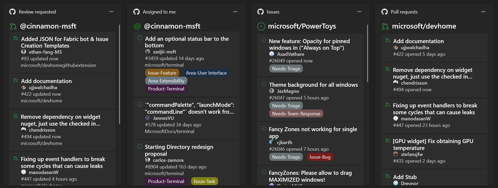

# Dev Home extensions

Dev Home supports both default and custom-built extensions. Learn more about the Dev Home GitHub extension, how to customize Git widgets and notifications in the Dev Home dashboard, and how to build your own Dev Home extension.

The GitHub extension is currently the only extension included with Dev Home by default, however new extensions are in active development.

## Dev Home GitHub extension

The Dev Home GitHub extension provides GitHub integration into the existing features of Dev Home. These features include the ability to recommend repositories to add when using the [Machine Configuration](setup.md#machine-configuration) and the ability to add Dev Home widgets customized to display your GitHub content.

To add the GitHub extension, select the Extensions tab in Dev Home, then select **Get** on the GitHub extension from the list of Dev Home extensions **Available in the Microsoft Store**.

When signing into GitHub using the Dev Home GitHub Extension, your GitHub credentials are added to the [Credential Manager](https://support.microsoft.com/windows/accessing-credential-manager-1b5c916a-6a16-889f-8581-fc16e8165ac0). This is how Dev Home is able to access information relevant to your GitHub account. Currently DevHome supports only a single GitHub account. (See the [DevHome Extension repo on GitHub](https://github.com/microsoft/devhomegithubextension/issues/276) for updates on adding support for multiple accounts.)

Want to contribute to or file an issue on this extension? See the open source [GitHub extension repository for Dev Home](https://github.com/microsoft/devhomegithubextension).

### Dev Home widgets customized using the GitHub extension

The Dev Home GitHub extension powers widgets that can be customized and display on the [Dev Home dashboard](index.md). These widgets can display:

- Issues associated with a specific GitHub repo
- Pull Requests (PRs) associated with a specific GitHub repo
- Only issues that are assigned to you in a specific GitHub repo
- Only issues or pull requests that you’ve been mentioned in
- PRs that have a request for your review

### Notifications using the Dev Home GitHub extension

The Dev Home GitHub extension has the ability to send Windows notifications based on GitHub events. As of now, the only supported notification event is when checks fail on a pull request that has been authored by the account that’s signed into the extension. Notifications can be disabled from the [Windows notification settings](https://support.microsoft.com/windows/change-notification-settings-in-windows-8942c744-6198-fe56-4639-34320cf9444e).

## Build your own custom Dev Home extension

If you are interested in building your own extension to use with Dev Home, visit the [Dev Home repo on GitHub](https://github.com/microsoft/devhome/blob/main/docs/extensions.md) to find documentation on how to get started.
