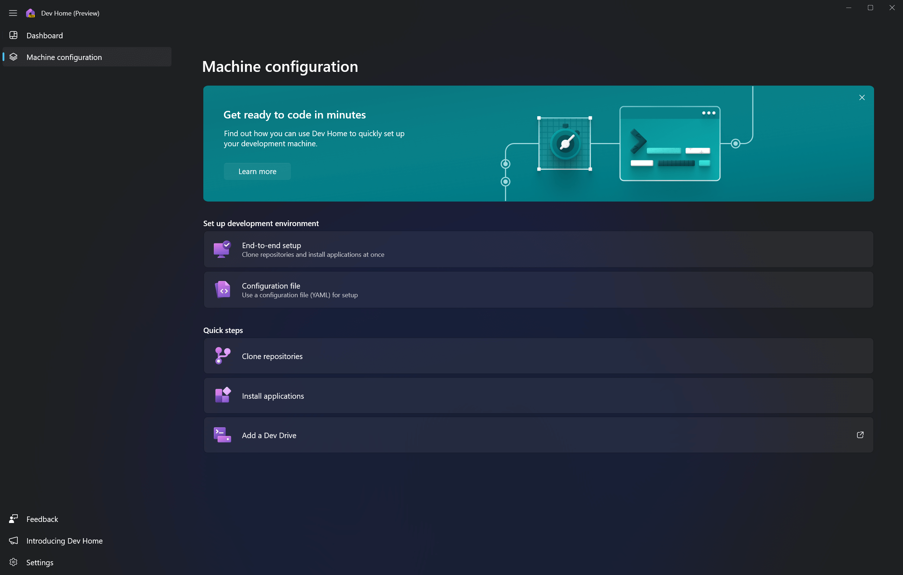
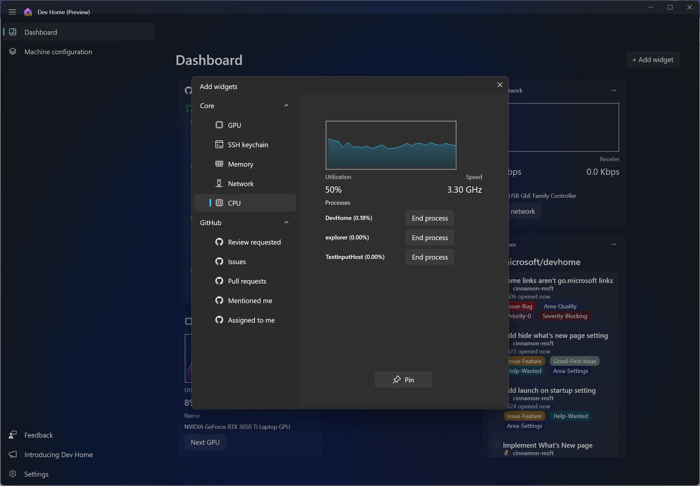
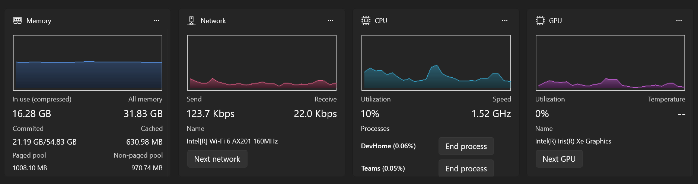
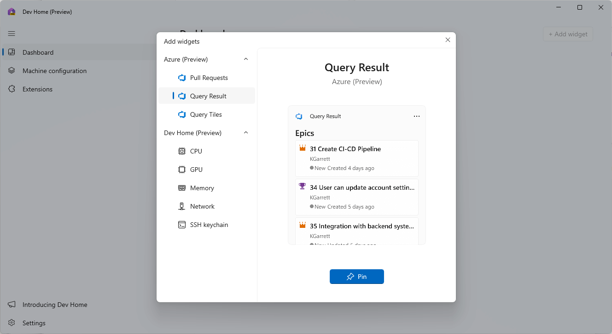

# What is Dev Home?

Dev Home is a new control center for Windows providing the ability to monitor projects in your dashboard using customizable widgets, set up your dev environment by downloading apps, packages, or repositories, connect to your developer accounts and tools (such as GitHub), and create a [Dev Drive](../dev-drive/index.md) for storage all in one place.

- Use the **centralized dashboard with customizable widgets** to monitor workflows, track your dev projects, coding tasks, [Azure DevOps queries](), GitHub issues, pull requests, available SSH connections, and system CPU, GPU, Memory, and Network performance.
- Use the **Machine configuration** tool to set up your development environment on a new device or onboard a new dev project.
- Use **Dev Home extensions** to set up widgets that display developer-specific information. Create and share your own custom-built extensions.
- Create a **Dev Drive** to store your project files and Git repositories.

> [!div class="nextstepaction"]
> [Install Dev Home (Preview)](https://aka.ms/devhome)

## Dev Home Machine configuration

To set up a new machine or onboard a new project with Dev Home, select **Machine configuration**. Dev Home can manage everything you need to get to your machine's development environment to a ready-to-code state, whether you want an end-to-end setup process, want to use a [WinGet Configuration file](../package-manager/configuration/index.md), or just want to perform a quick step, like cloning a Git repository, installing a specific application, or adding a [Dev Drive](../dev-drive/index.md) to improve the performance of your project's storage volume.

Learn more about how to get started with the **[Dev Home Machine configuration](./setup.md)** tool.

## Dev Home dashboard widgets

Monitor your workflows using customizable widgets on the Dev Home dashboard. By default, Dev Home provides widgets for:

- **GPU**: Monitor the performance of your machine's GPU.
- **SSH keychain**: Lists the SSH connections available in your `ssh/.config` file. Select one of these SSH items to open that connection in [Windows Terminal](/windows/terminal).
- **Memory**: Monitor the performance of your machine's memory.
- **Network**: Monitor the performance of your machine's network.
- **CPU**: Monitor the performance of your machine's CPU.
- **GitHub**: The Dev Home GitHub extension can be connected to your GitHub credentials to provide both customizable widgets and notifications.
- **Azure DevOps**: The Dev Home Azure extension can be connected to your Azure account to provide customizable widgets for queries and pull requests.

### System widgets

The Dev Home system widgets can provide real-time information on:

- **Memory**: Amount in use, total available, total committed, total cached, paged pool, non-paged pool.
- **Network**: Bandwidth measurements, including total kilobits per second for both sending and receiving data, along with the network name.
- **CPU**: Total utilization, speed, and active processes.
- **GPU**: Total utilization, temperature, and graphics chip name.

### GitHub extension widgets

The [Dev Home GitHub extension](./extensions.md#dev-home-github-extension) enables you to connect your GitHub account to Dev Home and create customized widgets that integrate with your GitHub repositories. To connect your GitHub account to Dev Home and begin creating GitHub widgets:

1. Once you've installed Dev Home, the GitHub extension will be available by default, but you will need to log-in to your GitHub account to gain access to the integrated features. Currently Dev Home supports only a single GitHub account. (See the [DevHome Extension repo on GitHub](https://github.com/microsoft/devhomegithubextension/issues/276) for updates on adding support for multiple accounts.) 

2. Select **Add a widget** from the top-right of your Dev Home dashboard. A list of widget options will appear that you can pin and then customize to your preference.

Learn more about the [Dev Home GitHub extension](extensions.md#dev-home-github-extension) and how to create customized widgets and set up Windows notifications.

## Dev Home extensions

Dev Home extensions power the functionality of Dev Home's customizable widgets. By default, Dev Home includes the GitHub extension, but you can also create and share your own custom-built extensions.

Learn more about **[Dev Home extensions](./extensions.md)**, including how to create customized GitHub widgets, set up GitHub notifications, create custom ADO widgets, or build and share your own Dev Home extensions.

## Dev Home Azure extension

The [Dev Home Azure extension](https://apps.microsoft.com/detail/9MV8F79FGXTR) provides integration with Azure DevOps directly into Dev Home and provides customizable widgets to allow you to display your queries and pull requests. To connect your Azure account to Dev Home and begin creating Azure Developer Operations (ADO) widgets:

1. Install the Dev Home Azure extension from the Microsoft Store.​ Once installed, if your machine is connected to a work account already, Dev Home will connect automatically. Otherwise, you can sign into your Azure account in Dev Home's account settings.

2. Select **Add a widget** from the top-right of your Dev Home dashboard. A list of widget options will appear that you can pin and then customize to your liking.

## Dev Home open source repos

Both Dev Home and Dev Home GitHub extension are open source and welcome your contributions.

- [Dev Home repository on GitHub](https://github.com/microsoft/devhome).
- [Dev Home GitHub extension repository on GitHub](https://github.com/microsoft/devhomegithubextension)
- [Dev Home Azure extension repository on GitHub](https://github.com/microsoft/devhomeazureextension)

You can also contribute to the open source documentation for Dev Home by visiting  the [Windows Dev Docs open source repo on GitHub](https://github.com/MicrosoftDocs/windows-dev-docs/issues).
