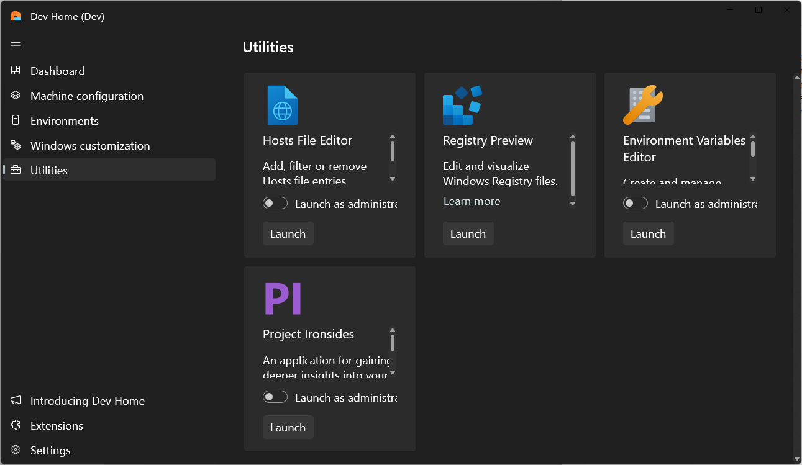
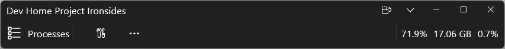
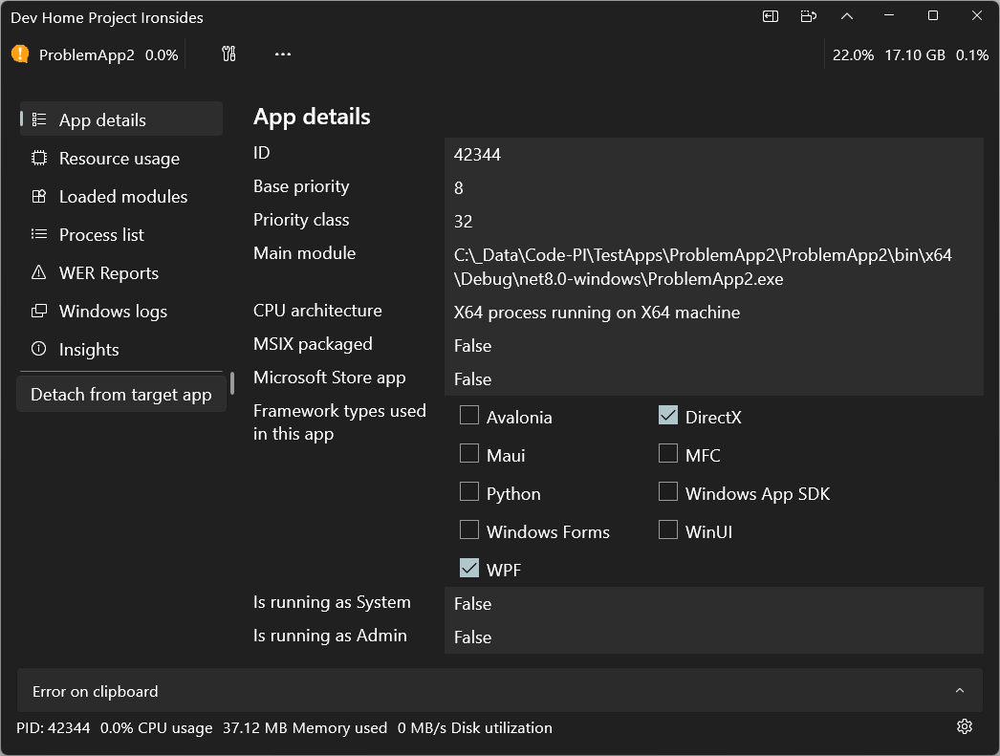
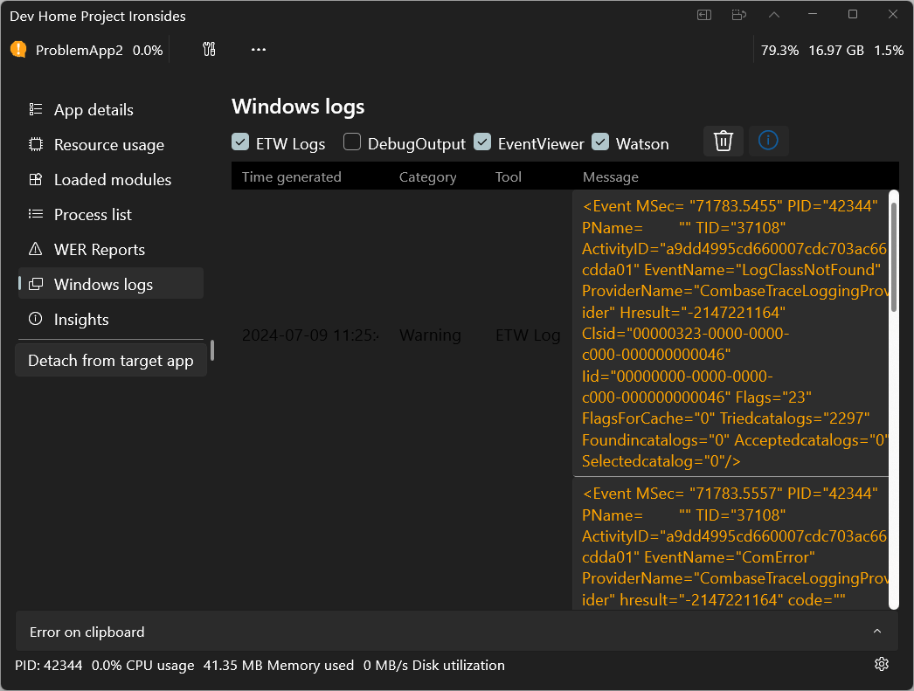
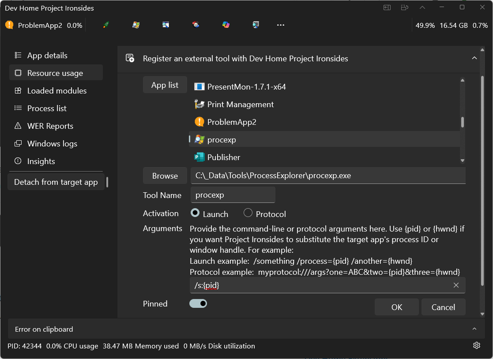

# Project Ironsides in Dev Home

Project Ironsides is an experimental feature in Windows Dev Home that enables you to "peek under the hood" of Windows to better understand how your app is working.

Project Ironsides enables you to:

- Gather data from a range of diagnostic tools and sources.
- Filter data for analysis of a specifically targeted Windows app.
- Format app data to improve readability.
- Analyze app data to identify performance and reliability issues.
- Combine diagnostic data and tools in a unified place.

## Enable the Project Ironsides feature

As this feature is currently experimental, you first need to open Dev Home and turn the feature on:

1. Navigate to **Settings -> Experimental Features -> Project Ironsides** and turn this feature on.

2. Once enabled, **Project Ironsides** can be launched from the [Utilities](utilities.md) page in Dev Home.

    

3. Project Ironsides starts as a minimal toolbar, gathering a list of running processes, system-wide CPU, and memory usage.

    

4. There multiple ways you can begin tracking your Windows app with Project Ironsides:

    - Select your app from the list of **Processes**.

    - Select and drag the **Finder tool** from the Project Ironsides toolbar onto the app window that you want to track.

    - Use the Project Ironsides hotkey. To use the hotkey, ensure your target app is active in the foreground, then select the **Windows + F12** keys. This also works if the Project Ironsides window has been closed, preventing you from using the Finder tool.

5. Project Ironsides will then analyze the target app and report some initial data, including the process ID, module list, windowing and application frameworks used. Use the **Expand** button at the top of the toolbar to expand the window.

    

## Project Ironsides data sources

Project Ironsides gathers data from a wide range of sources, performs analysis on that data, and (in some cases) recommends improvements. The data gathered is specific to the app, including events for that app from the Windows Event Log, crash dumps from Windows Error Reporting (WER), and reports from Event Tracing for Windows (ETW).

You can select which data sources you want to track in the **Windows logs** page. Then, as you work in your app, and reproduce the steps for any problem scenarios, any interesting data will be reported here.

   

If Project Ironsides can identify the root cause of a problem and suggest any solutions, it will highlight the **Insights** button, which will take you to the **Insights** page for more details.

## Project Ironsides tools 

Project Ironsides doesn't aim to replace any of the many existing developer tools, but offers a unified place to incorporate app analysis tools, including external 3rd-party tools and Project Ironsides' own internal diagnostic functionality.

To use an external 3rd-party diagnostic tool with Project Ironsides in Dev Home, you must “register” the tool with Project Ironsides. You can register any app on your machine. There are two ways to do this, both start from the Project Ironsides settings page.

1. Select **Settings** from the Project Ironsides toolbar.
2. Select **Additional tools**, then select **Register an external tool with Dev Home Project Ironsides**.

    

Project Ironsides can fetch a list of all the apps installed on your machine, both packaged and unpackaged. To select an installed app as a tool in Project Ironsides:

1. Select **App list** to fetch the list of all installed apps.
2. Select any app from that list.

Alternatively, to select a tool by its filesystem path:

1. Select **Browse** to bring up the file dialog.
1. Navigate to the tool that you would like to add.

For both options, continue as follows:

1. Select either the **Launch** or **Protocol** option, to indicate how Project Ironsides should launch this tool

2. (Optionally) provide any command-line or protocol arguments. Project Ironsides recognizes two pre-defined variables **{pid}** and **{hwnd}**, including the curly braces. If you include either (or both) of these in your arguments, then Project Ironsides will pass the target app's process ID or window handle into the tool when it launches it.

3. Launch example: `/something /process={pid} /another={hwnd}`

4. Protocol example: `myprotocol:///args?one=ABC&two={pid}&three={hwnd}`

5. When you register a tool, it is added to the Project Ironsides **External Tools** menu. If you turn on the  **Pinned** option, this will also display the tool in the Project Ironside toolbar.

Project Ironsides is an evolving feature with additional functionality coming soon.

Learn more about [Dev Home Utilities](utilities.md).
