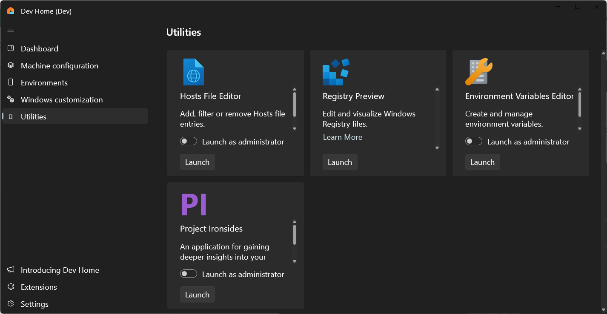

# Project Ironsides in Dev Home

Project Ironsides is an experimental feature in Windows Dev Home that enables you to "peek under the hood" of Windows to better understand how your app is working.

Project Ironside enables you to:

- Gather data from a range of diagnostic tools and sources.
- Filter data for analysis of a specifically targeted Windows app.
- Format app data to improve readability.
- Analyze app data to identify performance issues.
- Combine diagnostic data and tools in a unified place.

## Enable the Project Ironsides feature

As this feature is currently experimental, you first need to open Dev Home and turn the feature on:

1. Navigate to **Settings -> Experimental Features -> Project Ironsides** and turn this feature on.

2. Once enabled, **Project Ironsides** can be launched from the [Dev Home Utilities](utilities.md) page in Dev Home.

    

3. Project Ironsides starts as a minimal toolbar, gathering a list of running processes, system-wide CPU, and memory usage.

    :::image type="content" source="../images/dev-home-utilities-project-irongside-menu.png" alt-text="Screenshot of Windows Dev Home Project Ironsides menu showing app icons, cpu, and memory usage.":::

4. To begin tracking your Windows app with Project Ironsides, select and drag the **Finder tool** from the Project Ironsides toolbar onto the app window that you want to track. Project Ironsides will then analyze the target app and report some initial data, including the process ID, module list, windowing and application frameworks used.

    :::image type="content" source="../images/dev-home-utilities-project-irongside-app-details.png" alt-text="Screenshot of Windows Dev Home Project Ironsides toolbar with Finder tool highlighted.":::

## Project Ironsides tools and data sources

Project Ironsides gathers data from a wide range of sources, performs analysis on that data, and (in some cases) recommends improvements. The data gathered is specific to the app, including events from the app's Event Log, crash dumps from Windows Error Reporting (WER), and reports from Event Tracing for Windows (ETW).

Project Ironsides doesn't aim to replace any of the many existing developer tools, but offers a unified place to incorporate app analysis tools, including external 3rd-party tools and Project Ironsides's own internal diagnostic functionality.

To use an external 3rd-party diagnostic tool with Project Ironsides in Dev Home, you must “register” the tool with Project Ironsides.

To register an app diagnostic tool with Project Ironsides:

1. Select **Settings** from the Project Ironsides toolbar.

2. Select **Register an external tool with Project Ironsides**.

3. Select **Browse** and enter the file path to the tool that you would like to add.

4. Select from the **Basic arguments**:

    - **None**: Check if there are no additional arguments.
    - **Hwnd**: Check to compose a command line for your external tool that includes the runtime Hwnd (window handle) of the app you're targeting.
    - **ProcessId**: Check to compose a command line for your external tool that includes the runtime process ID of the app you're targeting. The composed command line is displayed in the "Sample command line" box.

5. You have the option to enable **Pinned** to display the added tool in the Project Ironside menu list.

    :::image type="content" source="../images/dev-home-utilities-project-irongside-register-tool.png" alt-text="Screenshot of Windows Dev Home Project Ironsides showing input boxes to register an external tool.":::

Project Ironsides is an evolving feature with additional functionality coming soon.

Learn more about [Dev Home Utilities](utilities.md).
