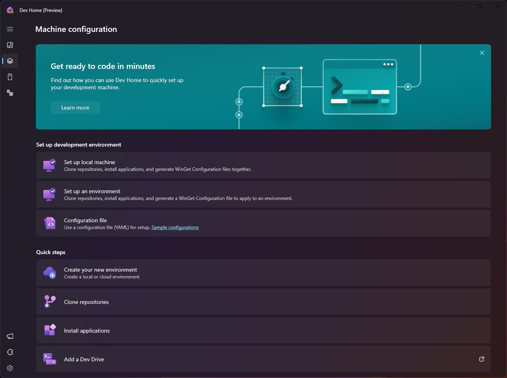

# Dev Home Machine Configuration - Set up your Windows development environment

The Dev Home machine configuration tool brings all of your dev environment set up tasks into one place, enabling you to efficiently set up a new machine or onboard new projects.

Avoid all of the fractured and tedious processes typically involved in getting your machine ready for development. Dev Home streamlines the process of searching for project requirements, cloning repositories, and finding specific versions of software and tools to install. Manage multiple tool sign-ins, minimize context switching, and reach productivity faster so you can focus on what you do best - developing.

## Machine configuration

Dev Home Machine configuration can manage everything you need to get to your machine's development environment to a ready-to-code state.

When you select **Machine configuration**, Dev Home will provide multiple set up options:

- **Set up a local machine**: Install applications, clone repositories, and add all of the requirements for a new development project using the built-in graphical configuration interface to enable unattended setup of your environment. The step-by-step tool will walk you through everything you need, including suggestions for popular dev tools or known repositories. At the end of the process you can generate a WinGet Configuration file to make it easy to apply these same steps to any machine. Once you've made all of your choices, sit back and let Dev Home handle the rest. If you've cloned any repositories that contain a WinGet Configuration file, Dev Home will detect that and let you continue to complete your set up.

- **Set up an environment**: *Experimental Feature*. Target an existing environment to configure by selecting applications to install and public repositories to clone in your specified development environment. From Hyper-V to Microsoft Dev Box support, Dev Home makes it easy to set up any other environment as easily as you can your local machine. 

- **Run a configuration file for an existing setup**: Use a [WinGet Configuration file](../package-manager/configuration/index.md) to consolidate all of your machine setup and project onboarding tasks into a single file, making the process of setting up your development environment reliable and repeatable. WinGet Configuration files use a YAML format with a JSON schema applying Windows Package Manager and PowerShell Desired State Configuration (DSC) Resource modules to handle every aspect of your machine set up. Remove any worry over finding the right software version, packages, tools, frameworks, and settings when onboarding to a new team or project. In this experience you can switch between a summary view or check out the raw contents of the YAML file. Be sure to [check the trustworthiness of a WinGet Configuration file](../package-manager/configuration/check.md) before running it.

- **Create environment**: *Experimental Feature*. Create a new local or cloud environment for development. Once created you can launch it from the environments page, or select it for configuration.

- **Clone repositories**: Once you have connected your credentials using the [Dev Home GitHub extension](extensions.md#dev-home-github-extension) or the [Dev Home Azure extension](extensions.md#dev-home-azure-extension), you can use Dev Home to clone repositories on to your machine.

- **Install applications**: Use Dev Home to discover and install software applications -- one at a time or have Dev Home install several while you take a snack break.

- **Add a Dev Drive**: To add a storage volume that utilizes ReFS and optimized security settings to be more performant for development-focused scenarios, consider adding Dev Drive. Learn more in the [Dev Drive](../dev-drive/index.md) docs.

## Clone a repo and store it on a Dev Drive

When using Dev Home to clone a repository, once you have selected a repo (or multiple repos), you can select which storage drive to clone them to. If you have already [set up a Dev Drive](../dev-drive/index.md#how-to-set-up-a-dev-drive), it will be used as the default path when cloning a repository.

If you have not yet created a Dev Drive, you will have the option to create one using Dev Home. Check the box to optimize the performance of your workloads with a Dev Drive. Then you can customize a few options, such as the drive letter, name, size, and location of the dynamic VHDX on which the Dev Drive will be created. The name will be used for both the VHDX file and the Dev Drive. By default, the options are the next available drive letter, size of 50GB, and created at `%userprofile%\DevDrives`.  

Learn more about what you can do with **[Dev Home](./index.md)**.
