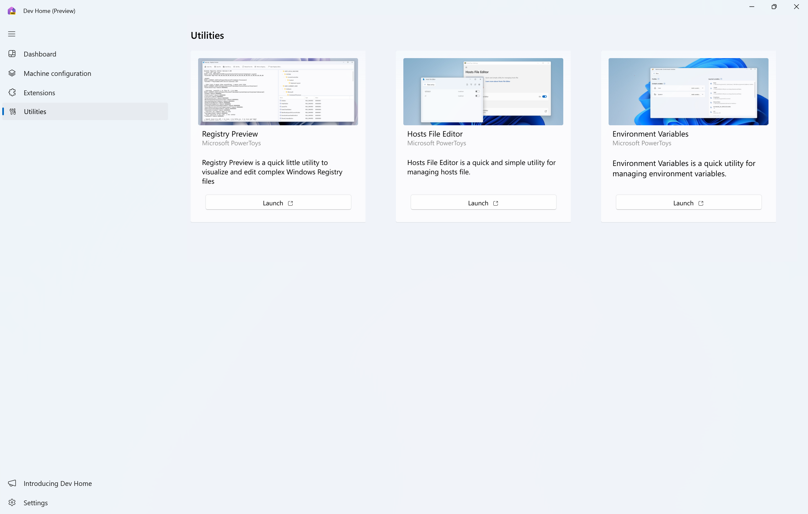

# Use developer utilities delivered with Dev Home

Dev Home brings a set of utilities that are helpful to developers directly to Windows. [Microsoft PowerToys](../powertoys/index.md) now delivers some of its utilities within Dev Home, making it even easier to use these tools.

## Environment Variables

[Environment Variables](../powertoys/environment-variables.md) offers an easy and convenient way to manage environment variables. It allows you to create profiles for managing a set of variables together. Profile variables have precedence over User and System variables.
Applying the profile adds variables to User environment variables in the background. When a profile is applied, if there is an existing User variable with the same name, a backup variable is created in User variables which will be reverted to the original value on profile un-apply.
Applied variables list shows the current state of the environment, respecting the order of evaluation of environment variables (Profile > User > System). Evaluated Path variable value is shown at the top of the list.

## Hosts File Editor

Windows includes a local "Hosts" file that contains domain names and matching IP addresses, acting as a map to identify and locate hosts on IP networks. Every time you visit a website, your computer will check the hosts file first to see which IP address it connects to. If the information is not there, your internet service provider will look into the Domain Name Server (DNS) for the resources to load the site.
The [Hosts File Editor](../powertoys/hosts-file-editor.md) provides a convenient way to edit the hosts file. This can be useful for scenarios like migrating a website to a new hosting provider or domain name, which may take a 24-48 hour period of downtime. Creating a custom IP address to associate with your domain using the hosts file can enable you to see how it will look on the new server.

## Registry Preview

[Registry Preview](../powertoys/registry-preview.md) simplifies the process of visualizing and editing complex Windows Registry files. It can also write changes to the Windows Registry.

