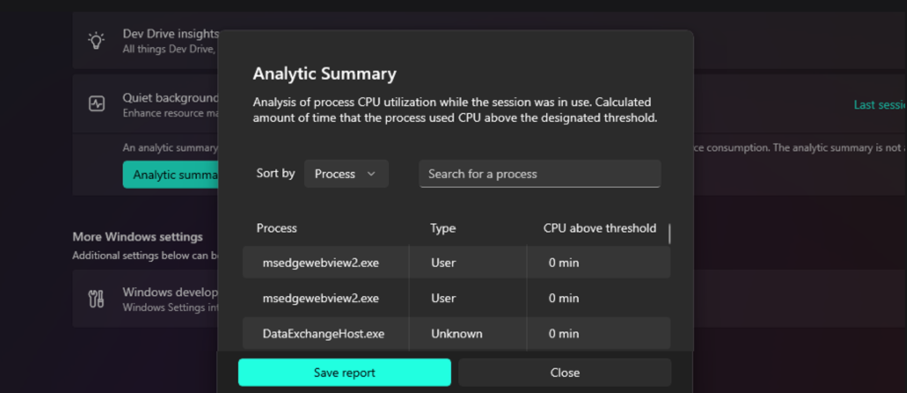

# Dev Home Windows Customization

Windows Customization in Dev Home enables you to configure your Windows environment to suit your development needs.

- Adjust advanced File Explorer settings, such as showing file extensions, hidden and system files, full paths in the title bar, and empty drives.
- Optimize the performance of your Windows machine using [Dev Drive insights](#dev-drive-insights).
- Enable or disable optional Windows virtualization features.
- Customize general system settings such as long paths and taskbar behaviors.
- New experimental features.

## Get started with Windows Customization

1. Ensure that you have the latest version of Dev Home by running the command: `winget upgrade Microsoft.DevHome`.
2. Enable any Windows Customization experimental features that you wish to use in the Dev Home Experimental settings (**Settings** > **Experimental features** > toggle to **On**).

### File Explorer settings

Adjust the default **File Explorer settings** in Windows for a more developer-friendly experience, including:

- **Show file extensions**: Display the file extension (for example `.docx` or `.png`) when listing files in File Explorer.
- **Show hidden and system files**: Display all files in File Explorer even if they are marked as a hidden or system file.
- **Show full path in title bar**: Display the full file path in File Explorer rather than using abbreviated paths.
- **Show files after extraction is complete**: Displays all files after an unzip (extract) action is performed on files or folders from a zipped (compressed) folder.
- **Show empty drives**: All attached drives will display in File Explorer, even if empty.
- **End Task**: Enable the ability to end a task using a right-click selection from the Windows taskbar.

### Dev Drive Insights

**Dev Drive insights** provides you with information and suggestions to optimize the use of Dev Drive volumes specific to an individual machine and workstream.

Check Dev Drive information at a glance, such as total size, amount of storage space used and amount of storage space available.

Dev Drive Insights will also list suggestions for moving package caches, such as the Pip cache or NuGet cache location, in order to improve your machine's performance. This suggestion may look something like: "Move contents of `C:\Users\user-name\AppData\Local\npm-cache` to a directory on the Dev Drive, such as `G:\packages\npm` and set `NPM_CONFIG_CACHE` to that chosen directory location on Dev Drive.

:::image type="content" source="../images/devhome-devdrive-insights.png" alt-text="Screenshot of Dev Drive insights in Windows Customization." lightbox="../images/devhome-devdrive-insights.png":::

### Virtualization Feature Management

Configure optional **virtualization features** to enable/disable virtualization behavior on your machine, including: 

- **Containers**: Provides services and tools to create and manage Windows Server Containers and their resources.
- **Guarded Host**: Enables the device to create and run Shielded Virtual Machine using remote attestation.
- **Hyper-V**: Provides services and management tools for creating and running virtual machines and their resources.
- **Hyper-V Management Tools**: Includes GUI and command-line tools for managing Hyper-V.
- **Hyper-V Platform**: Provides the services you can use to create and manage virtual machines and their resources.
- **Virtual Machine Platform**: Enables platform support for virtual machines.
- **Windows Hypervisor Platform**: Enables virtualization software to run on the Windows hypervisor.
- **Windows Sandbox**: Enables the dependencies required to run Windows Sandbox scenarios.
- **Windows Subsystem for Linux**: Provides services and environments for running native-user-mode Linux shells and tools on Windows.

### General System Settings

Configure various **general system** settings for developer workfloows, including: 

- **End Task**: Enable end task in taskbar by right-click.
- **Enable long paths**: Remove MAX_PATH limitations from common Win32 file and directory functions.

### Quiet Background Processes

Turning on **Quiet Background Processes** will deprioritize deferrable tasks by sending pause and resume notifications to applications that have registered their preferred execution policies with the [Activity Coordinator API](/windows/win32/activity_coordinator/activity-coordinator-api-overview).

Deprioritized tasks will be paused for a maximum of 2 hours in order to prioritize development-focused performance.

After ending a "Quiet Background Processes" session, you can review an **Analytic summary** to see how this setting may have impacted CPU usage during your development time.

*The Quiet Background Processes feature in Dev Home is only available on modern versions of Windows 11 and will not be displayed or available as an experimental feature on unsupported versions of Windows.

## Feedback and feature requests

Dev Home is open source and welcomes your contributions and feedback. File new feature requests for Windows Customization on [GitHub](https://github.com/microsoft/devhome).
