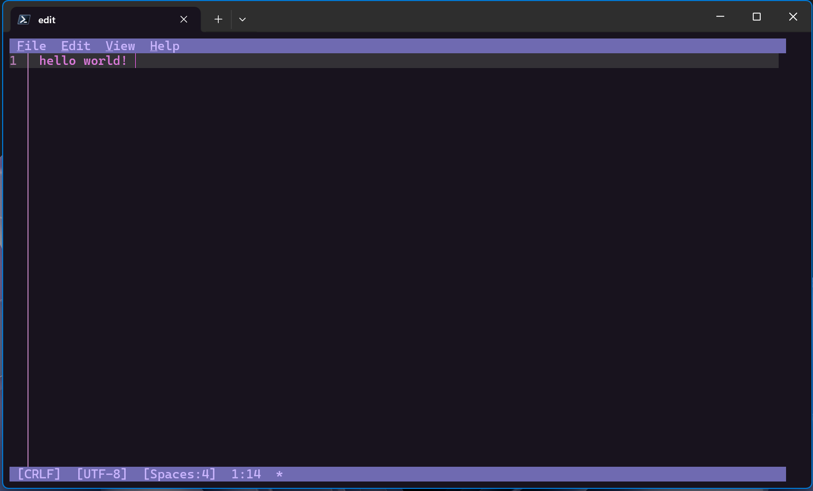

# Edit command line tool

**Edit** is a lightweight command-line text editor in Windows 11. 

## How to use Edit

Edit will be included in future builds of Windows 11. In the meantime, you can install the latest version of the Edit command line tool using this [winget command](../package-manager/winget/index.md): `winget install Microsoft.Edit`. If you are using an older version of Windows, you can use the Edit command line tool by [downloading the release from GitHub](https://github.com/microsoft/edit).

To open the Edit command line tool, enter: `edit` in the command line or run `edit <your-file-name>`. With this, you will be able to edit files directly in the command line without context switching.  

## Edit Features

Edit has several features out of the box. 

- **Mouse-Mode Support**: Edit is a modeless editor with a Text User Interface (TUI). All the menu options in Edit also comes with preconfigured keybindings.

- **Find & Replace**: You can find and replace text with <kbd>Ctrl+F</kbd> or select Edit > Find in the TUI menu. There is also Match Case, Whole Word, and Regular Expression support as well.

- **Word Wrap**: You can use Word Wrap with <kbd>Alt+Z</kbd> or select View > Word Wrap in the TUI menu. 

## FAQ

### Why build another command line text editor?

The need for a default CLI text editor in 64-bit versions of Windows motivated us to build Edit. We choose to build a modeless editor to provide a low barrier of entry for new users. 

Because many existing modeless editors have no first-party support for Windows or are too big to bundle with every version of the OS, we decided to build Edit from scratch.

## Edit open source repository

Edit is open source and welcomes your contributions and feedback. You can find the source code for Edit on [GitHub](https://github.com/microsoft/edit).
