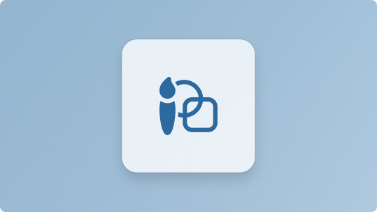
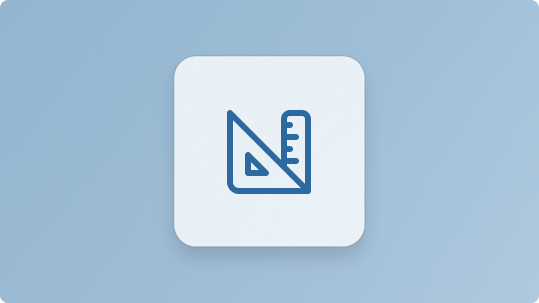
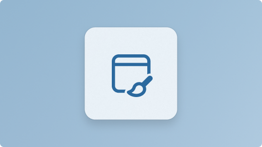

:::row:::
    :::column:::
        
        **[Design principles](../apps/design/design-principles.md)** 
        Core design principles for how Windows apps should look, feel, and behave.
    :::column-end:::
    :::column:::
        
        **[Guidelines](../apps/design/guidelines-overview.md)** 
        Deep-dive guidance on layout, navigation, input, typography, motion, and more.
    :::column-end:::
    :::column:::
         
        **[Design tools and resources](../apps/design/downloads/index.md)** 
       Assets, templates, and tools to design and prototype polished Windows experiences.
    :::column-end:::
:::row-end:::
