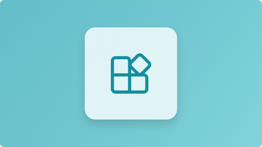
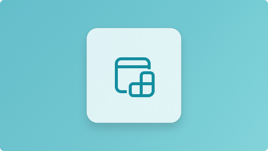
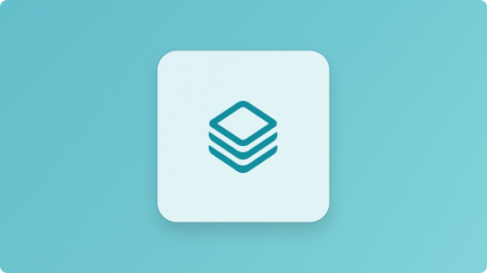
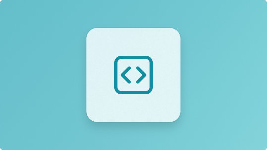
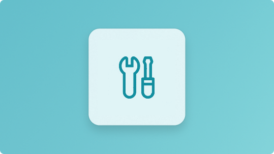
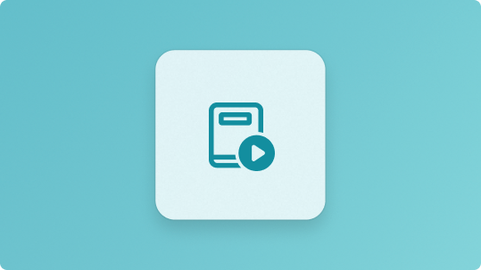

:::row:::
    :::column:::
        
        **[Features](../apps/develop/features-overview.md)** 
        Explore the building blocks for creating rich Windows experiences.
    :::column-end:::
    :::column:::
         
        **[Use features with other UI frameworks](../apps/desktop/modernize/index.md)** 
       Learn how to use Windows platform features outside of WinUI.
    :::column-end:::
    :::column:::
        
        **[Package and deploy](../apps/package-and-deploy/index.md)** 
        Package your app with MSIX and deploy it to users.
    :::column-end:::
:::row-end:::
:::row:::
    :::column:::
        
        **[API reference](../apps/api-reference/index.md)** 
        Look up detailed API docs for every namespace and feature.
    :::column-end:::
    :::column:::
         
        **[Tools and samples](../apps/dev-tools/index.md)** 
       Tools, samples, and AI-powered resources to help you build apps faster.
    :::column-end:::
    :::column:::
         
        **[What's new](../apps/windows-app-sdk/release-channels.md)** 
       See the latest features and updates in the Windows App SDK.
    :::column-end:::
:::row-end:::
