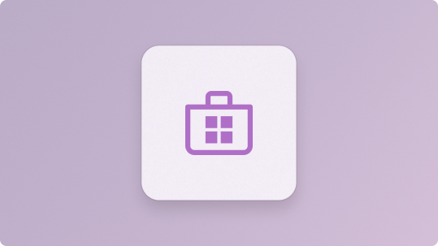
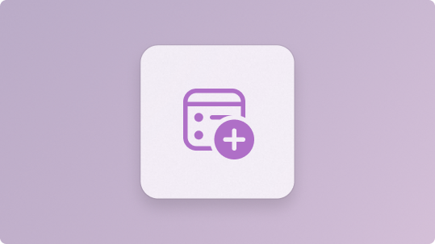
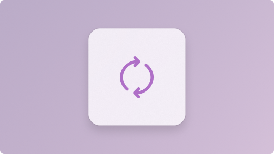
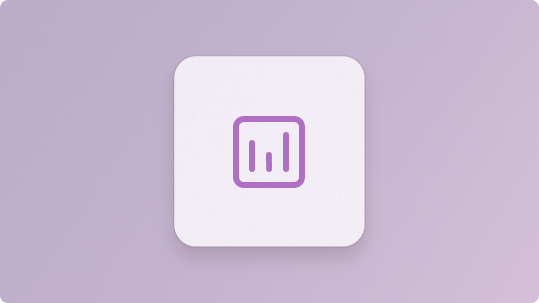

:::row:::
    :::column:::
        
        **[Get started with Microsoft Store](../apps/publish/get-started.md)** 
        Learn the basics of preparing, submitting, and publishing your app to the Microsoft Store.
    :::column-end:::
    :::column:::
        
        **[Developer account](../apps/publish/partner-center/open-a-developer-account.md)** 
        Set up and manage the developer account required to publish apps in the Microsoft Store.
    :::column-end:::
    :::column:::
         
        **[App submission](../apps/publish/publish-your-app/msix/reserve-your-apps-name.md)** 
       Package your app, create a Store listing, and submit it for certification.
    :::column-end:::
:::row-end:::

:::row:::
    :::column:::
        
        **[Managing your app](../apps/publish/publish-your-app/msix/publish-update-to-your-app-on-store.md)** 
        Update listings, publish new versions, and manage availability after your app is live.
    :::column-end:::
    :::column:::
        
        **[App performance monitoring](../apps/publish/analyze-app-performance/msix.md)** 
        Track usage, reliability, and performance insights to improve your app over time.
    :::column-end:::
    :::column:::
         
        **[Developer tools](../apps/publish/product-page-experiments.md)** 
       Use Partner Center and supporting tools to build, test, and publish Store apps.
    :::column-end:::
:::row-end:::