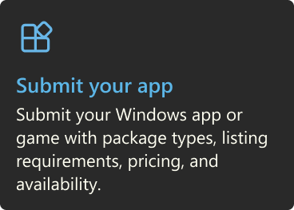
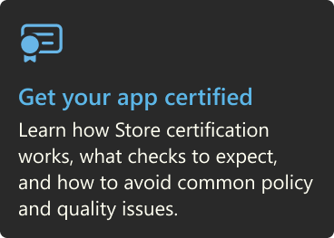
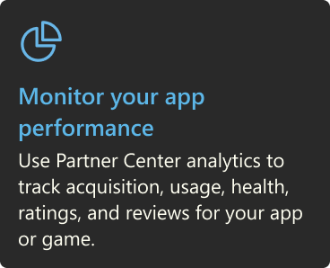
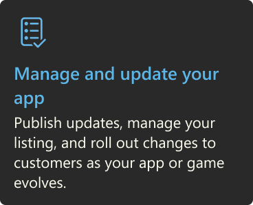
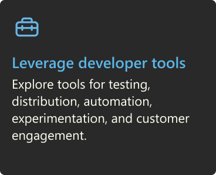
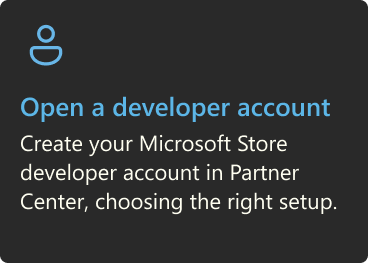
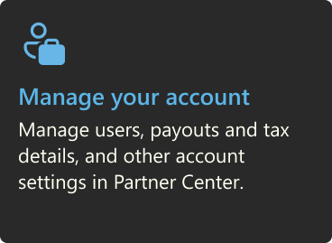
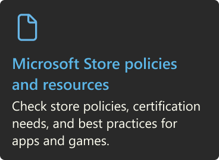
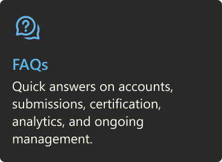
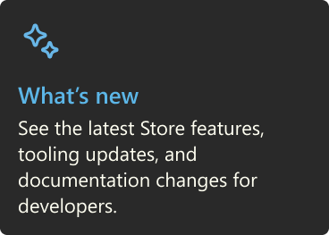

:::row:::
    :::column:::
       [ 
       **Open a developer account**
       Create your Microsoft Store developer account in Partner Center, choosing the right setup](../apps/publish/partner-center/open-a-developer-account.md)
    :::column-end:::
    :::column:::
        
    :::column-end:::
    :::column:::
         
    :::column-end:::
:::row-end:::

:::row:::
    :::column:::
        
    :::column-end:::
    :::column:::
        
    :::column-end:::
    :::column:::
         
        
       [ ](../apps/publish/partner-center/open-a-developer-account.md)
       **Open a developer account** 
       [Create your Microsoft Store developer account in Partner Center, choosing the right setup.](../apps/publish/partner-center/open-a-developer-account.md)
    :::column-end:::
    :::column:::
       [ ](../apps/publish/publish-your-app/msix/reserve-your-apps-name.md)
       **Submit your app** 
       [Submit your Windows app or game with package types, listing requirements, pricing, and availability.](../apps/publish/publish-your-app/msix/reserve-your-apps-name.md)
    :::column-end:::
    :::column:::
        [ ](../apps/publish/publish-your-app/msix/app-certification-process.md)
        **Get your app certified** 
        [Learn how Store certification works, what checks to expect, and how to avoid common policy and quality issues.](../apps/publish/publish-your-app/msix/app-certification-process.md)
    :::column-end:::
:::row-end:::

:::row:::
    :::column:::
        
    :::column-end:::
    :::column:::
        
    :::column-end:::
    :::column:::
         
        
       [ ](../apps/publish/analyze-app-performance/msix.md)
       **Monitor your app performance** 
       [Use Partner Center analytics to track acquisition, usage, health, ratings, and reviews for your app or game.](../apps/publish/analyze-app-performance/msix.md)
    :::column-end:::
    :::column:::
       [ ](../apps/publish/publish-your-app/msix/publish-update-to-your-app-on-store.md)
       **Manage and update your app** 
       [Publish updates, manage your listing, and roll out changes to customers as your app or game evolves.](../apps/publish/publish-your-app/msix/publish-update-to-your-app-on-store.md)
    :::column-end:::
    :::column:::
        [ ](../apps/publish/product-page-experiments.md)
        **Leverage developer tools** 
        [Explore tools for testing, distribution, automation, experimentation, and customer engagement.](../apps/publish/product-page-experiments.md)
    :::column-end:::
:::row-end:::

:::row:::
    :::column:::
        
        
       [ ](../apps/publish/partner-center/manage-account-users.md)
       **Manage your account** 
       [Manage users, payouts and tax details, and other account settings in Partner Center.](../apps/publish/partner-center/manage-account-users.md)
    :::column-end:::
    :::column:::
       [ ](../apps/publish/store-policies.md)
       **Microsoft Store policies and resources** 
       [Check store policies, certification needs, and best practices for apps and games.](../apps/publish/store-policies.md)
    :::column-end:::
    :::column:::
        [ ](../apps/publish/faq/get-started-with-the-microsoft-store.md)
        **FAQs** 
        [Quick answers on accounts, submissions, certification, analytics, and ongoing management.](../apps/publish/faq/get-started-with-the-microsoft-store.md)
    :::column-end:::
:::row-end:::

:::row:::
    :::column:::
       [ ](../apps/publish/whats-new-company-developer.md)
       **What’s new** 
       [See the latest Store features, tooling updates, and documentation changes for developers.](../apps/publish/whats-new-company-developer.md)
    :::column-end:::
    :::column:::
    :::column-end:::
    :::column:::
    :::column-end:::
:::row-end:::
