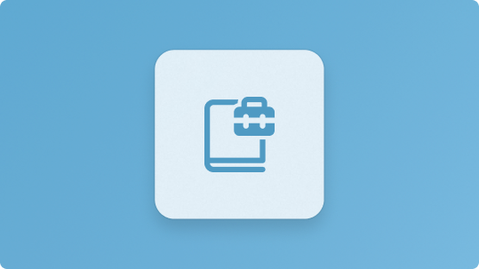
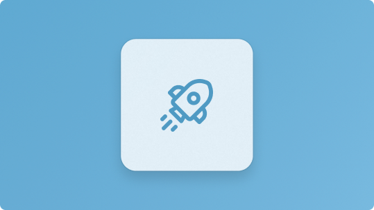

:::row:::
    :::column:::
         
        **[Core concepts](../apps/get-started/index.md)** 
       Learn the fundamental building blocks of the Windows platform, including the Windows SDK, Windows App SDK, and how to choose the right app framework.
    :::column-end:::
    :::column:::
        
        **[Get started with WinUI](../apps/get-started/start-here.md)** 
        Build your first WinUI app and get familiar with the basics of the platform and tooling.
    :::column-end:::
    :::column:::
        
        **[Help and guidance](../apps/get-started/best-practices.md)** 
        Find best practices, FAQs, and reference material to help you move forward with confidence.
    :::column-end:::
:::row-end:::
:::row:::
    :::column:::
        
        **[What's new](../apps/whats-new/whats-new-for-developers.md)** 
        Stay up to date with the latest Windows platform updates, SDK releases, and new capabilities.
    :::column-end:::
    :::column:::
    :::column-end:::
    :::column:::
    :::column-end:::
:::row-end:::