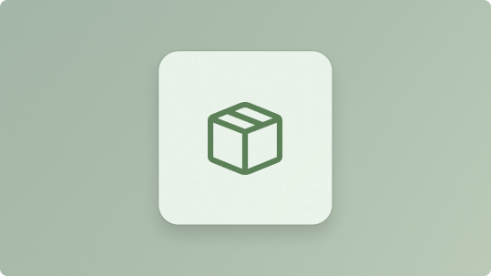

:::row:::
    :::column:::
        
        **[Packaging](../apps/package-and-deploy/packaging/index.md)** 
        Prepare your app for distribution by configuring how it’s packaged, installed, and updated.
    :::column-end:::
    :::column:::
        
        **[Deployment](../apps/package-and-deploy/deploy-overview.md)** 
        Learn how to deliver and manage the Windows App SDK with your app using framework or self-contained deployment options.
    :::column-end:::
    :::column:::

    :::column-end:::
:::row-end:::
