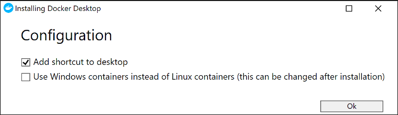
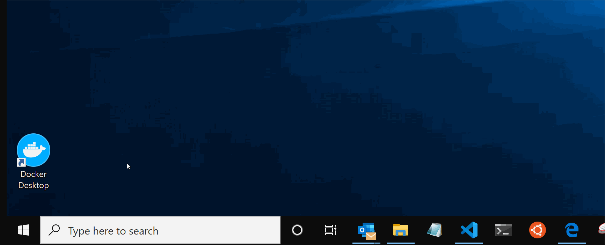
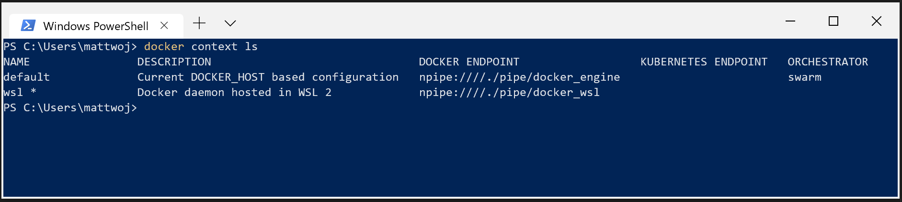
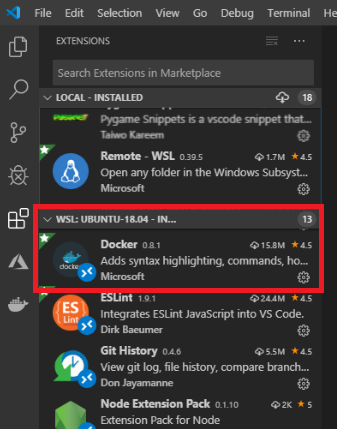

# Get started using Docker containers with Node.js

A step-by-step guide to help you get started using Docker containers with your Node.js apps.

## Prerequisites

This guide assumes that you've already completed the steps to [set up your Node.js development environment with WSL 2](./setup-on-wsl2.md), including:

- Install Windows 10 Insider Preview build 18932 or later.
- Enable the WSL 2 feature on Windows.
- Install a Linux distribution (Ubuntu 18.04 for our examples). You can check this with: `wsl lsb_release -a`.
- Ensure your Ubuntu 18.04 distribution is running in WSL 2 mode. (WSL can run distributions in both v1 or v2 mode.) You can check this by opening PowerShell and entering: `wsl -l -v`.
- Using PowerShell, set Ubuntu 18.04 as your default distribution, with: `wsl -s ubuntu 18.04`.

## Overview of Docker containers

**Docker** is a tool used to create, deploy, and run applications using containers. Containers enable developers to package an app with all of the parts it needs (libraries, frameworks, dependencies, etc) and ship it all out as one package. Using a container ensures that the app will run the same regardless of any customized settings or previously installed libraries on the computer running it that could differ from the machine that was used to write and test the app's code. This permits developers to focus on writing code without worrying about the system that code will be run on.

Docker containers are similar to virtual machines, but don't create an entire virtual operating system. Instead, Docker enables the app to use the same Linux kernel as the system that it's running on. This allows the app package to only require parts not already on the host computer, reducing the package size and improving performance.

Continuous availability, using Docker containers with tools like [Kubernetes](/azure/aks/), is another reason for the popularity of containers. This enables multiple versions of your app container to be created at different times. Rather than needing to take down an entire system for updates or maintenance, each container (and it's specific microservices) can be replaced on the fly. You can prepare a new container with all of your updates, set up the container for production, and just point to the new container once it's ready. You can also archive different versions of your app using containers and keep them running as a safety fallback if needed.

## Install Docker Desktop WSL 2 Tech Preview

Previously, WSL 1 could not run the Docker daemon directly, but that has changed with WSL 2 and led to significant improvements in speed and performance with Docker Desktop for WSL 2.

To install and run Docker Desktop WSL 2 Tech Preview:

1. Download the [Docker Desktop WSL 2 Tech Preview Installer](https://download.docker.com/win/edge/36883/Docker%20Desktop%20Installer.exe). (You can reference the [installer docs](https://docs.docker.com/docker-for-windows/wsl-tech-preview/) if needed).

2. Open the Docker installer that you just downloaded. The installation wizard will ask if you want to "Use Windows containers instead of Linux containers" - leave this unchecked as we will be using the Linux subsystem. Docker will be installed in a managed directory in your default WSL 2 distribution and will include the Docker daemon, CLI, and Compose CLI.

    

3. If you don't yet have a Docker ID, you will need to set one up by visiting: [https://hub.docker.com/signup](https://hub.docker.com/signup). Your ID must be all lowercase alphanumeric characters.

4. Once installed, start Docker Desktop by selecting the shortcut icon on your desktop or finding it in your Windows Start menu. The Docker icon will appear in the hidden icons menu of your taskbar. Right-click the icon to display the Docker commands menu and select "WSL 2 Tech Preview".

5. Once the tech preview windows opens, select **Start** to begin running the Docker daemon (background process) in WSL 2. When the WSL 2 docker daemon starts, a docker CLI context is automatically created for it.

    

6. To confirm that Docker has been installed and display the version number, open a command line (WSL or PowerShell) and enter: `docker --version`

7. Test that your installation works correctly by running a simple built-in Docker image: `docker run hello-world`

Here are a few Docker commands you should know:

- List the commands available in the Docker CLI by entering: `docker`
- List information for a specific command with: `docker <COMMAND> --help`
- List the docker images on your machine (which is just the hello-world image at this point), with: `docker image ls --all`
- List the containers on your machine, with: `docker container ls --all`
- List your Docker system statistics and resources (CPU & memory) available to you in the WSL 2 context, with: `docker info`
- Display where docker is currently running, with: `docker context ls`

You can see that there are two contexts that Docker is running in -- `default` (the classic Docker daemon) and `wsl` (our recommendation using the tech preview). (Also, the `ls` command is short for `list` and can be used interchangeably).



> [!TIP]
> Try building an example Docker image with this [tutorial on Docker Hub](https://hub.docker.com/?overlay=onboarding). Docker Hub also contains many thousands of open-source images that might match the type of app you want to containerize. You can download images, such as this [Gatsby.js framework container](https://hub.docker.com/r/gatsbyjs/gatsby-dev-builds) or this [Nuxt.js framework container](https://hub.docker.com/r/hobord/nuxtexpress), and extend it with your own application code. You can search the registry using [Docker from your command line](https://docs.docker.com/engine/reference/commandline/search/) or the [Docker Hub website](https://hub.docker.com/search/?type=image).

## Install the Docker extension on VS Code

The Docker extension makes it easy to build, manage and deploy containerized applications from Visual Studio Code.

1. Open the **Extensions** window (Ctrl+Shift+X) in VS Code and search for **Docker**.

2. Select the [Microsoft Docker extension](https://marketplace.visualstudio.com/items?itemName=ms-azuretools.vscode-docker) and **install**. You will need to reload VS Code after installing to enable the extension.

    

By installing the Docker extension on VS Code, you will now be able to bring up a list of `Dockerfile` commands used in the next section with the shortcut: `Ctrl+Space`

Learn more about [working with Docker in VS Code](https://code.visualstudio.com/docs/azure/docker).

## Create a container image with DockerFile

A **container image** stores your application code, libraries, configuration files, environment variables, and runtime. Using an image ensures that the environment in your container is standardized and contains only what is necessary to build and run your application.

A **DockerFile** contains the instructions needed to build the new container image. In other words, this file builds the container image that defines your app’s environment so it can be reproduced anywhere.

Let's build a container image using the Next.js app set up in the [web frameworks](./web-frameworks.md) guide.

1. Open your Next.js app in VS Code (ensuring that the Remote-WSL extension is running as indicated in the bottom-left green tab). Open the WSL terminal integrated in VS Code (**View > Terminal**) and make sure that the terminal path is pointed to your Next.js project directory (ie. `~/NextProjects/my-next-app$`).

2. Create a new file called `Dockerfile` in the root of your Next.js project and add the following:

    ```docker
    # Specifies where to get the base image (Node v12 in our case) and creates a new container for it
    FROM node:12
    
    # Set working directory. Paths will be relative this WORKDIR.
    WORKDIR /usr/src/app
    
    # Install dependencies
    COPY package*.json ./
    RUN npm install
    
    # Copy source files from host computer to the container
    COPY . .
    
    # Build the app
    RUN npm run build
    
    # Specify port app runs on
    EXPOSE 3000

    # Run the app
    CMD [ "npm", "start" ]
    ```

3. To build the docker image, run the following command from the root of your project (but replacing `<your_docker_username>` with the username you created on Docker Hub): `docker build -t <your_docker_username>/my-nextjs-app .`

> [!NOTE]
> Docker must be running with the WSL Tech Preview for this command to work. For a reminder of how to start Docker see [step #4](#install-docker-desktop-wsl-2-tech-preview) of the install section. The `-t` flag specifies the name of the image to be created, "my-nextjs-app:v1" in our case. We recommend that you always [use a version # on your tag names](https://medium.com/@mccode/the-misunderstood-docker-tag-latest-af3babfd6375) when creating an image. Be sure to include the period at the end of the command, which specifies the current working directory should be used to find and copy the build files for your Next.js app.

4. To run this new docker image of your Next.js app in a container, enter the command: `docker run -d -p 3333:3000 <your_docker_username>/my-nextjs-app:v1`

5. The `-p` flag binds port '3000' (the port that the app is running on inside the container) to local port '3333' on your machine, so you can now point your web browser to [http://localhost:3333](http://localhost:3333) and see your server-side rendered Next.js application running as a Docker container image.

> [!TIP]
> We built our container image using `FROM node:12` which references the Node.js version 12 default image stored on Docker Hub. This default Node.js image is based on a Debian/Ubuntu Linux system, there are many different Node.js images to choose from, however, and you may want to consider using something more lightweight or tailored to your needs. Learn more in the [Node.js Image Registry on Docker Hub](https://hub.docker.com/_/node/).

## Upload your container image to a repository

A **container repository** stores your container image in the cloud. Often a container repository will actually contain a collection of related images, such as different versions, that are all available for easy setup and rapid deployment. Typically, you can access images on container repositories via secure HTTPs endpoints, allowing you to pull, push or manage images through any system, hardware or VM instance.

A **container registry**, on the other hand, stores a collection of repositories as well as indexes, access control rules, and API paths. These can be hosted publicly or privately. [Docker Hub](https://hub.docker.com/) is an open-source Docker registry and the default used when running `docker push` and `docker pull` commands. It is free for public repos and requires a fee for private repos.

To upload your new container image to a repo hosted on Docker Hub:

1. Log in to Docker Hub. You will be prompted to enter the username and password you used to create your Docker Hub account during the installation step. To log in to Docker in your terminal, enter: `docker login`

2. To get a list of the docker container images that you've created on your machine, enter: `docker image ls --all`

3. Push your container image up to Docker Hub, creating a new repo for it there, using this command: `docker push <your_docker_username>/my-nextjs-app:v1`

4. You can now view your repository on Docker Hub, enter a description, and link your GitHub account (if you want to), by visiting: https://cloud.docker.com/repository/list

5. You can also view a list of your active Docker containers with: `docker container ls` (or `docker ps`)

6. You should see that your "my-nextjs-app:v1" container is active on port 3333 ->3000/tcp. You can also see your "CONTAINER ID" listed here. To stop running your container, enter the command: `docker stop <container ID>`

7. Typically, once a container is stopped, it should also be removed. Removing a container cleans up any resources it leaves behind. Once you remove a container, any changes you made within its image filesystem are permanently lost. You will need to build a new image to represent changes. TO remove your container, use the command: `docker rm <container ID>`

Learn more about [building a containerized web application with Docker](/learn/modules/intro-to-containers/).

## Deploy to Azure Container Registry

[**Azure Container Registry**](https://azure.microsoft.com/services/container-registry/) (ACR) enables you to store, manage, and keep your container images safe in private, authenticated, repositories. Compatible with standard Docker commands, ACR can handle critical tasks for you like container health monitoring and maintenance, pairing with [Kubernetes](/azure/aks/intro-kubernetes) to create scalable orchestration systems. Build on demand, or fully automate builds with triggers such as source code commits and base image updates. ACR also leverages the vast Azure cloud network to manage network latency, global deployments, and create a seamless native experience for anyone using [Azure App Service](/azure/app-service/) (for web hosting, mobile back ends, REST APIs), or [other Azure cloud services](https://azure.microsoft.com/product-categories/containers/).

> [!IMPORTANT]
> You need your own Azure subscription to deploy a container to Azure and you may receive a charge. If you don't already have an Azure subscription, [create a free account](https://azure.microsoft.com/free/) before you begin.

For help creating an Azure Container Registry and deploy your app container image, see the exercise: [Deploy a Docker image to an Azure Container Instance](/learn/modules/intro-to-containers/7-exercise-deploy-docker-image-to-container-instance).

## Additional resources

- [Node.js on Azure](https://azure.microsoft.com/develop/nodejs/)
- Quickstart: [Create a Node.js web app in Azure](/azure/app-service/app-service-web-get-started-nodejs)
- Online course: [Administer containers in Azure](/learn/paths/administer-containers-in-azure/)
- Using VS Code: [Working with Docker](https://code.visualstudio.com/docs/azure/docker)
- Docker Docs: [Docker Desktop WSL 2 Tech Preview](https://docs.docker.com/docker-for-windows/wsl-tech-preview/)