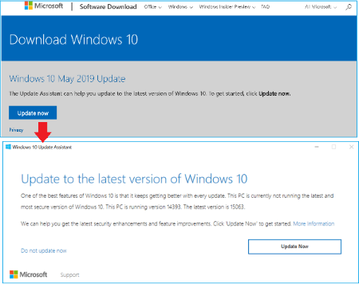
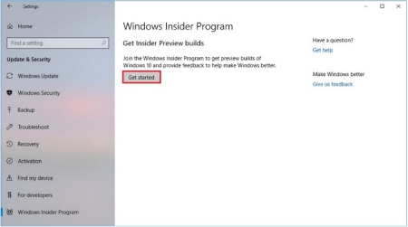
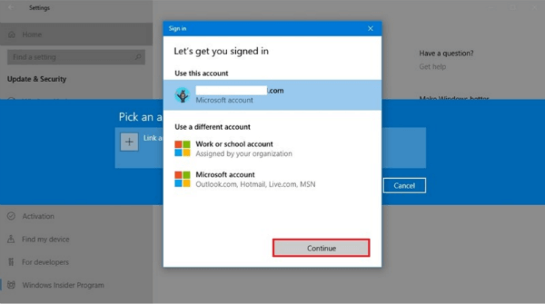
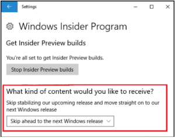
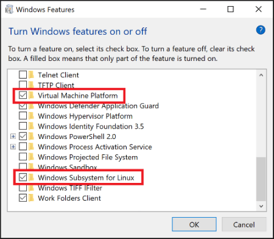
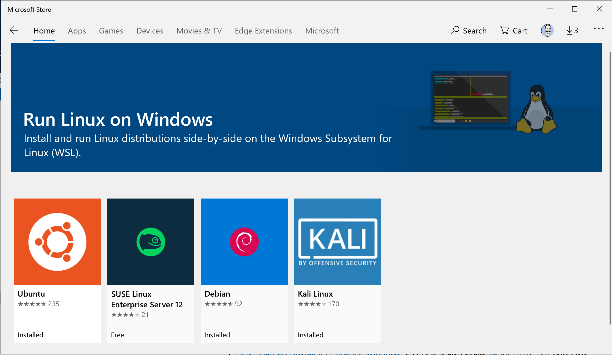
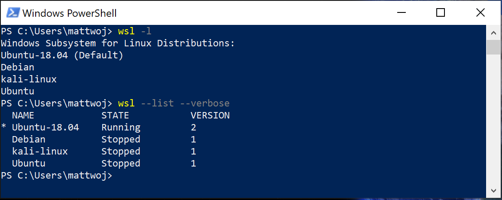
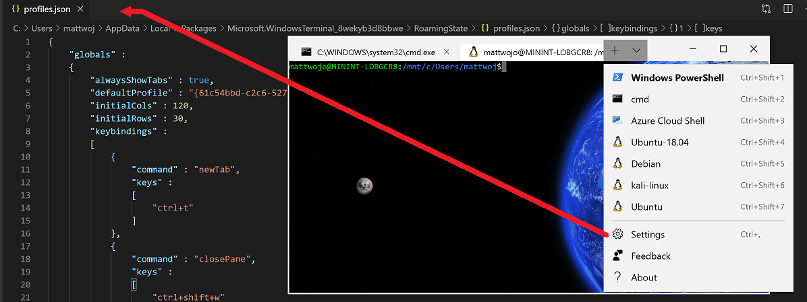

# Set up your Node.js development environment with WSL 2

The following is a step-by-step guide to help you get your Node.js development environment set up using Windows Subsystem for Linux (WSL). This guide currently requires that you install and run a Windows Insider Preview Build in order to install and use [WSL 2](https://devblogs.microsoft.com/commandline/wsl-2-is-now-available-in-windows-insiders/). WSL 2 has significant speed and performance improvements over WSL 1, particularly in regard to Node.js. Many npm modules and tutorials for Node.js web development are written for Linux users and use Linux-based packaging and installation tools. Most web apps are also deployed on Linux, so using WSL 2 will ensure you have consistency between your development and production environments.

> [!NOTE]
> If you are committed to using Node.js directly on Windows, or plan to use a Windows Server production environment, see our guide to [set up your Node.js development environment directly on Windows](./setup-on-windows.md).

## Install Windows 10 Insider Preview Build

1. **[Install the most recent version of Windows 10](https://www.microsoft.com/software-download/windows10)**: Select **Update now** to download the Update Assistant. Once downloaded, open the update assistant to see whether you are currently running the latest version of Windows and, if not, select **Update now** inside the assistant window to update your machine. *(This step is optional if you're running a fairly recent version of Windows 10.)*

    

2. **[Go to Start > Settings > Windows Insider Program](ms-settings:windowsinsider)**: Inside the Windows Insider Program window, select **Get started** , then **Link an account**.

    

3. **[Register as a Windows Insider](https://insider.windows.com/getting-started/#register)**: If you aren't registered with the Insider program, you'll need to do so with your [Microsoft account](https://account.microsoft.com/account).

    

4. Choose to receive **Fast Ring** updates or **Skip ahead to the next Windows release** content. Confirm and choose to **Restart later**. We will need to change a couple of additional settings before restarting.

    

## Enable Windows Subsystem for Linux and Virtual Machine Platform

1. While still in **Windows Settings**, search for **Turn Windows features on or off**.
2. Once the **Windows Features** list appears, scroll to find **Virtual Machine Platform** and **Windows Subsystem for Linux**, ensure that the box is checked to enable both, then select **OK**.
3. Restart your computer when prompted.

    

## Install a Linux distribution

There are several Linux distributions available to run on WSL. You can find and install your favorite in the Microsoft Store. We recommend starting with [Ubuntu 18.04 LTS](https://www.microsoft.com/store/productId/9N9TNGVNDL3Q) as it's current, popular, and well supported.

1. Open this [Ubuntu 18.04 LTS](https://www.microsoft.com/store/productId/9N9TNGVNDL3Q) link, open the Microsoft Store, and select **Get**. *(This is a fairly large download and may take some time to install.)*

2. After the download completes, select **Launch** from the Microsoft Store or launch by typing "Ubuntu 18.04 LTS" into the **Start** menu.

3. You will be asked to create an account name and password when you run the distribution for the first time. After this, you'll be automatically signed in as this user by default. You can choose any username and password. They have no bearing on your Windows user name.

    

You can check the Linux distribution that you are currently using by entering: `lsb_release -dc`. To update your Ubuntu distribution, use: `sudo apt update && sudo apt upgrade`. We recommend updating regularly to ensure you have the most recent packages. Windows doesn't automatically handle this update. For links to other Linux distributions available in the Microsoft Store, alternative installation methods, or troubleshooting, see [Windows Subsystem for Linux Installation Guide for Windows 10](https://docs.microsoft.com/windows/wsl/install-win10).

## Install WSL 2

WSL 2 is a [new version of the architecture](https://docs.microsoft.com/windows/wsl/wsl2-about) in WSL that changes how Linux distros interact with Windows, improving performance and adding full system call compatibility.

1. In PowerShell, enter the command: `wsl -l` to view the list of WSL distributions that you have installed on your machine. You should now see Ubuntu-18.04 in this list.
2. Now, enter the command: `wsl --set-version Ubuntu-18.04 2` to set your Ubuntu installation to use WSL 2.
3. Verify the version of WSL each of your installed distributions are using with: `wsl --list --verbose` (or `wsl -l -v`).

    

> [!TIP]
> You can set any Linux distribution that you've installed to WSL 2 following the same instructions (using PowerShell), just change 'Ubuntu-18.04' to the name of installed distro that you would like to target. To change back to WSL 1, run the same command as above but replacing the '2' with a '1'.  You can also set WSL 2 as your default for any newly installed distributions by entering: `wsl --set-default-version 2`.

## Install nvm, node.js, and npm

There are multiple ways to install Node.js. We recommend using a version manager as versions change very quickly. You will likely need to switch between multiple versions based on the needs of different projects you're working on. Node Version Manager, more commonly called nvm, is the most popular way to install multiple versions of Node.js. We will walk through the steps to install nvm and then use it to install Node.js and Node Package Manager (npm). There are [alternative version managers](#alternative-version-managers) to consider as well covered in the next section.

> [!IMPORTANT]
> It is always recommended to remove any existing installations of Node.js or npm from your operating system before installing a version manager as the different types of installation can lead to strange and confusing conflicts. For example, the version of Node that can be installed with Ubuntu's `apt-get` command is currently outdated. For help with removing previous installations, see [How to remove nodejs from ubuntu](https://askubuntu.com/questions/786015/how-to-remove-nodejs-from-ubuntu-16-04).)

1. Open your Ubuntu 18.04 command line.
2. Install cURL (a tool used for downloading content from the internet in the command-line) with: `sudo apt-get install curl`
3. Install nvm, with: `curl -o- https://raw.githubusercontent.com/nvm-sh/nvm/v0.35.2/install.sh | bash`
4. To verify installation, enter: `command -v nvm` ...this should return 'nvm', if you receive 'command not found' or no response at all, close your current terminal, reopen it, and try again. [Learn more in the nvm github repo](https://github.com/nvm-sh/nvm).
5. List which versions of Node are currently installed (should be none at this point): `nvm ls`

    

6. Install the current release of Node.js (for testing the newest feature improvements, but more likely to have issues): `nvm install node`
7. Install the latest stable LTS release of Node.js (recommended): `nvm install --lts`
8. List what versions of Node are installed: `nvm ls` ...now you should see the two versions that you just installed listed.

    

9. Verify that Node.js is installed and the currently default version with: `node --version`. Then verify that you have npm as well, with: `npm --version` (You can also use `which node` or `which npm` to see the path used for the default versions).
10. To change the version of Node.js you would like to use for a project, create a new project directory `mkdir NodeTest`, and enter the directory `cd NodeTest`, then enter `nvm use node` to switch to the Current version, or `nvm use --lts` to switch to the LTS version. You can also use the specific number for any additional versions you've installed, like `nvm use v8.2.1`. (To list all of the versions of Node.js available, use the command: `nvm ls-remote`).

> [!TIP]
> If you are using NVM to install Node.js and NPM, you should not need to use the SUDO command to install new packages.

> [!NOTE]
> At the time of publication, NVM v0.35.2 was the most recent version available. You can check the [GitHub project page for the latest release of NVM](https://github.com/nvm-sh/nvm), and adjust the above command to include the newest version.
Installing the newer version of NVM using cURL will replace the older one, leaving the version of Node you've used NVM to install intact. For example: `curl -o- https://raw.githubusercontent.com/nvm-sh/nvm/v0.36.0/install.sh | bash`

## Alternative version managers

While nvm is currently the most popular version manager for node, there are a few alternatives to consider:

- [n](https://www.npmjs.com/package/n#installation) is a long-standing `nvm` alternative that accomplishes the same thing with slightly different commands and is installed via `npm` rather than a bash script.
- [fnm](https://github.com/Schniz/fnm#using-a-script) is a newer version manager, claiming to be much faster than `nvm`. (It also uses [Azure Pipelines](https://docs.microsoft.com/azure/devops/pipelines/get-started/what-is-azure-pipelines?view=azure-devops).)
- [Volta](https://github.com/volta-cli/volta#installing-volta) is a new version manager from the LinkedIn team that claims improved speed and cross-platform support.
- [asdf-vm](https://asdf-vm.com/#/core-manage-asdf-vm) is a single CLI for multiple languages, like ike gvm, nvm, rbenv & pyenv (and more) all in one.
- [nvs](https://github.com/jasongin/nvs) (Node Version Switcher) is a cross-platform `nvm` alternative with the ability to [integrate with VS Code](https://github.com/jasongin/nvs/blob/master/doc/VSCODE.md).

## Install your favorite code editor

We recommend using **Visual Studio Code** with the **Remote-WSL Extension** for Node.js projects. This splits VS Code into a “client-server” architecture, with the client (the user interface) running on your Windows machine and the server (your code, Git, plugins, etc) running remotely.

- Linux-based Intellisense and linting is supported.
- Your project will automatically build in Linux.
- You can use all your extensions running on Linux ([ES Lint, NPM Intellisense, ES6 snippets, etc.](https://marketplace.visualstudio.com/items?itemName=waderyan.nodejs-extension-pack)).

Terminal-based text editors (vim, emacs, nano) are also helpful for making quick changes from right inside your console. ([This article](https://medium.com/linode-cube/emacs-nano-or-vim-choose-your-terminal-based-text-editor-wisely-8f3826c92a68) does a nice job explaining the difference and a bit about how to use each.)

> [!NOTE]
> Some GUI editors (Atom, Sublime Text, Eclipse) may run into trouble accessing the WSL shared network location (\\wsl$\Ubuntu\home\) and will try to build your Linux files using Windows tools, which may not be what you want. The Remote-WSL Extension in VS Code will handle this compatibility for you.

To install VS Code and the Remote-WSL Extension:

1. [Download and install VS Code for Windows](https://code.visualstudio.com). VS Code is also available for Linux, but Windows Subsystem for Linux does not support GUI apps, so we need to install it on Windows. Not to worry, you'll still be able to integrate with your Linux command line and tools using the Remote - WSL Extension.

2. Install the [Remote - WSL Extension](https://marketplace.visualstudio.com/items?itemName=ms-vscode-remote.remote-wsl) on VS Code. This allows you to use WSL as your integrated development environment and will handle compatibility and pathing for you. [Learn more](https://code.visualstudio.com/docs/remote/remote-overview).

> [!IMPORTANT]
> If you already have VS Code installed, you need to ensure that you have the [1.35 May release](https://code.visualstudio.com/updates/v1_35) or later in order to install the [Remote - WSL Extension](https://marketplace.visualstudio.com/items?itemName=ms-vscode-remote.remote-wsl). We do not recommend using WSL in VS Code without the Remote-WSL extension as you will lose support for auto-complete, debugging, linting, etc. Fun fact: This WSL extension is installed in $HOME/.vscode-server/extensions.

### Helpful VS Code Extensions

While VS Code comes with many features for Node.js development out of the box, there are some helpful extensions to consider installing available in the [Node.js Extension Pack](https://marketplace.visualstudio.com/items?itemName=waderyan.nodejs-extension-pack). Install them all or pick and choose which seem the most useful to you.

To install the Node.js extension pack:

1. Open the **Extensions** window (Ctrl+Shift+X) in VS Code.

    The Extensions window is now divided into three sections (because you installed the Remote-WSL extension).
    - "Local - Installed": The extensions installed for use with your Windows operating system.
    - "WSL:Ubuntu-18.04-Installed": The extensions installed for use with your Ubuntu operating system (WSL).
    - "Recommended": Extensions recommended by VS Code based on the file types in your current project.

    

2. In the search box at the top of the Extensions window, enter: **Node Extension Pack** (or the name of whatever extension you are looking for). The extension will be installed for either your Local or WSL instances of VS Code depending on where you have the current project opened. You can tell by selecting the remote link in the bottom-left corner of your VS Code window (in green). It will either give you the option to open or close a remote connection. Install your Node.js extensions in the "WSL:Ubuntu-18.04" environment.

    

A few additional extensions you may want to consider include:

- [Debugger for Chrome](https://code.visualstudio.com/blogs/2016/02/23/introducing-chrome-debugger-for-vs-code): Once you finish developing on the server side with Node.js, you'll need to develop and test the client side. This extension integrates your VS Code editor with your Chrome browser debugging service, making things a bit more efficient.
- [Keymaps from other editors](https://marketplace.visualstudio.com/search?target=VSCode&category=Keymaps&sortBy=Downloads): These extensions can help your environment feel right at home if you're transitioning from another text editor (like Atom, Sublime, Vim, eMacs, Notepad++, etc).
- [Settings Sync](https://marketplace.visualstudio.com/items?itemName=Shan.code-settings-sync): Enables you to synchronize your VS Code settings across different installations using GitHub. If you work on different machines, this helps keep your environment consistent across them.

## Install Windows Terminal (optional)

The new Windows Terminal enables multiple tabs (quickly switch between Command Prompt, PowerShell, or multiple Linux distributions), custom key bindings (create your own shortcut keys for opening or closing tabs, copy+paste, etc.), emojis ☺, and custom themes (color schemes, font styles and sizes, background image/blur/transparency). [Learn more](https://devblogs.microsoft.com/commandline/).

1. Get [Windows Terminal (Preview) in the Microsoft Store](https://www.microsoft.com/store/apps/9n0dx20hk701): By installing via the store, updates are handled automatically.

2. Once installed, open Windows Terminal and select **Settings** to customize your terminal using the `profile.json` file. [Learn more about Editing Windows Terminal Settings](https://github.com/microsoft/terminal/blob/master/doc/user-docs/UsingJsonSettings.md).

    

## Set up Git (optional)

If you plan to collaborate with others, or host your project on an open-source site (like GitHub), VS Code supports [version control with Git](https://code.visualstudio.com/docs/editor/versioncontrol#_git-support). The Source Control tab in VS Code tracks all of your changes and has common Git commands (add, commit, push, pull) built right into the UI.

1. Git comes installed with the Windows Subsystem for Linux distros, however, you will need to set up your git config file. To do so, in your terminal enter: `git config --global user.name "Your Name"` and then, `git config --global user.email "youremail@domain.com"`. If you don't yet have a Git account, you can [sign-up for one on GitHub](https://github.com/join). If you've never worked with Git before, [GitHub Guides](https://guides.github.com/) can help you get started. If you need to edit your git config, you can do so with a built-in text editor like nano: `nano ~/.gitconfig`.

2. We recommend adding a [.gitignore file](https://help.github.com/en/articles/ignoring-files) to your Node projects. Here is [GitHub's default gitignore template for Node.js](https://github.com/github/gitignore/blob/master/Node.gitignore). If you choose to [create a new repo using the GitHub website](https://help.github.com/articles/create-a-repo), there are check boxes available to initialize your repo with a README file, .gitignore file set up for Node.js projects, and options to add a license if you need one.

## Next steps

You now have a Node.js development environment set up. To get started using your Node.js environment, consider trying one of these tutorials:

- [Get started with Node.js for beginners](./beginners.md)
- [Get started with Node.js web frameworks on Windows](./web-frameworks.md)
- [Get started connecting Node.js apps to a database](./databases.md)
- [Get started using Docker containers with Node.js](./containers.md)
