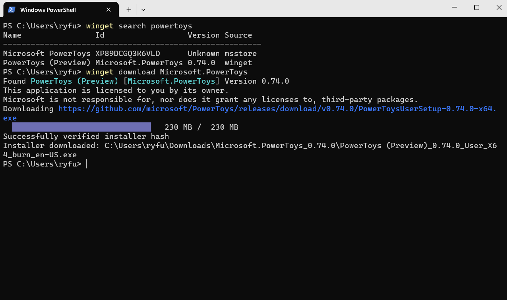

# download command (winget)

The **download** command of the [winget](index.md) tool downloads the installer, dependencies, and license file (when downloading a Microsoft Store Packaged app). Use the [**search**](search.md) command and the [**show**](show.md) command to identify the package installer you want to download.

The **download** command requires that you specify the exact string to download. If there is any ambiguity, you will be prompted to further filter the **download** command to an exact application.

The **download** command requires EntraID (formally Azure Active Directory) authentication to download a Microsoft Store packaged app (*.msix, *.appx, *.msixbundle, or *.appxbundle) and to download the Microsoft Store packaged app license file. The EntraID account used for authentication to generate and retrieve a Microsoft Store packaged app license file must be a member of one of the following three Azure roles: Global Administrator, User Administrator, or License Administrator.

> [!NOTE]
> By default, the **download** command will download the appropriate installer to the user's Downloads folder. Use the **--download-directory** option to specify a custom download path.

## Usage

`winget download [[-q] <query>] [<options>]`



### Download without license file
Downloading a package using WinGet, the package license file can be omitted by appending to the command the `--skip-license` parameter. The exclusion of the package license file will remove the authorization requirement for generating the offline license file.

```cmd
winget download [[--id] <package id>] [[--skip-license]] [<options>]
```

### Download for a specific platform
Downloading a package using WinGet, by default will download the latest available version of a package for each applicable use case (architecture, device platform, etc.). Filtering the downloaded content for a specific device platform is done by appending to the command the `--platform` parameter.

```cmd
winget download [[--id] <package id>] [[--platform] <platform type> ] [<options>]
```

| Platform | Description |
|--|--|
| Windows.Desktop | Supports being installed on Windows desktop experience |
| Windows.Universal | Supports being installed on all Microsoft operating systems |
| Windows.Holographic | Supports being installed on Microsoft HoloLens devices |

### Download for a specific architecture
Downloading a package using WinGet, by default will download the latest available version of a package for each applicable use case (architecture, device platform, etc.). Filtering the downloaded content with a specific architecture is done by appending to the command the `--architecture` parameter.

```cmd
winget download [[--id] <package id>] [[--architecture] <Architecture>] [<options>]
```

| Architecture | Description |
|--|--|
| x86 | 32-bit processor |
| x64 | 64-bit processor |
| arm | 32-bit ARM processor |
| arm64 | 64-bit ARM processor |

## Arguments

The following arguments are available.

| Argument      | Description |
|-------------|-------------|
| **-q,--query**  |  The query used to search for an app. |

> [!NOTE]
> The query argument is positional. Wild-card style syntax is not supported. This is most often the string of characters you expect to uniquely identify the package you wish to download.

## Options

The options allow you to customize the download experience to meet your needs.

| Option  | Description |
|-------------|-------------|
| **-d, --download-directory** | Directory where the installers are downloaded to. |
| **-m, --manifest** |  Must be followed by the path to the manifest (YAML) file. |
| **--id**    |  Limits the download to the ID of the application.   |
| **--name**   |  Limits the search to the name of the application. |
| **--moniker**   | Limits the search to the moniker listed for the application. |
| **-v, --version**  |  Enables you to specify an exact version to install. If not specified, latest will download the highest versioned application. |
| **-s, --source**   |  Restricts the search to the source name provided. Must be followed by the source name. |
| **--scope**   |  Allows you to specify if the installer should target user or machine scope. See [known issues relating to package installation scope](./troubleshooting.md#scope-for-specific-user-vs-machine-wide).|
| **-a, --architecture**   |  Select the architecture to download. |
| **--installer-type**  | Select the installer type to download. |
| **-e, --exact**   |   Uses the exact string in the query, including checking for case-sensitivity. It will not use the default behavior of a substring. |
| **--locale** | Specifies which locale to use (BCP47 format). |
| **--ignore-security-hash** |    Ignore the installer hash check failure. Not recommended. |
| **--skip-dependencies** | Skips processing package dependencies and Windows features. |
| **--header** | Optional Windows-Package-Manager REST source HTTP header. |
| **--authentication-mode** | Specify authentication window preference (silent, silentPreferred or interactive). |
| **--authentication-account** | Specify the account to be used for authentication. |
| **--accept-package-agreements** | Used to accept the license agreement, and avoid the prompt. |
| **--accept-source-agreements** | Used to accept the source license agreement, and avoid the prompt. |
| **--skip-license,--skip-microsoft-store-package-license** | Skips retrieving Microsoft Store package offline license. |
| **--platform** | Select the target platform. |
| **-?, --help** |  Get additional help on this command. |
| **--wait** | Prompts the user to press any key before exiting. |
| **--logs,--open-logs** | Open the default logs location. |
| **--verbose, --verbose-logs** | Used to override the logging setting and create a verbose log. |
| **--nowarn,--ignore-warnings** | Suppresses warning outputs. |
| **--disable-interactivity** | Disable interactive prompts. |
| **--proxy** | Set a proxy to use for this execution. |
| **--no-proxy** | Disable the use of proxy for this execution. |

### Example queries

The following example downloads a specific version of an application from its ID.

```CMD
winget download --id Microsoft.PowerToys --version 0.15.2
```

The following example downloads an application with a specific installer type.

```CMD
winget download --id Microsoft.WingetCreate --installer-type msix
```

The following example downloads an application by architecture and scope to a specific download directory.

```CMD
winget download --id Microsoft.PowerToys --scope machine --architecture x64 --download-directory <Path>
```


## Related topics

* [Use the winget tool to install and manage applications](index.md)
* [Submit packages to Windows Package Manager](../package/index.md)
