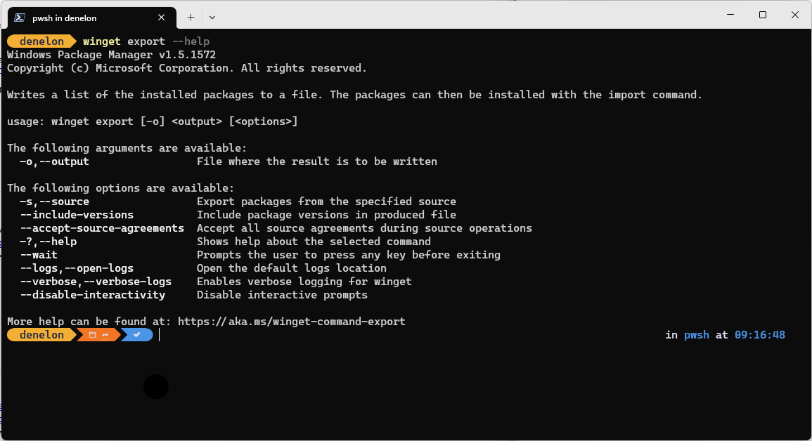
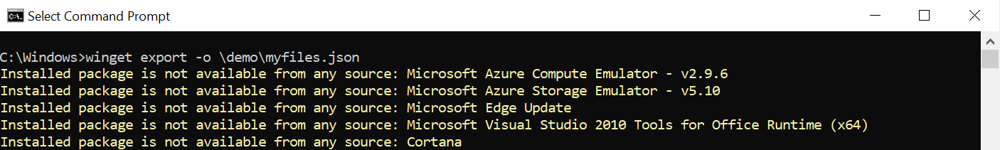

# export command (winget)

The **export** command of the [winget](./index.md) tool exports a JSON file of apps to a specified file. The **export** command uses JSON as the format. You can find the [schema for the JSON file](https://github.com/microsoft/winget-cli/tree/master/schemas/JSON/packages) used by winget in the [Windows Package Manager Client repo on GitHub](https://github.com/microsoft/winget-cli).

The **export** combined with the [**import**](./import.md) command allows you to batch install applications on your PC.

The **export** command is often used to create a file that you can share with other developers, or for use when restoring your build environment.

## Usage

`winget export [-o] <output> [<options>]`

## Arguments

The following arguments are available.

| Argument    | Description |
|-------------|-------------|  
| **-o,--output** | Path to the JSON file to be created |

## Options

The options allow you to customize the export experience to meet your needs.

| Option    | Description |
|----------------|-------------|  
| **-s, --source**  |  [Optional] Specifies a source to export files from. Use this option when you only want files from a specific source.  |
| **--include-versions** | [Optional] Includes the version of the app currently installed. Use this option if you want a specific version. By default, unless specified, [**import**](./import.md) will use latest. |
| **--accept-source-agreements** | Used to accept the source license agreement, and avoid the prompt. |
| **--verbose-logs** | Used to override the logging setting and create a verbose log. |

## JSON schema

The driving force behind the **export** command is the JSON file. You can find the [schema for the JSON file](https://github.com/microsoft/winget-cli/tree/master/schemas/JSON/packages) in the [Windows Package Manager Client repo on GitHub](https://github.com/microsoft/winget-cli).

The JSON file includes the following hierarchy.

| Entry      | Description |
|-------------|-------------|  
| **Sources**  |  The sources application manifests come from.  |
| **Packages**  |  The collection of packages to install.  |
| **PackageIdentifier**  |  The Windows Package Manager package identifier used to specify the package.  |
| **Version**  |  [Optional] The specific version of the package to install.  |

## Exporting files

When the Windows Package Manager exports the JSON file, it attempts to export all the applications installed on the PC. If the **winget export** command is not able to match an application to an application from an available **source**, the export command will show a warning.

> [!NOTE]
> Matching an application depends on metadata in the manifest from a configured source, and metadata in **Add / Remove Programs** in Windows based on the package installer.

After the export is complete, you can edit the resulting JSON file in your favorite editor. You can remove apps you do not wish to import in the future.

## Related topics

* [Use the winget tool to install and manage applications](index.md)
