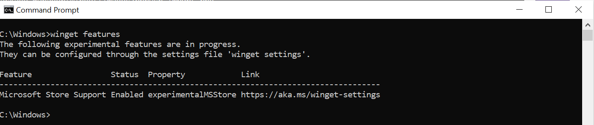
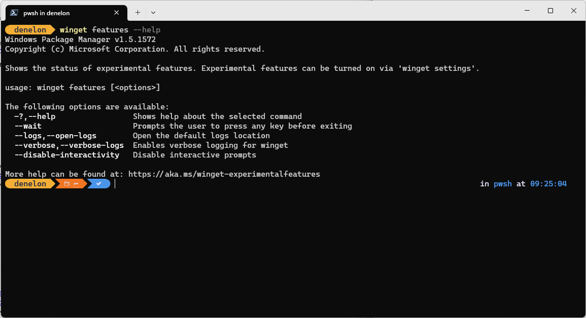

# features command (winget)

The **features** command of the [winget](index.md) tool displays a list of the experimental features available with your version of the Windows Package Manager. Experimental features are only available in preview builds. Instructions for obtaining a preview build can be found in the [GitHub repository](https://github.com/microsoft/winget-cli).

Each feature can be turned on individually by enabling the features through [**settings**](./settings.md).

You can find the latest up to date information features on the [experimental features](https://aka.ms/winget-experimentalfeatures) web page.

## Usage

`winget features [<options>]`

Notice above that the status of each feature is listed. If the feature is **disabled** you will not be able to use it. If the feature is **enabled** you will notice that the command will be available to you through **winget**.

To enabled any disabled features, go to **settings** and enable the feature.

> [!NOTE]
> Features may be managed by group policy. You can use the **winget --info** command to view any policies in effect on your system.

## Options

The following options are available.

| Option  | Description |
|--------------|-------------|
| **-?,--help** | Shows help about the selected command. |
| **--wait** | Prompts the user to press any key before exiting. |
| **--logs,--open-logs** | Open the default logs location. |
| **--verbose, --verbose-logs** | Used to override the logging setting and create a verbose log. |
| **--nowarn,--ignore-warnings** | Suppresses warning outputs. |
| **--disable-interactivity** | Disable interactive prompts. |
| **--proxy** | Set a proxy to use for this execution. |
| **--no-proxy** | Disable the use of proxy for this execution. |
