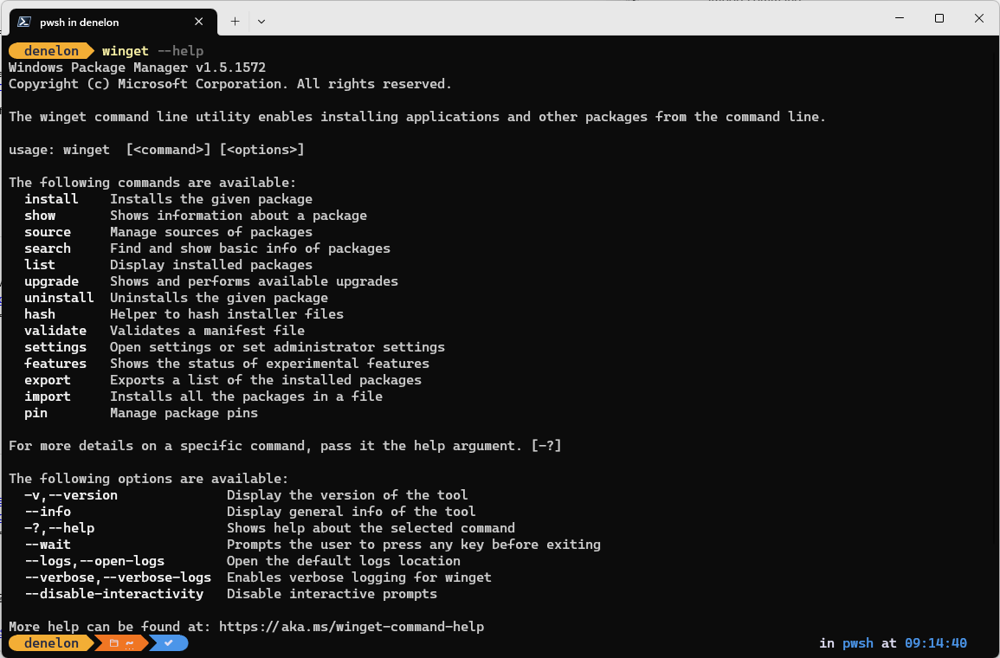

# Use the WinGet tool to install and manage applications

The **WinGet** command line tool enables users to discover, install, upgrade, remove and configure applications on Windows 10 and Windows 11 computers. This tool is the client interface to the Windows Package Manager service.

## Install WinGet

Windows Package Manager **WinGet** command-line tool is available on Windows 11 and modern versions of Windows 10 as a part of the **App Installer**.

You can [get App Installer from the Microsoft Store](https://www.microsoft.com/p/app-installer/9nblggh4nns1#activetab=pivot:overviewtab). If it's already installed, make sure it is updated with the latest version.

> [!NOTE]
> The **WinGet** command line tool is only supported on Windows 10 1709 (build 16299) or later at this time. The WinGet tool will not be available until you have logged into Windows as a user for the first time, triggering Microsoft Store to register Windows Package Manager as part of an asynchronous process. If you have recently logged in as a user for the first time and find that WinGet is not yet available, you can open PowerShell and enter the following command to request this WinGet registration: `Add-AppxPackage -RegisterByFamilyName -MainPackage Microsoft.DesktopAppInstaller_8wekyb3d8bbwe`.

### Install WinGet preview version [Developers Only]

WinGet is included in the Windows App Installer. To try the latest Windows Package Manager features, you can install a preview build one of the following ways:

- Download the latest [WinGet preview version](https://aka.ms/getwingetpreview). Read the [Release notes for WinGet preview](https://github.com/microsoft/winget-cli/releases) to learn about any new features. Installing this package will give you the preview version of the WinGet client, but it will not enable automatic updates of new preview versions from the Microsoft Store.

- Use a Microsoft Account (MSA), work, school or Azure Active Directory (AAD) account to sign up for the [Windows Insider Dev Channel](https://insider.windows.com/understand-flighting). The Windows Insider Dev Channel includes automatic updates of new preview versions from the Microsoft Store.

- Use a Microsoft Account (MSA) to sign up for the [Windows Package Manager Insiders Program](https://aka.ms/AppInstaller_InsiderProgram). Once your Microsoft Account (MSA) has been added (a few days after you receive e-mail notification) you will receive automatic updates of new preview versions from the Microsoft Store.

### Install WinGet on Windows Sandbox

[Windows Sandbox](/windows/security/threat-protection/windows-sandbox/windows-sandbox-overview) provides a lightweight desktop environment to safely run applications in isolation. Software installed inside the Windows Sandbox environment remains "sandboxed" and runs separately from the host machine. Windows Sandbox does not include WinGet, nor the Microsoft Store app, so you will need to download the latest WinGet package from the WinGet releases page on GitHub.

To install the stable release of WinGet on Windows Sandbox, follow these steps from a Windows PowerShell command prompt:

```powershell
$progressPreference = 'silentlyContinue'
Write-Host "Installing WinGet PowerShell module from PSGallery..."
Install-PackageProvider -Name NuGet -Force | Out-Null
Install-Module -Name Microsoft.WinGet.Client -Force -Repository PSGallery | Out-Null
Write-Host "Using Repair-WinGetPackageManager cmdlet to bootstrap WinGet..."
Repair-WinGetPackageManager
Write-Host "Done."
```

To install the PowerShell module in machine scope, you can use the `-Scope AllUsers` parameter with the `Install-Module` cmdlet. If you would like a preview version of WinGet, you can add `-IncludePrerelease` parameter with the Repair-WinGetPackageManager cmdlet. To see the available parameters for the Repair-WinGetPackageManager cmdlet, you can run `Get-Help Repair-WinGetPackageManager -Full`.

For more information on Windows Sandbox, including how to install a sandbox and what to expect from it's usage, see the [Windows Sandbox docs](/windows/security/threat-protection/windows-sandbox/windows-sandbox-overview).

## Administrator considerations

Installer behavior can be different depending on whether you are running **WinGet** with administrator privileges.

* When running **WinGet** without administrator privileges, some applications may [require elevation](/windows/security/identity-protection/user-account-control/how-user-account-control-works) to install. When the installer runs, Windows will prompt you to [elevate](/windows/security/identity-protection/user-account-control/how-user-account-control-works). If you choose not to elevate, the application will fail to install.  

* When running **WinGet** in an Administrator Command Prompt, you will not see [elevation prompts](/windows/security/identity-protection/user-account-control/how-user-account-control-works) if the application requires it. Always use caution when running your command prompt as an administrator, and only install applications you trust.

## Use WinGet

After **App Installer** is installed, you can run **WinGet** by typing 'WinGet' from a Command Prompt.

One of the most common usage scenarios is to search for and install a favorite tool.

1. To [search](./search.md) for a tool, type `winget search <appname>`.
2. After you have confirmed that the tool you want is available, you can [install](./install.md) the tool by typing `winget install <appname>`. The **WinGet** tool will launch the installer and install the application on your PC.
    

3. In addition to install and search, **WinGet** provides a number of other commands that enable you to [show details](show.md) on applications, [change sources](./source.md), and [validate packages](./validate.md). To get a complete list of commands, type: `winget --help`.
    

Some users have reported [issues](https://github.com/microsoft/winget-cli/issues/210) with the client not being on their PATH.

### Commands

The current preview of the **WinGet** tool supports the following commands.

| Command | Description |
|---------|-------------|
| [info](info.md) | Displays metadata about the system (version numbers, architecture, log location, etc). Helpful for troubleshooting. |
| [install](install.md) | Installs the specified application. |
| [show](show.md) | Displays details for the specified application. |
| [source](source.md) | Adds, removes, and updates the Windows Package Manager repositories accessed by the **WinGet** tool. |
| [search](search.md) | Searches for an application. |
| [list](list.md) | Display installed packages. |
| [upgrade](upgrade.md) |  Upgrades the given package. | 
| [uninstall](uninstall.md) | Uninstalls the given package. |
| [hash](hash.md) | Generates the SHA256 hash for the installer. |
| [validate](validate.md) | Validates a manifest file for submission to the Windows Package Manager repository. |
| [settings](settings.md) | Open settings. |
| [features](features.md) | Shows the status of experimental features. |
| [export](export.md) | Exports a list of the installed packages. |
| [import](import.md) | Installs all the packages in a file. |
| [pin](pinning.md) | Manage package pins. |
| [configure](configure.md) | Configures the system into a desired state. |
| [download](download.md) | Downloads the specified application's installer. |

### Options

The **WinGet** tool supports the following options.

| Option | Description |
|--------------|-------------|
| **-v, --version** | Returns the current version of WinGet. |
| **--info** |  Provides you with all detailed information on WinGet, including the links to the license, privacy statement, and configured group policies. |
| **-?, --help** |  Shows additional help for WinGet. |

## Supported installer formats

The **WinGet** tool supports the following types of installers:

* EXE (with **Silent** and **SilentWithProgress** flags)
* ZIP
* INNO
* NULLSOFT
* MSI
* WIX
* APPX
* MSIX
* BURN
* PORTABLE

## Scripting WinGet

You can use the following syntax to install multiple applications in a single command.

`USAGE: winget install <query1> <query2> ...`

### Example

``` CMD
winget install Microsoft.WindowsTerminal Microsoft.PowerToys Microsoft.VisualStudioCode
```

> [!NOTE]
> When scripted, **WinGet** will launch the applications in the specified order. When an installer returns success or failure, **WinGet** will launch the next installer. If an installer launches another process, it is possible that it will return to **WinGet** prematurely. This will cause **WinGet** to install the next installer before the previous installer has completed.

## Debugging and troubleshooting

**WinGet** provides logging to help diagnose issues. For troubleshooting and details on logging, see [Debugging and troubleshooting](./troubleshooting.md).

## Missing tools

If the [community repository](../package/repository.md) does not include your tool or application, please submit a package to our [repository](https://github.com/microsoft/winget-pkgs). By adding your favorite tool, it will be available to you and everyone else.

## Customize WinGet settings

You can configure the **WinGet** command line experience by modifying the **settings.json** file. For more information, see [https://aka.ms/winget-settings](https://aka.ms/winget-settings). Note that the settings are still in an experimental state and not yet finalized for the preview version of the tool.

## Open source details

The **WinGet** tool is open source software available on GitHub in the repo [https://github.com/microsoft/winget-cli/](https://github.com/microsoft/winget-cli/). The source for building the client is located in the [src folder](https://github.com/microsoft/winget-cli/tree/master/src).

The source for **WinGet** is contained in a Visual Studio 2019 C++ solution. To build the solution correctly, install the latest [Visual Studio with the C++ workload](https://visualstudio.microsoft.com/downloads/).

We encourage you to contribute to the **WinGet** source on GitHub. You must first agree to and sign the Microsoft CLA.

## Troubleshooting

The WinGet-cli repo maintains a list of common issues and common errors, along with recommendations on how to resolve:

- [common issues -- not recognized, failed to run, App Installer version or PATH variable need updating](https://github.com/microsoft/winget-cli/tree/master/doc/troubleshooting#common-issues)
- [common errors -- Error 0x801901a0, 0x80d03002, 0x80070490](https://github.com/microsoft/winget-cli/tree/master/doc/troubleshooting#common-errors)
