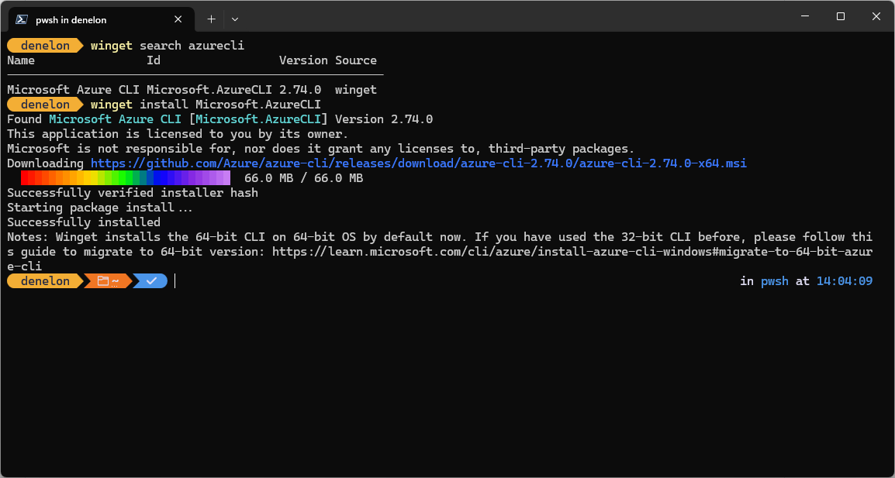
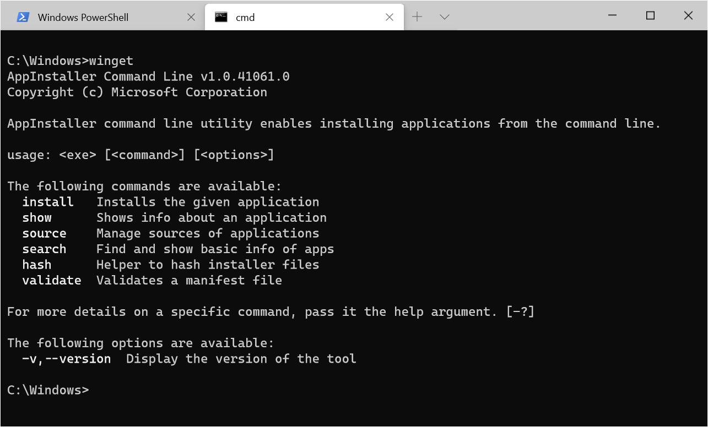

# Use WinGet to install and manage applications

**WinGet** is a command line tool enabling users to discover, install, upgrade, remove and configure applications on Windows 10, Windows 11, and Windows Server 2025 computers. This tool is the client interface to the Windows Package Manager service.

## Install WinGet

**WinGet** the Windows Package Manager is available on Windows 11, modern versions of Windows 10, and Windows Server 2025 as a part of the **App Installer**. The **App Installer** is a System Component delivered and updated by the Microsoft store on Windows Desktop versions, and via Updates on Windows Server 2025.

> [!NOTE]
> The **WinGet** command line tool is only supported on Windows 10 version 1809 (build 17763) or later. WinGet will not be available until you have logged into Windows as a user for the first time, triggering Microsoft Store to register the Windows Package Manager as part of an asynchronous process. If you have recently logged in as a user for the first time and find that WinGet is not yet available, you can open PowerShell and enter the following command to request this WinGet registration: `Add-AppxPackage -RegisterByFamilyName -MainPackage Microsoft.DesktopAppInstaller_8wekyb3d8bbwe`.

> [!NOTE]
> It's possible that **App Installer** is not installed on your device. In such case it can be downloaded [here](https://apps.microsoft.com/detail/9nblggh4nns1).

### Install WinGet preview version [Developers Only]

WinGet is included in the App Installer. To try the latest Windows Package Manager features, you can install a preview build one of the following ways:

- Download the latest [WinGet preview version](https://aka.ms/getwingetpreview). Read the [Release notes for WinGet preview](https://github.com/microsoft/winget-cli/releases) to learn about any new features. Installing this package will give you the preview version of the WinGet client, but it will not enable automatic updates of new preview versions from the Microsoft Store.

- Use a Microsoft Account (MSA), work, school or Azure Active Directory (AAD) account to sign up for the [Windows Insider Program](https://insider.windows.com/) in the Canary or Dev [Channels](/windows-insider/flighting). The Windows Insider Canary and Dev Channels include automatic updates of new preview versions of WinGet from the Microsoft Store.

### Install WinGet on Windows Sandbox

[Windows Sandbox](/windows/security/threat-protection/windows-sandbox/windows-sandbox-overview) provides a lightweight desktop environment to safely run applications in isolation. Software installed inside the Windows Sandbox environment remains "sandboxed" and runs separately from the host machine. Windows Sandbox does not include WinGet, nor the Microsoft Store app, so you will need to download the latest WinGet package from the WinGet releases page on GitHub, or use the `Repair-WinGetPackageManager` cmdlet.

To install the stable release of WinGet on Windows Sandbox, follow these steps from a Windows PowerShell command prompt:

```powershell
$progressPreference = 'silentlyContinue'
Write-Host "Installing WinGet PowerShell module from PSGallery..."
Install-PackageProvider -Name NuGet -Force | Out-Null
Install-Module -Name Microsoft.WinGet.Client -Force -Repository PSGallery | Out-Null
Write-Host "Using Repair-WinGetPackageManager cmdlet to bootstrap WinGet..."
Repair-WinGetPackageManager -AllUsers
Write-Host "Done."
```

To install the WinGet PowerShell module in machine scope, you can use the `-Scope AllUsers` parameter with the `Install-Module` cmdlet. If you would like a preview version of WinGet, you can add `-IncludePrerelease` parameter with the `Repair-WinGetPackageManager` cmdlet. To see the available parameters for the `Repair-WinGetPackageManager` cmdlet, you can run `Get-Help Repair-WinGetPackageManager -Full`.

For more information on Windows Sandbox, including how to install a sandbox and what to expect from its usage, see the [Windows Sandbox docs](/windows/security/threat-protection/windows-sandbox/windows-sandbox-overview).

## Administrator considerations

Installer behavior can be different depending on whether you are running **WinGet** with administrator privileges.

* When running **WinGet** without administrator privileges, some applications may [require elevation](/windows/security/identity-protection/user-account-control/how-user-account-control-works) to install. When the installer runs, Windows will prompt you to [elevate](/windows/security/identity-protection/user-account-control/how-user-account-control-works). If you choose not to elevate, the application will fail to install.

* When running **WinGet** in an Administrator Command Prompt, you will not see [elevation prompts](/windows/security/identity-protection/user-account-control/how-user-account-control-works) if the application requires it. Always use caution when running your command prompt as an administrator, and only install applications you trust.

## Use WinGet

After **App Installer** is installed, you can run **WinGet** by typing 'winget' from a Command Prompt.

One of the most common usage scenarios is to search for and install a favorite tool.

1. To [search](./search.md) for a tool, type `winget search <appname>`.
2. After you have confirmed that the tool you want is available, you can [install](./install.md) the tool by typing `winget install <appname>`. The **WinGet** tool will launch the installer and install the application on your PC.
    

3. In addition to install and search, **WinGet** provides a number of other commands that enable you to [show details](show.md) on applications, [change sources](./source.md), and [validate packages](./validate.md). To get a complete list of commands, type: `winget --help`.
    

Some users have reported [issues](https://github.com/microsoft/winget-cli/issues/210) with the client not being on their PATH.

### Commands

The current version of the **WinGet** tool supports the following commands.

| Command | Description |
|---------|-------------|
| [install](install.md) | Installs the specified application. |
| [show](show.md) | Displays details for the specified application. |
| [source](source.md) | Adds, edits, removes, and updates the Windows Package Manager repositories accessed by **WinGet**. |
| [search](search.md) | Searches for an application. |
| [list](list.md) | Display installed packages. |
| [upgrade](upgrade.md) |  Upgrades the given specified application. |
| [uninstall](uninstall.md) | Uninstalls the specified application. |
| [hash](hash.md) | Generates the SHA256 hash for the installer. |
| [validate](validate.md) | Validates a manifest file for submission to the Windows Package Manager repository. |
| [settings](settings.md) | Open settings. |
| [features](features.md) | Shows the status of experimental features. |
| [export](export.md) | Exports a list of the installed packages. |
| [import](import.md) | Installs all the packages in a file. |
| [pin](pinning.md) | Manage package pins. |
| [configure](configure.md) | Configures the system into a desired state. |
| [download](download.md) | Downloads the specified application's installer. |
| [repair](repair.md) | Repairs the selected application. |
| [dscv3](dscv3.md) | PowerShell Desired State Configuration (DSC) v3 resource commands. |

### Options

The **WinGet** tool supports the following options.

| Option | Description |
|--------------|-------------|
| **-v, --version** | Returns the current version of WinGet. |
| **--info** | Provides you with all detailed information on WinGet, including the links to the license, privacy statement, and configured group policies. |
| **-?, --help** | Shows additional help for WinGet. |
| **--wait** | Prompts the user to press any key before exiting. |
| **--logs,--open-logs** | Opens the default logs location. |
| **--verbose,--verbose-logs** | Enables verbose logging for winget. |
| **--nowarn,--ignore-warnings** | Suppresses warning outputs. |
| **--disable-interactivity** | Disables interactive prompts. |
| **--proxy** | Sets a proxy to use for this execution. |
| **--no-proxy** | Disables the use of proxy for this execution. |

## Supported installer formats

**WinGet** supports the following types of installers:

* EXE (with **Silent** and **SilentWithProgress** flags)
* ZIP
* INNO
* NULLSOFT
* MSI
* WIX
* APPX
* MSIX
* BURN
* PORTABLE
* FONT

## Scripting WinGet

The [Microsoft.WinGet.Client](https://www.powershellgallery.com/packages/Microsoft.WinGet.Client/) PowerShell module is available on the PowerShell Gallery.

## Debugging and troubleshooting

**WinGet** provides logging to help diagnose issues. For troubleshooting and details on logging, see [Debugging and troubleshooting](./troubleshooting.md).

## Missing tools

If the [community repository](../package/repository.md) does not include your tool or application, submit a package to our [repository](https://github.com/microsoft/winget-pkgs). By adding your favorite tool, it will be available to you and everyone else.

## Customize WinGet settings

You can configure the **WinGet** command line experience by modifying the **settings.json** file. For more information, see the page for the [settings command](./settings.md).

## Open source details

The **WinGet** tool is open source software available on GitHub in the repo [https://github.com/microsoft/winget-cli/](https://github.com/microsoft/winget-cli/). The source for building the client is located in the [src folder](https://github.com/microsoft/winget-cli/tree/master/src).

The source for **WinGet** is contained in a Visual Studio 2022 C++ solution. To build the solution correctly, clone the repository and run the appropriate WinGet Configuration file located in the ".github" directory.

We encourage you to contribute to the **WinGet** source on GitHub. You must first agree to and sign the Microsoft CLA. Pull requests should come from a branch on your own fork.

## Troubleshooting

The winget-cli repo maintains a list of common issues and common errors, along with recommendations on how to resolve:

- [common issues -- not recognized, failed to run, App Installer version or PATH variable need updating](https://github.com/microsoft/winget-cli/tree/master/doc/troubleshooting#common-issues)
- [common errors -- Error 0x801901a0, 0x80d03002, 0x80070490](https://github.com/microsoft/winget-cli/tree/master/doc/troubleshooting#common-errors)
