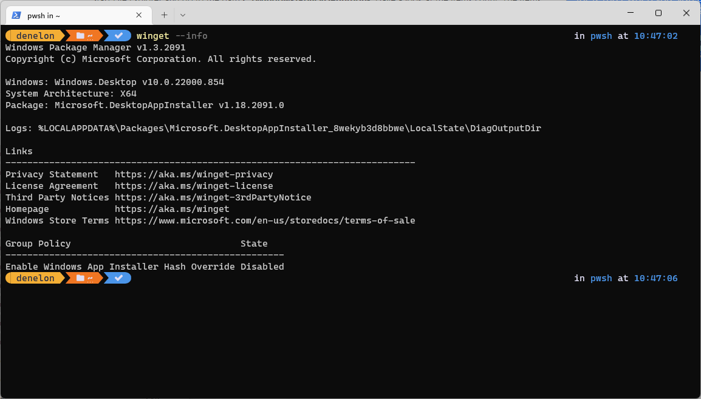

# info command (winget)

The **info** command of the [winget](./index.md) tool displays metadata about the system, including version numbers, system architecture, log location, links to legal agreements, and Group Policy state.

When submitting an issue to the [winget repository](https://github.com/microsoft/winget-cli/issues) on GitHub, this information is helpful for troubleshooting. It may also explain why the winget client behaves differently than expected in the case of Group Policy configuration.

## Usage

`winget --info`

Result fields include:

- Windows Package Manager version number installed
- System architecture type
- MSIX package version number (winget is delivered as a part of the "App Installer" package)
- Log file location
- Links to privacy statement, license agreement, third party notices, homepage, and store terms
- Group policy and state - this will only appear if a policy has been manually configured. (Learn more about how to [configure Group Policies for Windows Package Manager](https://techcommunity.microsoft.com/t5/windows-it-pro-blog/manage-windows-package-manager-with-group-policy/ba-p/2346322)).

## Related topics

* [Use the winget tool to install and manage applications](index.md)
