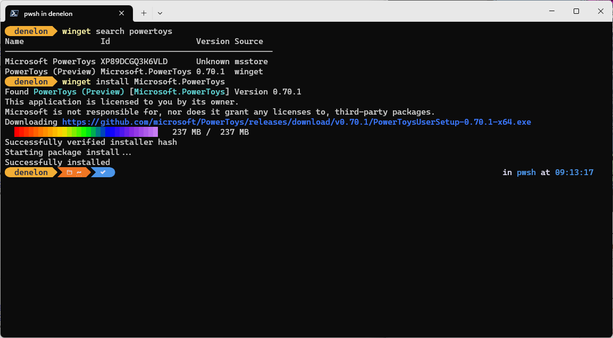
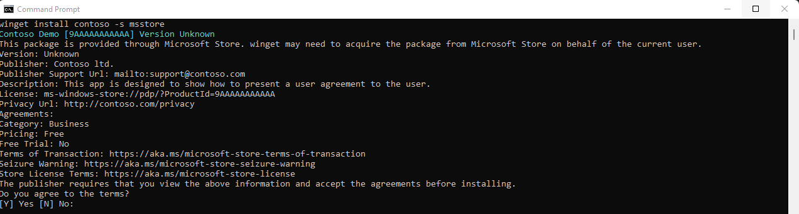

# install command (winget)

The **install** command of the [winget](index.md) tool installs the specified application. Use the [**search**](search.md) command to identify the application you want to install.

The **install** command requires that you specify the exact string to install. If there is any ambiguity, you will be prompted to further filter the **install** command to  an exact application.

## Usage

`winget install [[-q] \<query> ...] [\<options>]`



## Aliases

The following aliases are available for this command:

- add

## Arguments

The following arguments are available.

| Argument      | Description |
|-------------|-------------|
| **-q,--query**  |  The query used to search for an app. |

> [!NOTE]
> The query argument is positional. Wild-card style syntax is not supported. This is most often the string of characters you expect to uniquely identify the package you wish to install.

## Options

The options allow you to customize the install experience to meet your needs.

| Option  | Description |
|-------------|-------------|
| **-m, --manifest** |  Must be followed by the path to the manifest (YAML) file. You can use the manifest to run the install experience from a [local YAML file](#local-install). |
| **--id**    |  Limits the install to the ID of the application.   |
| **--name**   |  Limits the search to the name of the application. |
| **--moniker**   | Limits the search to the moniker listed for the application. |
| **-v, --version**  |  Enables you to specify an exact version to install. If not specified, latest will install the highest versioned application. |
| **-s, --source**   |  Restricts the search to the source name provided. Must be followed by the source name. |
| **--scope**   |  Allows you to specify if the installer should target user or machine scope. See [known issues relating to package installation scope](./troubleshooting.md#scope-for-specific-user-vs-machine-wide).|
| **-a, --architecture**   |  Select the architecture to install. |
| **-e, --exact**   |   Uses the exact string in the query, including checking for case-sensitivity. It will not use the default behavior of a substring. |
| **-i, --interactive** |  Runs the installer in interactive mode. The default experience shows installer progress. |
| **-h, --silent** |  Runs the installer in silent mode. This suppresses all UI. The default experience shows installer progress. |
| **--locale** | Specifies which locale to use (BCP47 format). |
| **-o, --log**  |  Directs the logging to a log file. You must provide a path to a file that you have the write rights to. |
| **--custom** | Arguments to be passed on to the installer in addition to the defaults.    |
| **--override** | A string that will be passed directly to the installer.    |
| **-l, --location** |    Location to install to (if supported). |
| **--ignore-security-hash** |    Ignore the installer hash check failure. Not recommended. |
| **--ignore-local-archive-malware-scan** |    Ignore the malware scan performed as part of installing an archive type package from local manifest. |
| **--dependency-source** |    Find package dependencies using the specified source. |
| **--accept-package-agreements** | Used to accept the license agreement, and avoid the prompt. |
| **--accept-source-agreements** | Used to accept the source license agreement, and avoid the prompt. |
| **--no-upgrade** |    Skips upgrade if an installed version already exists. |
| **--header** | Optional Windows-Package-Manager REST source HTTP header. |
| **-r, --rename** | The value to rename the executable file (portable) |
| **--uninstall-previous** | Uninstall the previous version of the package during upgrade |
| **--force** | Direct run the command and continue with non security related issues. |
| **-?, --help** |  Get additional help on this command. |
| **--wait** | Prompts the user to press any key before exiting. |
| **--logs,--open-logs** | Open the default logs location. |
| **--verbose, --verbose-logs** | Used to override the logging setting and create a verbose log. |
| **--disable-interactivity** | Disable interactive prompts. |

### Example queries

The following example installs a specific version of an application.

```CMD
winget install powertoys --version 0.15.2
```

The following example installs an application from its ID.

```CMD
winget install --id Microsoft.PowerToys
```

The following example installs an application by version and ID.

```CMD
winget install --id Microsoft.PowerToys --version 0.15.2
```

## Multiple selections

If the query provided to **winget** does not result in a single application, then **winget** will display the results of the search. This will provide you with the additional data necessary to refine the search for a correct install.

The best way to limit the selection to one file is to use the **id** of the application combined with the **exact** query option.  For example:

```CMD
winget install --id Git.Git -e
```

If multiple sources are configured, it is possible to have duplicate entries. Specifying a source is required to further disambiguate.

```CMD
winget install --id Git.Git -e --source winget
```

The **msstore** source uses unique identifiers as the "Id" for packages. These do not require the **exact** query toption. For example:

```CMD
winget install XP9KHM4BK9FZ7Q -s msstore
```

## Local install

The **manifest** option enables you to install an application by passing in a YAML file directly to the client. If the manifest is a multi-file manifest, the directory containing the files must be used. The **manifest** option has the following usage.

Usage: `winget install --manifest \<path>`

| Option  | Description |
|---------|-------------|
|  **-m, --manifest** | The path to the manifests of the application to install. |

> [!NOTE]
> Installing packages from local manifest files may have risks. As an extra measure of precaution this feature needs to be enabled by an administrator. To enable this feature run `winget settings --enable LocalManifestFiles`. To disable this feature run `winget settings --disable LocalManifestFiles`.

### Log files

The log files for winget unless redirected, will be located in the following folder:  **\%temp%\\AICLI\\*.log**

## License Agreements

Some applications when installed will require the user to agree to the license or other agreements before installing.  When this occurs, the Windows Package Manager will prompt the user to agree to the agreements.  If the user does not agree, the application will not install.



From the command line, you can auto accept the agreements by passing the following option **--accept-package-agreements** on the command line. This can be beneficial when scripting the Windows Package Manager.

## Related topics

* [Use the winget tool to install and manage applications](index.md)
