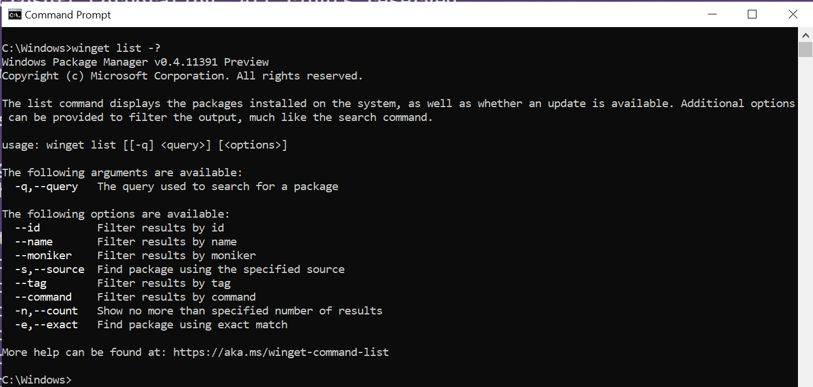
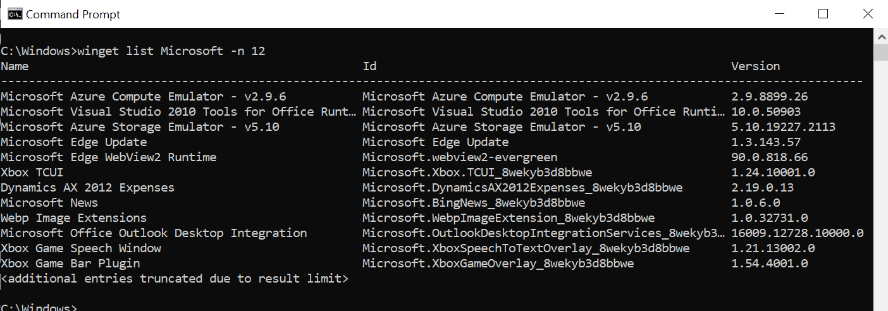
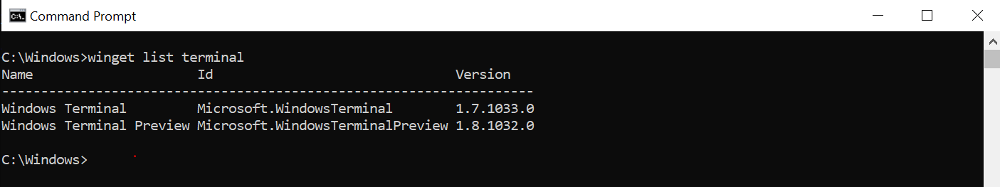

# list command (winget)

The **list** command of the [winget](./index.md) tool displays a list of the applications currently installed on your computer. The list command will show apps that were installed through the Windows Package Manager as well as apps that were installed by other means.

The **list** command will also display if an update is available for an app, and you can use the [**upgrade**](./upgrade.md) command to update the app.

The **list** command also supports filters which can be used to limit your list query.

## Usage

`winget list [[-q] \<query>] [\<options>]`

> [!NOTE]
> If you want to list all apps with available updates use `winget upgrade` (without any arguments).

## Arguments

The following arguments are available.

| Argument      | Description |
|-------------|-------------|
| **-q,--query**  |  The query used to search for an app. |

> [!NOTE]
> The query argument is positional. Wild-card style syntax is not supported. This is most often the string of characters you expect to help find the installed package you are searching for.

## Options

The options allow you to customize the list experience to meet your needs.

| Option      | Description |
|-------------|-------------|
| **--id**    |  Limits the list to the ID of the application.   |
| **--name**   |  Limits the list to the name of the application. |
| **--moniker**   | Limits the list to the moniker listed for the application. |
| **-s, --source**   |  Restricts the list to the source name provided. Must be followed by the source name. |
| **--tag** |  Filters results by tags. |
| **--cmd, --command** |  Filters results by command specified by the application. |
| **-n, --count** | Limits the number of apps displayed in one query.   |
| **-e, --exact**   |   Uses the exact string in the list query, including checking for case-sensitivity. It will not use the default behavior of a substring. |
| **--scope** | Select installed package scope filter (user or machine). |
| **--header** | Optional Windows-Package-Manager REST source HTTP header. |
| **--accept-source-agreements** | Used to accept the source license agreement, and avoid the prompt. |
| **--upgrade-available** | Lists only packages which have an upgrade available. |
| **-?, --help** |  Get additional help on this command. |
| **--wait** | Prompts the user to press any key before exiting. |
| **--logs,--open-logs** | Open the default logs location. |
| **--verbose, --verbose-logs** | Used to override the logging setting and create a verbose log. |
| **--disable-interactivity** | Disable interactive prompts. |

### Example queries

The following example lists a specific version of an application.

The following example lists all application by ID from a specific source.

The following example limits the output of **list** to 9 apps.

## List with update

As stated above, the **list** command allows you to see what apps you have installed that have updates available.

In the image below, you will notice the preview version of Terminal has an update available.

The **list** command will show not only the update version available, but the source that the update is available from.

If there are no updates available, **list** will only show you the currently installed version and the update column will not be displayed.

* [Use the winget tool to list and manage applications](index.md)
