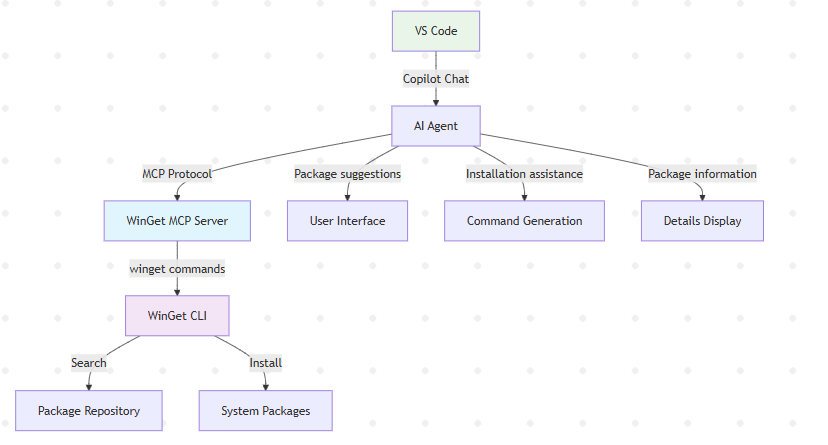

# WinGet MCP Server overview

The Windows Package Manager (WinGet) includes a built-in Model Context Protocol (MCP) server. The WinGet MCP server enables AI agents and development tools to intelligently assist you by understanding what packages are available and how to install them.

The WinGet MCP server exposes WinGet's core functionality to AI agents, enabling them to help you find packages, understand their details, and assist with installation workflows. This functionality enhances the overall developer workflow by providing contextual information about available packages directly to AI-powered tools.

## What is Model Context Protocol (MCP)?

Model Context Protocol (MCP) is an open protocol that enables AI systems to interact with external data sources and tools in a consistent way. It provides a standardized interface for AI agents to discover capabilities, retrieve information, and invoke actions across different systems and services.

MCP allows AI-powered tools to understand what operations are possible and how to perform them, without requiring custom integrations for each system. This protocol makes it easier for developers to build AI assistants that can work with multiple tools and services seamlessly.

To learn more about MCP and how it works with AI agents, see [Use MCP servers in VS Code](https://code.visualstudio.com/docs/copilot/chat/mcp-servers).

## How WinGet MCP works with AI agents

To use the WinGet MCP server with AI agents, you first need to configure your development environment to connect to the MCP server. Once connected, the WinGet MCP server can assist with:

- **Discovering available packages**: When you ask an agent to help with software installation tasks, the agent can search the WinGet repository for available packages. WinGet MCP helps agents provide accurate, up-to-date information about available software.For example:

  - **You ask**: "I need to install Visual Studio Code"
  - **Agent searches**: The WinGet repository for Visual Studio Code packages
  - **Agent provides**: Package details including ID, version, publisher, and installation options

- **Installing packages**: When you need to install specific software, agents can assist with the installation process, ensuring that your software is installed with the correct configuration. For example:

  - **You ask**: "Install Python for development"
  - **Agent identifies**: The appropriate Python package from the WinGet repository
  - **Agent provides**: Installation commands or can initiate the installation with your approval

## How WinGet MCP integrates with VS Code

The WinGet MCP server integrates with VS Code and AI agents as follows:

1. **VS Code Copilot** communicates with AI agents that can access MCP servers.
1. **AI agents** use the MCP protocol to query the WinGet MCP server for information.
1. **WinGet MCP server** processes requests and calls the appropriate WinGet CLI commands.
1. **WinGet CLI** performs package searches and installations in the repository.
1. **Results** flow back through the chain to provide enhanced assistance.

## Related content

- [Set up WinGet MCP Server](mcp-server-setup.md)
- [Use WinGet MCP Server](mcp-server-usage.md)
