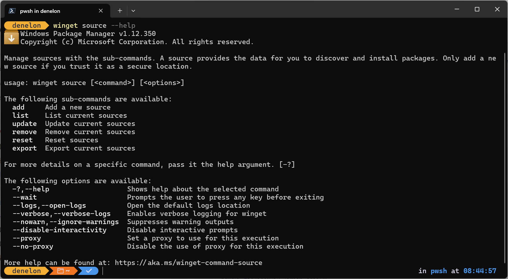
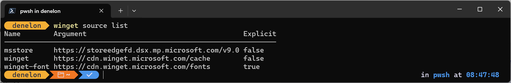
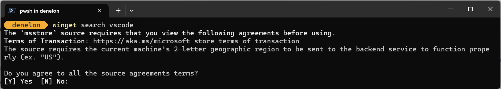

# The WinGet source command

The [WinGet](index.md) **source** command allows you to manage sources. With the **source** command, you can **add**, **list**, **update**, **remove**, **reset**, or **export** WinGet sources.

A WinGet source provides the data for you to discover and install applications. Only use secure, trusted sources.

WinGet specifies the following three default sources, which you can list by using `winget source list`.

- **msstore** - The Microsoft Store catalog.
- **winget** -  The WinGet Community Repository for applications.
- **winget-font** - The WinGet Community Repository for fonts.

## Usage

```cmd
winget source <subcommand> <options>
```



## Sub-Commands

The following arguments are available.

| Sub-Command  | Description |
|--------------|-------------|
| **add** | Adds a new source. |
| **list** | Lists current sources. |
| **update** | Updates current sources. |
| **remove** | Removes current sources. |
| **reset** | Resets default sources **msstore**, **winget**, and **winget-font**. |
| **export** | Exports current sources. |

## Options

The following options are available.

| Option  | Description |
|--------------|-------------|
| **-?,--help** | Shows help about the selected command. |
| **--wait** | Prompts the user to press any key before exiting. |
| **--logs,--open-logs** | Open the default logs location. |
| **--verbose, --verbose-logs** | Used to override the logging setting and create a verbose log. |
| **--nowarn,--ignore-warnings** | Suppresses warning outputs. |
| **--disable-interactivity** | Disable interactive prompts. |
| **--proxy** | Set a proxy to use for this execution. |
| **--no-proxy** | Disable the use of proxy for this execution. |

### add

The **add** subcommand adds a new source. This subcommand requires the **--name** and **--arg** options. Because the command changes user access, using **add** requires administrator privileges.

Usage:

```cmd
winget source add [-n] <name> [-a] <arg> [[-t] <type>] [<options>]
```

#### Arguments

The following arguments are available.

| Argument  | Description |
|--------------|-------------|
| **-n, --name** | The name to identify the source by. |
| **-a, --arg** | The URL or UNC of the source. |
| **-t, --type** | The type of source. |

#### Options

The following options are available.

| Option  | Description |
|--------------|-------------|
| **--trust-level** | Trust level of the source (none or trusted). |
| **--header** | Optional Windows-Package-Manager REST source HTTP header. |
| **--accept-source-agreements** | Used to accept the source license agreement, and avoid the prompt. |
| **--explicit** |  |
| **-?, --help** |  Get additional help on this command. |
| **--wait** | Prompts the user to press any key before exiting. |
| **--logs,--open-logs** | Open the default logs location. |
| **--verbose, --verbose-logs** | Used to override the logging setting and create a verbose log. |
| **--nowarn,--ignore-warnings** | Suppresses warning outputs. |
| **--disable-interactivity** | Disable interactive prompts. |
| **--proxy** | Set a proxy to use for this execution. |
| **--no-proxy** | Disable the use of proxy for this execution. |

For example,  `winget source add --name Contoso https://www.contoso.com/cache` adds the Contoso repository at URL `https://www.contoso.com/cache`.

#### Optional type parameter

The **add** subcommand supports the optional **type** parameter, which tells the client what type of repository it is connecting to. The following types are supported.

| Type  | Description |
|--------------|-------------|
| **Microsoft.PreIndexed.Package** | The default source type. |
| **Microsoft.Rest** | A Microsoft REST API source. |

### list

The **list** subcommand enumerates the currently enabled sources, or provides details on a specific source.

> [!NOTE]
> When a source is set to be explicit, it must be specifically targeted. The **winget-font** source is set to explicit by default. This means any other WinGet commands must directly reference the source using either "--source winget-font" or "-s winget-font" to be included.

Usage:

```cmd
winget source list [[-n] <name>] [<options>]
```



#### Aliases

The following aliases are available for this subcommand:

- ls

#### Arguments

The following arguments are available.

| Argument  | Description |
|--------------|-------------|
| **-n, --name** | The name to identify the source by. |

#### Options

The following options are available.

| Option  | Description |
|--------------|-------------|
| **-?, --help** |  Get additional help on this command. |
| **--wait** | Prompts the user to press any key before exiting. |
| **--logs,--open-logs** | Open the default logs location. |
| **--verbose, --verbose-logs** | Used to override the logging setting and create a verbose log. |
| **--nowarn,--ignore-warnings** | Suppresses warning outputs. |
| **--disable-interactivity** | Disable interactive prompts. |
| **--proxy** | Set a proxy to use for this execution. |
| **--no-proxy** | Disable the use of proxy for this execution. |

#### list all

The **list** subcommand by itself, `winget source list`, provides the complete list of configured sources:

```output
Name        Argument                                      Explicit
------------------------------------------------------------------
msstore     https://storeedgefd.dsx.mp.microsoft.com/v9.0 false
winget      https://cdn.winget.microsoft.com/cache        false
winget-font https://cdn.winget.microsoft.com/fonts        true
```

#### list source details

To get complete details about a source, pass in the name of the source. For example:

```cmd
winget source list --name winget
```

Returns the following output:

```output
Field       Value
--------------------------------------------------
Name        winget
Type        Microsoft.PreIndexed.Package
Argument    https://cdn.winget.microsoft.com/cache
Data        Microsoft.Winget.Source_8wekyb3d8bbwe
Identifier  Microsoft.Winget.Source_8wekyb3d8bbwe
Trust Level Trusted|StoreOrigin
Explicit    false
Updated     2025-12-11 08:30:25.000
```

- `Name` is the name of the source.
- `Type` is the type of source.
- `Arg` is the URL or path the source uses.
- `Data` is the optional package name, if appropriate.
- `Updated` is the last date and time the source was updated.

### update

The **update** subcommand forces an update to an individual source, or to all sources.

Usage:

```cmd
winget source update [[-n] <name>] [<options>]
```

#### Aliases

The following aliases are available for this subcommand:

- refresh

#### Arguments

The following arguments are available.

| Argument  | Description |
|--------------|-------------|
| **-n, --name** | The name to identify the source by. |

#### Options

The following options are available.

| Option  | Description |
|--------------|-------------|
| **-?, --help** |  Get additional help on this command. |
| **--wait** | Prompts the user to press any key before exiting. |
| **--logs,--open-logs** | Open the default logs location. |
| **--verbose, --verbose-logs** | Used to override the logging setting and create a verbose log. |
| **--nowarn,--ignore-warnings** | Suppresses warning outputs. |
| **--disable-interactivity** | Disable interactive prompts. |
| **--proxy** | Set a proxy to use for this execution. |
| **--no-proxy** | Disable the use of proxy for this execution. |

#### update all

The **update** subcommand by itself, `winget source update`, requests updates to all repos.

#### update source

The **update** subcommand with the **--name** option directs an update to the named source. For example: `winget source update --name Contoso` forces an update to the Contoso repository.

### remove

The **remove** subcommand removes a source. This subcommand requires the **--name** option to identify the source. Because the command changes user access, using **remove** requires administrator privileges.

Usage:

```cmd
winget source remove [-n] <name> [<options>]
```

#### Aliases

The following aliases are available for this subcommand:

- rm

#### Arguments

The following arguments are available.

| Argument  | Description |
|--------------|-------------|
| **-n, --name** | The name to identify the source by. |

#### Options

The following options are available.

| Option  | Description |
|--------------|-------------|
| **-?, --help** |  Get additional help on this command. |
| **--wait** | Prompts the user to press any key before exiting. |
| **--logs,--open-logs** | Open the default logs location. |
| **--verbose, --verbose-logs** | Used to override the logging setting and create a verbose log. |
| **--nowarn,--ignore-warnings** | Suppresses warning outputs. |
| **--disable-interactivity** | Disable interactive prompts. |
| **--proxy** | Set a proxy to use for this execution. |
| **--no-proxy** | Disable the use of proxy for this execution. |

#### Examples

```cmd
winget source remove --name Contoso
```

This command removes the Contoso repository.

### reset

The **reset** subcommand resets the client back to its original configuration, and removes all sources except the default. Only use this subcommand in rare cases. Because the command changes user access, using **reset** requires administrator privileges.

Because the **reset** command removes all sources, you must force the action by using the **--force** option.

Usage:

```cmd
winget source reset [[-n] <name>] [<options>]
```

#### Arguments

The following arguments are available.

| Argument  | Description |
|--------------|-------------|
| **-n, --name** | The name to identify the source by. |

#### Options

The following options are available.

| Option  | Description |
|--------------|-------------|
| **--force** | Forces the reset of the sources. |
| **-?, --help** |  Get additional help on this command. |
| **--wait** | Prompts the user to press any key before exiting. |
| **--logs,--open-logs** | Open the default logs location. |
| **--verbose, --verbose-logs** | Used to override the logging setting and create a verbose log. |
| **--nowarn,--ignore-warnings** | Suppresses warning outputs. |
| **--disable-interactivity** | Disable interactive prompts. |
| **--proxy** | Set a proxy to use for this execution. |
| **--no-proxy** | Disable the use of proxy for this execution. |

### export

The **export** sub-command exports the specific details for a source to JSON output. This is useful for configuring Group Policy for source management.

Usage:

```cmd
winget source export [[-n] <name>] [<options>]
```

#### Arguments

The following arguments are available.

| Argument  | Description |
|--------------|-------------|
| **-n, --name** | The name to identify the source by. |

#### Options

The following options are available.

| Option  | Description |
|--------------|-------------|
| **-?, --help** |  Get additional help on this command. |
| **--wait** | Prompts the user to press any key before exiting. |
| **--logs,--open-logs** | Open the default logs location. |
| **--verbose, --verbose-logs** | Used to override the logging setting and create a verbose log. |
| **--nowarn,--ignore-warnings** | Suppresses warning outputs. |
| **--disable-interactivity** | Disable interactive prompts. |
| **--proxy** | Set a proxy to use for this execution. |
| **--no-proxy** | Disable the use of proxy for this execution. |

#### Examples

```cmd
winget source export winget
```

Returns the following output:

```output
{"Arg":"https://cdn.winget.microsoft.com/cache","Data":"Microsoft.Winget.Source_8wekyb3d8bbwe","Explicit":false,"Identifier":"Microsoft.Winget.Source_8wekyb3d8bbwe","Name":"winget","TrustLevel":["Trusted","StoreOrigin"],"Type":"Microsoft.PreIndexed.Package"}
```

## Source agreement

An individual **source** may request that the user agree to agreements presented before adding or using the source. If a user does not accept the agreements, WinGet will not be able to access the source.

You can use the **--accept-source-agreements** option to accept the source agreements and avoid the prompt.

Many WinGet commands evaluate all configured sources. If any configured source requires agreements, WinGet will prompt before using those sources. Source agreements are required to be accepted before use. If a source updates agreement terms, or if a source is removed and readded (as in the case of `winget source reset --force`) agreements will be presented again.



## Related topics

- [Use the winget tool to install and manage applications](index.md)
