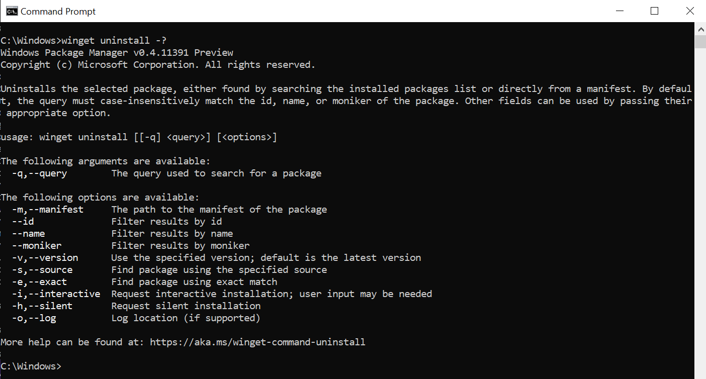
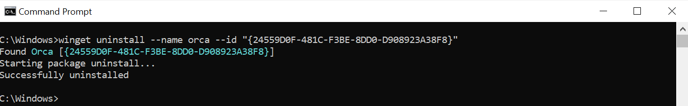
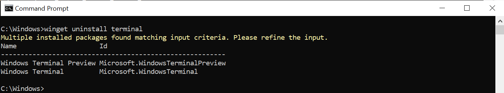
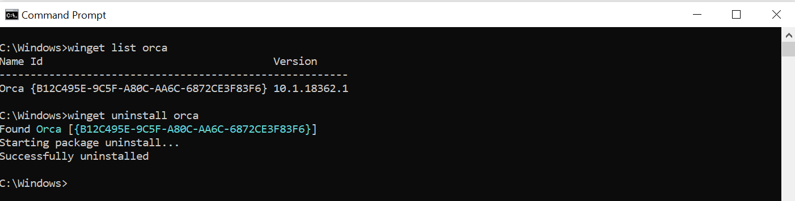

# uninstall command (winget)

The **uninstall** command of the [winget](index.md) tool uninstalls the specified application.

The **uninstall** command requires that you specify the exact string to uninstall. If there is any ambiguity, you will be prompted to further filter the **uninstall** command to an exact application.

## Aliases

The following aliases are available for this command:

- remove
- rm

## Usage

`winget uninstall [[-q] <query>] [<options>]`



> [!NOTE]
> When using WinGet to uninstall a package, you may encounter a Microsoft Store agreement. This is due to the way in which WinGet queries package manifest sources. If you prefer not to have the Microsoft Store policy popup when uninstalling, you can pass in `--source winget` to suppress the agreement. Alternatively, you can uninstall using **Start  > Settings  > Apps > Apps & features**, finding the app you want to remove, and selecting **More  > Uninstall**.

## Arguments

The following arguments are available.

| Argument      | Description |
|-------------|-------------|
| **-q,--query**  |  The query used to search for an app. |

> [!NOTE]
> The query argument is positional. Wild-card style syntax is not supported. This is most often the string of characters you expect to help find the package you are uninstalling.

## Options

The options allow you to customize the uninstall experience to meet your needs.

| Option      | Description |
|-------------|-------------|
| **-m, --manifest** |   Must be followed by the path to the manifest (YAML) file. You can use the manifest to run the uninstall experience from a [local YAML file](install.md#local-install). |
| **--id**    |  Limits the uninstall to the ID of the application.   |
| **--name**   |  Limits the search to the name of the application. |
| **--moniker**   | Limits the search to the moniker listed for the application. |
| **--product-code** | Filters using the product code. |
| **-v, --version**  |  Enables you to specify an exact version to uninstall. If not specified, latest will uninstall the highest versioned application. |
| **--all,--all-versions** | Uninstall all versions. |
| **-s, --source**   |  Restricts the search to the source name provided. Must be followed by the source name. |
| **-e, --exact**   |   Uses the exact string in the query, including checking for case-sensitivity. It will not use the default behavior of a substring. |
| **--scope** | Select installed package scope filter (user or machine). |
| **-i, --interactive** |  Runs the uninstaller in interactive mode. The default experience shows uninstaller progress. |
| **-h, --silent** |  Runs the uninstaller in silent mode. This suppresses all UI. The default experience shows uninstaller progress. |
| **--force** | Direct run the command and continue with non security related issues. |
| **--purge** | Deletes all files and directories in the package directory (portable). |
| **--preserve** | Retains all files and directories created by the package (portable). |
| **-o, --log**  |  Directs the logging to a log file. You must provide a path to a file that you have the write rights to. |
| **--header** | Optional Windows-Package-Manager REST source HTTP header. |
| **--authentication-mode** | Specify authentication window preference (silent, silentPreferred or interactive). |
| **--authentication-account** | Specify the account to be used for authentication. |
| **--accept-source-agreements** | Used to accept the source license agreement, and avoid the prompt. |
| **-?,--help** | Shows help about the selected command. |
| **--wait** | Prompts the user to press any key before exiting. |
| **--logs,--open-logs** | Open the default logs location. |
| **--verbose, --verbose-logs** | Used to override the logging setting and create a verbose log. |
| **--nowarn,--ignore-warnings** | Suppresses warning outputs. |
| **--disable-interactivity** | Disable interactive prompts. |
| **--proxy** | Set a proxy to use for this execution. |
| **--no-proxy** | Disable the use of proxy for this execution. |

After you have successfully identified the application intended to uninstall, winget will execute the uninstall command. In the example below, the **name** 'orca' and the **id** was passed in.



### Example queries

The following example uninstalls a specific version of an application.

```CMD
winget uninstall --name powertoys --version 0.15.2
```

The following example uninstalls an application using its ID.

```CMD
winget uninstall --id "{24559D0F-481C-F3BE-8DD0-D908923A38F8}"
```

## Multiple selections

If the query provided to **winget** does not result in a single application to uninstall, then **winget** will display multiple results. You can then use additional filters to refine the search for a correct application.



## Uninstalling apps not installed with Windows Package Manager

As mentioned in [**list**](.\list.md), the **winget list** command will display more than just apps installed with the **winget**. Therefore you can use these commands to quickly and easily remove apps from your PC.

In this example, **list** was used to find the application, and then the **id** was passed in as part of uninstall.


