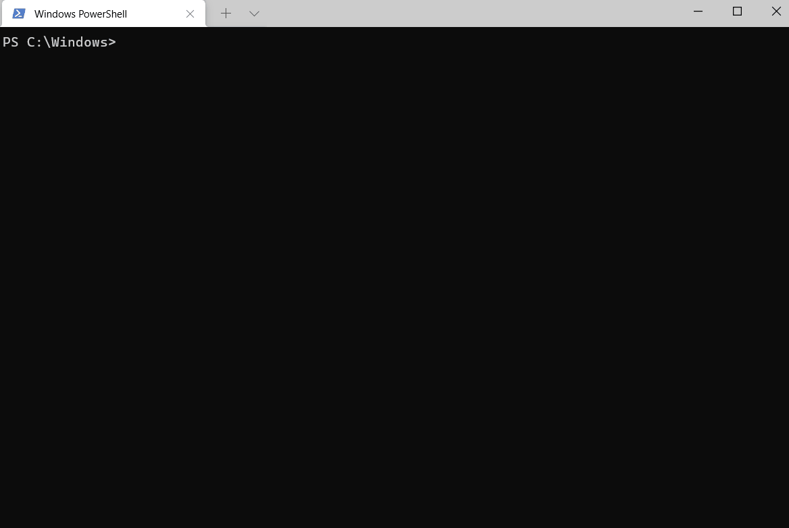

# upgrade command (winget)

The **upgrade** command of the [winget](index.md) tool upgrades the specified application. Optionally, you may use the [**list**](.\list.md) command to identify the application you want to upgrade.

The **upgrade** command requires that you specify the exact string to upgrade. If there is any ambiguity, you will be prompted to further filter the **upgrade** command to  an exact application.

## Aliases

The following aliases are available for this command:

- update

## Usage

`winget upgrade [[-q] \<query> ...] [\<options>]`


## Arguments

The following arguments are available.

| Argument      | Description |
|-------------|-------------|
| **-q,--query**  |  The query used to search for an app. |

> [!NOTE]
> The query argument is positional. Wild-card style syntax is not supported. This is most often the string of characters you expect to help find the package you are upgrading.

## Options

The options allow you to customize the upgrade experience to meet your needs.

| Option      | Description |
|-------------|-------------|
| **-m, --manifest** |   Must be followed by the path to the manifest (YAML) file. You can use the manifest to run the upgrade experience from a [local YAML file](install.md#local-install). |
| **--id**    |  Limits the upgrade to the ID of the application.   |
| **--name**   |  Limits the search to the name of the application. |
| **--moniker**   | Limits the search to the moniker listed for the application. |
| **-v, --version**  |  Enables you to specify an exact version to upgrade. If not specified, latest will upgrade the highest versioned application. |
| **-s, --source**   |  Restricts the search to the source name provided. Must be followed by the source name. |
| **-e, --exact**   |   Uses the exact string in the query, including checking for case-sensitivity. It will not use the default behavior of a substring. |
| **-i, --interactive** |  Runs the installer in interactive mode. The default experience shows installer progress. |
| **-h, --silent** |  Runs the installer in silent mode. This suppresses all UI. The default experience shows installer progress. |
| **--purge** | Deletes all files and directories in the package directory (portable) |
| **-o, --log**  |  Directs the logging to a log file. You must provide a path to a file that you have the write rights to. |
| **--custom** | Arguments to be passed on to the installer in addition to the defaults.  |
| **--override** | A string that will be passed directly to the installer.    |
| **-l, --location** |    Location to upgrade to (if supported). |
| **--scope** | Select installed package scope filter (user or machine). |
| **a, --architecture** | Select the architecture to install. |
| **--installer-type**   |  Select the installer type to upgrade. See [supported installer types for WinGet client](./index.md#supported-installer-formats). |
| **--locale** | Specifies which locale to use (BCP47 format). |
| **--ignore-security-hash** | Ignore the installer hash check failure. Not recommended. |
| **--ignore-local-archive-malware-scan** | Ignore the malware scan performed as part of installing an archive type package from local manifest. |
| **--accept-package-agreements** | Used to accept the license agreement, and avoid the prompt. |
| **--accept-source-agreements** | Used to accept the source license agreement, and avoid the prompt. |
| **--header** | Optional Windows-Package-Manager REST source HTTP header. |
| **-r, --recurse, --all** | Updates all available packages to the latest application. |
| **-u, --unknown, --include-unknown** | Upgrade packages even if their current version cannot be determined. |
| **--pinned,--include-pinned** | Upgrade packages even if they have a non-blocking pin. |
| **--uninstall-previous** | Uninstall the previous version of the package during upgrade. Behavior will depend on the individual package. Some installers are designed to install new versions side-by-side. Some installers include a manifest that specifies “uninstallPrevious” so earlier versions are uninstalled without needing to use this command flag. In this case, using the `winget upgrade --uninstall-previous` command will tell WinGet to uninstall the previous version regardless of what is in the package manifest. If the package manifest does not include “uninstallPrevious” and the --uninstall-previous flag is not used, then the default behavior for the installer will apply.|
| **--force** | Direct run the command and continue with non security related issues. |
| **-?,--help** | Shows help about the selected command. |
| **--wait** | Prompts the user to press any key before exiting. |
| **--logs,--open-logs** | Open the default logs location. |
| **--verbose, --verbose-logs** | Used to override the logging setting and create a verbose log. |
| **--disable-interactivity** | Disable interactive prompts. |

### Example queries

The following example upgrades a specific version of an application.

```CMD
winget upgrade powertoys --version 0.15.2
```

The following example upgrades an application from its ID.

```CMD
winget upgrade --id Microsoft.PowerToys
```

The following example shows upgrading all apps

```CMD
winget upgrade --all
```

## Using **upgrade**

To identify which apps are in need of an update, simply use **upgrade** without any arguments to show all available upgrades.

In the example below, you will see **winget upgrade** shows the user which apps have an available update. From the available updates, the user identifies that an update is available for *JanDeDobbeleer.OhMyPosh* and uses **upgrade** to update the application.



## Using **list** and **upgrade**
To search for an available update for a specific app, use to the [**list**](.\list.md) command. Once you have identified that an update is available for your specific app, use **upgrade** to install the latest.

The example below shows the [**list**](.\list.md) command being used to identify that an update is available for *Microsoft.WindowsTerminalPreview*. The user then uses **upgrade** to update the application.


## **upgrade** --all

**upgrade --all** will identify all the applications with upgrades available. When you run **winget upgrade --all** the Windows Package Manager will look for all applications that have updates available and attempt to install the updates.

> [!NOTE]
> Some applications do not provide a version.  They are always latest.  Because the Windows Package Manager cannot identify if there is a newer version of the app, an upgrade will not be possible.

## **upgrade** --uninstall-previous

**upgrade --uninstall-previous** will uninstall the previous version prior to installing the newer version of the package. When using `--uninstall-previous`, the behavior will depend on the individual package. Some installers are designed to install new versions side-by-side while other installers include a manifest that specifies `uninstallPrevious` as their default upgrade behavior (so earlier versions are uninstalled without needing to use the command flag). 

If the package manifest does not include `uninstallPrevious` as the upgrade behavior and the `--uninstall-previous` flag is not used with the upgrade command, then the default behavior for the installer will apply.
