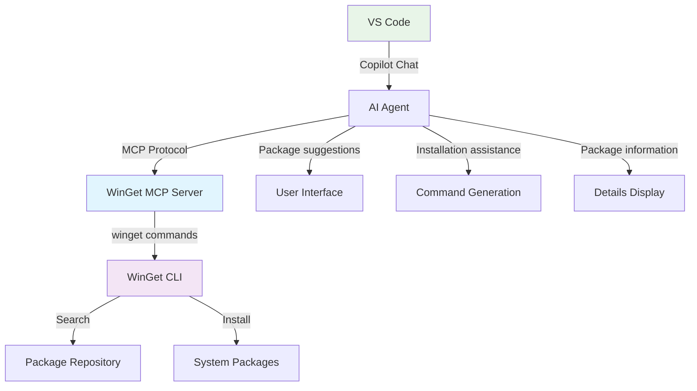

# Using Windows Package Manager with Model Context Protocol (MCP) Server

The Windows Package Manager (WinGet) includes a built-in Model Context Protocol
(MCP) server that enables AI agents and development tools to interact with
WinGet's package discovery and installation capabilities through a standardized
interface. This integration provides intelligent assistance for discovering and
installing packages on your system.

The WinGet MCP server exposes WinGet's core functionality to AI agents,
enabling them to help you find packages, understand their details, and assist
with installation workflows. This enhances the overall authoring experience by
providing contextual information about available packages directly to AI-powered
tools.

## What is Model Context Protocol (MCP)?

Model Context Protocol (MCP) is an open protocol that enables AI systems to
interact with external data sources and tools in a consistent way. It provides
a standardized interface for AI agents to discover capabilities, retrieve
information, and invoke actions across different systems and services.

MCP allows AI-powered tools to understand what operations are possible and how
to perform them, without requiring custom integrations for each system. This
makes it easier for developers to build AI assistants that can work with
multiple tools and services seamlessly.

To learn more about MCP and how it works with AI agents, see
[Use MCP servers in VS Code][01].

## How AI agents use WinGet MCP tools

The WinGet MCP server enables AI agents to intelligently assist you by
understanding what packages are available and how to install them. Here's how
agents use these capabilities to help fulfill your requests:

### Discovering available packages

When you ask an agent to help with software installation tasks, the agent can
search the WinGet repository for available packages. For example:

- **You ask**: "I need to install Visual Studio Code"
- **Agent searches**: The WinGet repository for Visual Studio Code packages
- **Agent provides**: Package details including ID, version, publisher, and
  installation options

This discovery helps agents provide accurate, up-to-date information about
available software.

### Installing packages

When you need to install specific software, agents can assist with the
installation process:

- **You ask**: "Install Python for development"
- **Agent identifies**: The appropriate Python package from the WinGet repository
- **Agent provides**: Installation commands or can initiate the installation
  with your approval

This ensures you get the right software installed with the correct
configuration.

## How WinGet MCP integrates with VS Code

The following diagram illustrates how the WinGet MCP server integrates with
VS Code and AI agents:



The integration works as follows:

1. **VS Code Copilot** communicates with AI agents that can access MCP servers
2. **AI agents** use the MCP protocol to query the WinGet MCP server for
   information
3. **WinGet MCP server** processes requests and calls the appropriate WinGet CLI
   commands
4. **WinGet CLI** performs package searches and installations in the repository
5. **Results** flow back through the chain to provide enhanced assistance

## Prerequisites

Before using the WinGet MCP server integration, ensure you have:

- Windows 10 version 1809 (build 17763) or later, or Windows 11
- WinGet with MCP server support installed on your system
- VS Code v1.104 or above with [GitHub Copilot extension][02] enabled
- Access to [Copilot in VS Code][03]

## Setting up WinGet MCP Server

### Locating the WinGet MCP Server executable

The WinGet MCP server executable is installed alongside the Windows Package
Manager. You can find it using one of the following methods:

#### Method 1: Using the winget mcp command

The **winget** tool includes an **mcp** command that provides the configuration
information needed for MCP clients:

```powershell
winget mcp
```

This command displays the JSON configuration fragment showing the path to the
`WindowsPackageManagerMCPServer.exe` executable.

#### Method 2: Locating via PowerShell

You can locate the WinGet MCP server executable by first finding the WinGet
executable path and then navigating to the same directory:

```powershell
# Find the WinGet executable path
$wingetPath = (Get-Command winget).Source
# Get the directory containing WinGet
$wingetDir = Split-Path $wingetPath -Parent
# The MCP server executable is in the same directory
$mcpServerPath = Join-Path -Path $wingetDir `
    -ChildPath "Microsoft.DesktopAppInstaller_8wekyb3d8bbwe" `
    -AdditionalChildPath "WindowsPackageManagerMCPServer.exe"
Write-Host "WinGet MCP Server path: $mcpServerPath"
```

The typical location is:

```text
C:\Users\<username>\AppData\Local\Microsoft\WindowsApps\Microsoft.DesktopAppInstaller_8wekyb3d8bbwe\WindowsPackageManagerMCPServer.exe
```

### Configuring the MCP server in VS Code

The recommended way to configure the WinGet MCP server is through an `mcp.json`
configuration file. Create or update your MCP configuration file in the
`.vscode` folder with the following content:

```json
{
  "servers": {
    "winget-mcp": {
      "type": "stdio",
      "command": "C:\\Users\\<username>\\AppData\\Local\\Microsoft\\WindowsApps\\Microsoft.DesktopAppInstaller_8wekyb3d8bbwe\\WindowsPackageManagerMCPServer.exe"
    }
  },
  "inputs": []
}
```

Replace `<username>` with your actual Windows username, or use the path
discovered using one of the methods above.

This configuration tells MCP clients to:

- Use the Windows Package Manager MCP server executable as the command
- Use standard I/O communication between the client and server
- Register the server with the identifier `winget-mcp`

For detailed information about MCP configuration and setup in VS Code, refer to
the [official MCP documentation][04].

### Manual command-line testing

You can also start the WinGet MCP server manually for testing or development
purposes by running the executable directly:

```powershell
& "C:\Users\<username>\AppData\Local\Microsoft\WindowsApps\Microsoft.DesktopAppInstaller_8wekyb3d8bbwe\WindowsPackageManagerMCPServer.exe"
```

The server will start and wait for MCP protocol messages on standard input. The
server will continue running until terminated or the input stream is closed.

## Using WinGet MCP tools in VS Code

### Step 1: Open Copilot Chat in Agent Mode

1. Open the GitHub Copilot extension window in VS Code
2. Select "Agent Mode" to enable MCP tool integration

### Step 2: Access WinGet MCP tools

1. Click on the tool icon in the GitHub Copilot chat window
2. Search for "MCP Server: winget-mcp" in the available tools list
3. Verify that the WinGet MCP server tools are available and loaded

### Step 3: Start using WinGet MCP integration

Begin asking questions or requesting assistance with package management tasks.
The AI agent will automatically use the WinGet MCP tools when appropriate to
provide accurate, context-aware help.

Example prompts that work well with WinGet MCP integration:

- "What packages are available for Python development?"
- "Help me install Visual Studio Code"
- "Find packages for Docker on Windows"
- "Install the latest version of Git"

## Available MCP tools

The WinGet MCP server currently provides the following tools:

### find

Searches the WinGet repository for packages matching specified criteria. This
tool helps discover available software and their details.

**Parameters:**

- Search query or package identifier
- Optional filters for source, version, or other criteria

### install

Initiates the installation of a specified package from the WinGet repository.
This tool can install packages with your approval.

**Parameters:**

- Package identifier or name
- Optional version specification
- Optional installation parameters

## Troubleshooting

### Connection issues

If you encounter connection issues between VS Code and the WinGet MCP server:

1. Verify your `mcp.json` configuration file syntax
2. Check that the path to `WindowsPackageManagerMCPServer.exe` is correct
3. Ensure the executable has proper permissions to run
4. Review VS Code's output panel for detailed error messages
5. Try restarting the MCP integration in VS Code

### Limited or no response from AI Agent

If the AI agent doesn't seem to be using WinGet MCP tools:

- Use specific prompts that clearly indicate you want package management
  information
- Try phrases like "Search for packages" or "Install using WinGet"
- Verify that Agent Mode is enabled in Copilot Chat
- Check if the WinGet MCP tools are visible in the tools list

### Package installation issues

If package installation fails or behaves unexpectedly:

- Review the installation command or parameters suggested by the AI agent
- Check the [WinGet troubleshooting guide][05] for common issues
- Verify you have appropriate permissions to install software
- Ensure the package source is accessible

## Limitations

> [!IMPORTANT]
> It is your responsibility to review all commands generated with AI assistance.
> **Always validate installation commands and verify the software source before
> executing them on your system.**

Current limitations of the WinGet MCP server integration include:

- **Agent behavior**: There is no guarantee that AI agents will use WinGet MCP
  tools for any particular query, though specific prompting can help guide tool
  usage
- **Tool availability**: Currently supports find and install operations;
  additional operations may be added in future releases

## See also

- [Use the winget tool to install and manage applications][06]
- [winget install command][07]
- [winget search command][08]
- [WinGet troubleshooting guide][05]
- [Use MCP servers in VS Code][01]
- [Model Context Protocol documentation][09]
- [Windows Package Manager GitHub repository][10]

<!-- Link reference definitions -->
[01]: https://code.visualstudio.com/docs/copilot/chat/mcp-servers
[02]: https://marketplace.visualstudio.com/items?itemName=GitHub.copilot
[03]: https://code.visualstudio.com/docs/copilot/overview
[04]: https://code.visualstudio.com/docs/copilot/customization/mcp-servers
[05]: ./troubleshooting.md
[06]: index.md
[07]: install.md
[08]: search.md
[09]: https://modelcontextprotocol.io/docs
[10]: https://github.com/microsoft/winget-cli
