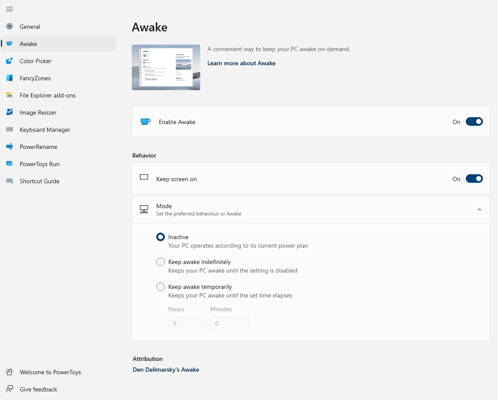

# PowerToys Awake utility

PowerToys Awake is a tool for Windows designed to keep a computer awake without having to manage its [power & sleep settings](https://support.microsoft.com/windows/how-to-adjust-power-and-sleep-settings-26f623b5-4fcc-4194-863d-b824e5ea7679). This can be helpful when running time-consuming tasks, ensuring that the computer does not go to sleep or turn off its screens.

## Getting started

You can use PowerToys Awake directly from PowerToys Settings or as a standalone executable. When it's running from PowerToys, it can be managed from PowerToys Settings or the system tray.

> [!NOTE]
> PowerToys Awake does not modify any of the Windows power plan settings, and does not depend on a custom power plan configuration. Instead, it spawns background threads that tell Windows that they require a specific state of the machine.

## Settings

In the PowerToys Settings, start PowerToys Awake by toggling **Enable Awake** on. Once enabled, the application will manage the awakeness state of the computer.

You can choose the following Awake states:

| Setting | Description |
| :-- | :-- |
| Keep using the selected power plan | The computer awakeness state is unaffected. The application is waiting for user input. |
| Keep awake indefinitely | The computer stays awake indefinitely, until you explicitly put the machine to sleep or close/disable the application. |
| Keep awake for a time interval | Keep machine awake for a defined limited time. After the defined time, Awake returns to the previous state. |
| Keep awake until expiration. | Keep machine awake until a defined time. |

> [!NOTE]
> Changing the hours or minutes while the computer is kept awake temporarily will reset the timer.

### Keep screen on

While PowerToys Awake can keep the computer awake indefinitely or temporarily, in its default state the displays connected to the machine will turn off. If you need the displays to be available, use the **Keep screen on** switch, which will keep displays active.

This feature only works if Awake is running in one of the three **Keep awake** states. It does not survive a computer restart. It also does not prevent any user-initiated actions, such as manually putting the computer to sleep or hibernating it.

## System tray

To manage the execution of the tool from the system tray, right-click on the PowerToys Awake icon.

## Command Line Interface (CLI)

PowerToys Awake can also be executed as a standalone application, directly from the PowerToys folder. The following command line arguments can be used when running _PowerToys.Awake.exe_ from the terminal or via a _.lnk_ shortcut file:

| Argument          | Description |
| :---------------- | :---------- |
| `--use-pt-config` | Use the PowerToys configuration file to manage the settings. This assumes that there is a _settings.json_ file for Awake, generated by PowerToys, that contains all required runtime information. This includes the Behavior Mode (indefinite or timed), whether screens should be kept on, and what the values for hours and minutes are for a temporary keep-awake. When this argument is used, all other arguments are ignored. Awake will look for changes in the `settings.json` file to update its state. |
| `--display-on`    | Keep displays on or off while the machine is kept awake. Expected values are `true` or `false`. |
| `--time-limit`    | Duration, in seconds, during which Awake keeps the computer awake. Can be used in combination with `--display-on`. |
| `--expire-at`     | Expiration date and/or time when Awake will turn off and resume the standard power state. Can be used in combination with `--display-on`. |
| `--pid`           | Attaches the execution of Awake to a Process ID (PID). When the process with a given PID terminates, Awake terminates as well. |

> [!NOTE]
> The _settings.json_ configuration file is located at `%HomePath%\AppData\Local\Microsoft\PowerToys\Awake\`. "Keep awake temporarily" options can be adjusted by modifying the `"customTrayTimes"` value, an array consisting of name and duration (in seconds) to stay awake. For example: `"customTrayTimes":{"8 hours":28800}`.

In absence of command-line arguments, PowerToys Awake will keep the computer awake indefinitely.

When setting the value for the `--time-limit` parameter, both of these formats will be accepted:

- `PowerToys.Awake.exe --time-limit 36000`
- `PowerToys.Awake.exe --time-limit=36000`

When setting the value for the `--expire-at` parameter, these formats will be accepted based on [DateTime.Parse](/dotnet/api/system.datetime.parse)

- `PowerToys.Awake.exe --expire-at=17:00:00` will expire at 5PM of the current day
- `PowerToys.Awake.exe --expire-at="4/13/2023 17:00:00"` will expire at 5PM on April 13 2023

[!INCLUDE [install-powertoys.md](../includes/install-powertoys.md)]
