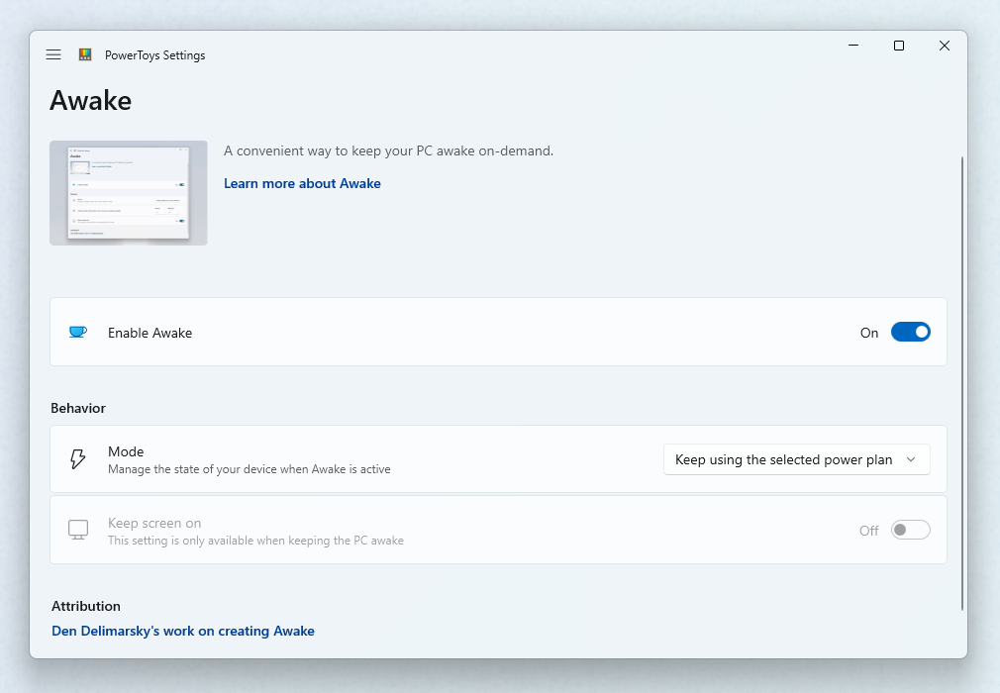

# PowerToys Awake utility

PowerToys Awake is a tool for Windows designed to keep a computer awake without having to manage its [power and sleep settings](https://support.microsoft.com/windows/how-to-adjust-power-and-sleep-settings-26f623b5-4fcc-4194-863d-b824e5ea7679). This can be helpful when running time-consuming tasks, ensuring that the computer does not go to sleep or turn off its screens.

## Getting started

You can use PowerToys Awake directly from PowerToys Settings or as a standalone executable (`PowerToys.Awake.exe` in the PowerToys installation folder).

> [!NOTE]
> PowerToys Awake does not modify any of the Windows power plan settings and does not depend on a custom power plan configuration. Instead, it spawns background threads that tell Windows that they require a specific state of the machine. Once PowerToys Awake exits, the threads are terminated and the computer will resume its standard power plan behavior.

## Settings

In the PowerToys Settings, start PowerToys Awake by toggling **Enable Awake** on. Once enabled, the application will manage the power and screen state of the computer.



PowerToys Awake supports a variety of modes that can be used to control computer and screen power behaviors:

| Setting                            | Description |
| :--------------------------------- | :-- |
| Keep using the selected power plan | The computer power state is unaffected. PowerToys Awake runs in the background but does not request any custom power behaviors. |
| Keep awake indefinitely            | The computer stays awake indefinitely until you explicitly put the machine to sleep or close/disable the application. |
| Keep awake for a time interval     | Keep machine awake for a predefined limited time. After the time period elapses, PowerToys Awake returns to the disable state. |
| Keep awake until expiration        | Keep machine awake until a defined date and time is hit. |

> [!NOTE]
> Changing the hours or minutes while the computer is kept awake for a time interval will reset the timer. Timer starts from last input.

### Keep screen on

While PowerToys Awake can keep the computer awake indefinitely or temporarily, in its default state the displays connected to the machine will turn off even if the computer stays awake. If you need the displays to be available, use the **Keep screen on** switch, which will keep displays active.

This feature only works when PowerToys Awake is enabled and has one of the custom power states selected. It also does not prevent any user-initiated actions, such as manually putting the computer to sleep or hibernating it.

## System tray

To manage the execution of the tool from the system tray, right-click on the PowerToys Awake icon.


PowerToys Awake tray icon represents the currently selected mode:

| State | Icon | Description |
|:------|:-----|:------------|
| Disabled (Passive) |        | PowerToys Awake is running but does not hold any power states. Your operating system's power plan is in effect. |
| Timed (Interval)   |            | You set PowerToys Awake to keep your computer awake for a pre-defined time interval (for example, 30 minutes). |
| Expirable          |     | PowerToys Awake will be keeping the defined power request until a date and time that you've set through PowerToys settings or in the configuration file. |
| Indefinite         |  | PowerToys Awake will continue to keep your computer awake until you exit the application. |

The tray icon tooltip will also provide a hint about the currently active PowerToys Awake mode.

## Command Line Interface (CLI)

PowerToys Awake can also be executed as a standalone application, directly from the PowerToys folder. The following command line arguments can be used when running `PowerToys.Awake.exe` from the terminal:

| Argument          | Description |
| :---------------- | :---------- |
| `--use-pt-config` | Use the PowerToys configuration file to manage the settings. This assumes that there is a `settings.json` file for PowerToys Awake, generated by PowerToys, that contains all required runtime information. This includes the operating mode (indefinite, timed, expirable, or disabled), whether screens should be kept on, and the values for a temporary keep-awake.<br/>When this argument is used, all other arguments are ignored. PowerToys Awake will look for changes in the `settings.json` file to update its state. |
| `--display-on`    | Keep displays on or off while the machine is kept awake. Expected values are `true` or `false`. |
| `--time-limit`    | Duration, in seconds, during which PowerToys Awake keeps the computer awake. Can be used in combination with `--display-on`. |
| `--expire-at`     | Expiration date and/or time when PowerToys Awake will turn off and resume the standard power state. Can be used in combination with `--display-on`. |
| `--pid`           | Attaches the execution of Awake to a Process ID (PID). When the process with a given PID terminates, PowerToys Awake terminates as well. |
| `--use-parent-pid`| Attaches the execution of Awake to a parent process. When the parent process terminates, PowerToys Awake terminates as well. |

In absence of command-line arguments, PowerToys Awake will keep the computer awake indefinitely.

When setting the value for the `--time-limit` parameter, both of these formats will be accepted:

- `PowerToys.Awake.exe --time-limit 36000`
- `PowerToys.Awake.exe --time-limit=36000`

When setting the value for the `--expire-at` parameter, the following formats will be accepted:

- `PowerToys.Awake.exe --expire-at=17:00:00` will expire at 5PM of the current day, based on the computer clock.
- `PowerToys.Awake.exe --expire-at="4/13/2023 17:00:00"` will expire at 5PM on April 13, 2023, based on the computer clock.

## Custom settings

The `settings.json` configuration file is located in `%HomePath%\AppData\Local\Microsoft\PowerToys\Awake\`.

**Keep awake temporarily** options in the system tray can be adjusted by modifying the `"customTrayTimes"` property, a dictionary consisting of key-value pairs that contain the name of the shortcut and its duration (in seconds) to stay awake.

For example, here is a `settings.json` file that contains custom tray time shortcut definitions:

```json

{
    "properties":
    {
        "keepDisplayOn": true,
        "mode": 1,
        "intervalHours": 2,
        "intervalMinutes": 0,
        "expirationDateTime": "2024-07-29T15:53:00-07:00",
        "customTrayTimes":
        {
			"8 hours": 28800,
			"12 hours": 43200
		}
    },
    "name": "Awake",
    "version": "1.0"
}
```

For the `mode` property, the following values can be used:

| Value | Mode |
|:------|:-----|
| `0`   | Passive (disabled)      |
| `1`   | Indefinite              |
| `2`   | Timed (interval)        |
| `3`   | Expirable at date/time  |

[!INCLUDE [install-powertoys.md](../includes/install-powertoys.md)]
