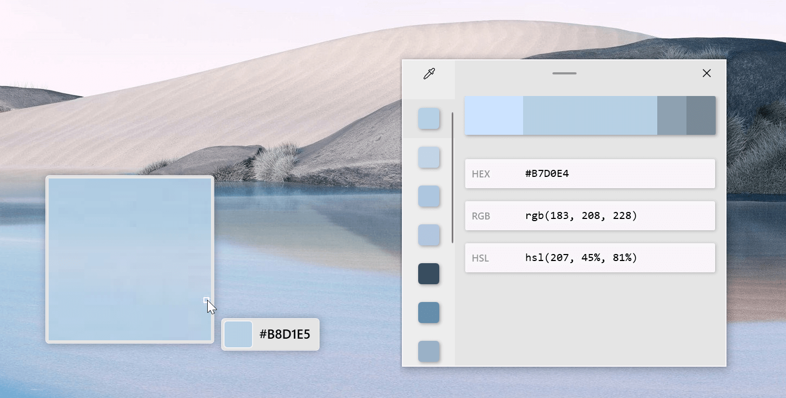
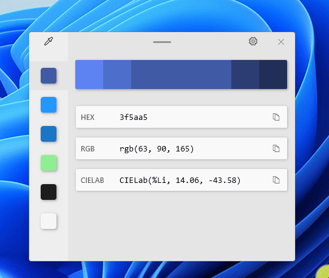
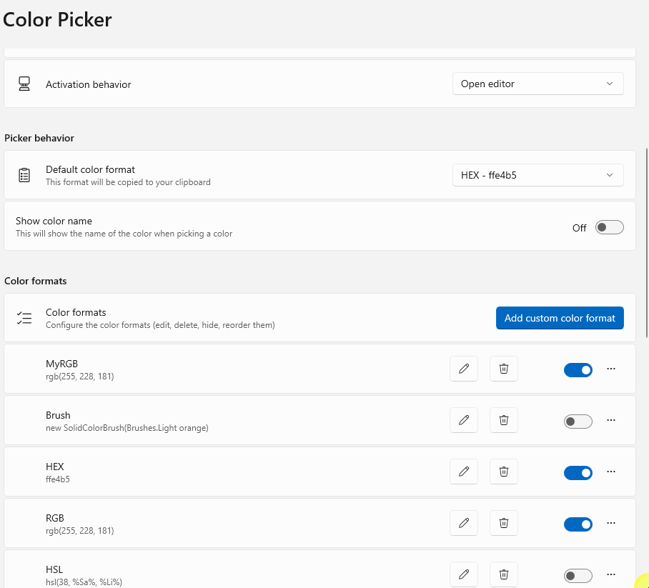

# Color Picker utility

A system-wide color picking utility for Windows to pick colors from any screen and copy it in a configurable format to your clipboard.

## Getting started

### Enable

To start using Color Picker, enable it in the PowerToys Settings (Color Picker tab).

### Activate

Once enabled, you can choose one of the following three behaviors to be executed when launching Color Picker with the activation shortcut (default: <kbd>Win</kbd>+<kbd>Shift</kbd>+<kbd>C</kbd>).

:::image type="content" source="../images/pt-colorpicker-activation.gif" alt-text="ColorPicker behaviors.":::

- **Editor** - Opens editor window directly, from here you can choose a color from the history, fine-tune a selected color, or capture a new color by opening the color picker.
- **Color Picker with editor mode enabled** - Opens Color Picker. After selecting a color, the editor is opened and the selected color is copied to the clipboard (in the default format - configurable in the Settings dialog).
- **Color Picker only** - Opens Color Picker only and the selected color will be copied to the clipboard.

### Select color

After the Color Picker is activated, hover your mouse cursor over the color you would like to copy and left-click the mouse button to select a color. If you want to see the area around your cursor in more detail, scroll up to zoom in.

The copied color will be stored in your clipboard in the format that is configured in the settings (default: HEX).

> [!TIP]
> To select the color of the non-hover state of a element:
>
> - Move the mouse pointer close, but not over the element
> - Zoom in by scrolling the mouse wheel up (image will be frozen)
> - In the enlarged area, you can pick the color of the element

## Editor usage

The editor lets you see the history of (up to 20) picked colors and copy their representation in any predefined string format. In PowerToys Settings you can configure which color formats are visible in the editor and in what order that they appear.

The color in the middle represents your currently selected color from the colors history. By clicking on it, the fine-tuning control will appear, where you can change HSV or RGB values. Using the **Select** button will add the new color into the colors history.

The editor allows you to fine-tune any picked color or get a new similar color. Editor suggests two lighter and two darker shades of the currently selected color. Selecting any of those alternative shades will add it to the history of picked colors.

To remove any color from the colors history, right-click a color and select **Remove**.

To export the colors history, right-click a color and select **Export**. The exported values can be grouped by colors or formats.

## Settings

Color Picker has following settings:

- Activation shortcut
- Behavior of activation shortcut
- The default format of a copied color (HEX, RGB, etc.)
- Show the name of the color. The shown name will be a high-level representation of the color. Example: Light Green, Green, Dark Green.
- Order and presence of color formats in the editor

To add a new color format, select **Add custom color format**.

To reorder the colors, select the **...** button on the right and select **Move up** or **Move down**.

To disable a color format, toggle the switch on the right. Disabled color formats are not deleted but are not shown in the Color Picker Editor window.

To delete a color format, select the button with the bin icon.

To edit a color format, click on the list item. In the appearing window the name and the format can be modified.

### Managing color formats

Color formats can be deleted or edited and new color formats can be added to the list. The syntax is described in the color format editor window.

The following table contains the parameters, which can be used for defining a color format and their meaning:

| Parameter | Meaning             |
|-----------|---------------------|
| %Re  | red                 |
| %Gr  | green               |
| %Bl  | blue                |
| %Al  | alpha               |
| %Cy  | cyan                |
| %Ma  | magenta             |
| %Ye  | yellow              |
| %Bk  | Black key           |
| %Hu  | hue                 |
| %Si  | saturation (HSI)    |
| %Sl  | saturation (HSL)    |
| %Sb  | saturation (HSB)    |
| %Br  | brightness          |
| %In  | intensity           |
| %Hn  | hue (natural)       |
| %Ll  | lightness (natural) |
| %Lc  | lightness (CIE)     |
| %Va  | value               |
| %Wh  | whiteness           |
| %Bn  | blackness           |
| %Ca  | chromaticity A        |
| %Cb  | chromaticity B        |
| %Xv  | X value             |
| %Yv  | Y value             |
| %Zv  | Z value             |
| %Dv  | decimal value       |
| %Na  | color name          |

The red, green, blue and alpha values can be formatted to the following formats:

| Formatter | Meaning                    |
|-----------|----------------------------|
| b    | byte value (default)       |
| h   | hex lowercase one digit    |
| H   | hex uppercase one digit    |
| x   | hex lowercase two digits   |
| X   | hex uppercase two digits   |
| f   | float with leading zero    |
| F   | float without leading zero |

For example `%ReX` means the red value in hex uppercase two digits format.

The color format may contain any words or characters that you prefer. For example, the default color format, which shows up on color format creation is: `_'new Color (R = %Re, G = %Gr, B = %Bl)'_`.

## Limitations

- Color Picker can't be displayed on top of the Start menu or Action Center, but you can still pick a color.
- If the currently-focused application was started with an administrator elevation (Run as administrator), the Color Picker activation shortcut will not work, unless PowerToys was also started with an administrator elevation.
- Currently Wide Color Gamut (WCG) and High Dynamic Range (HDR) color formats are not supported.
