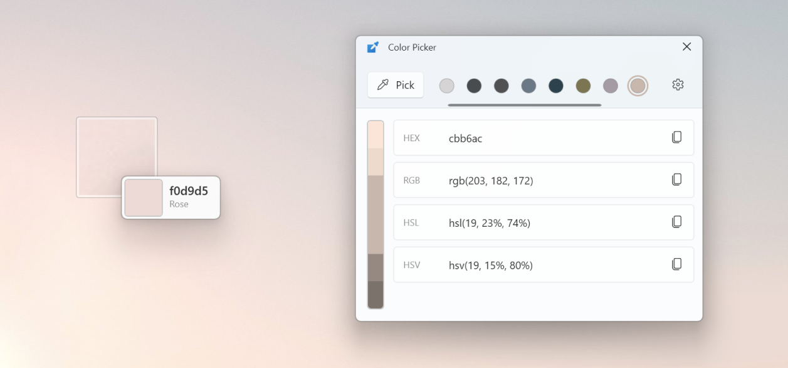
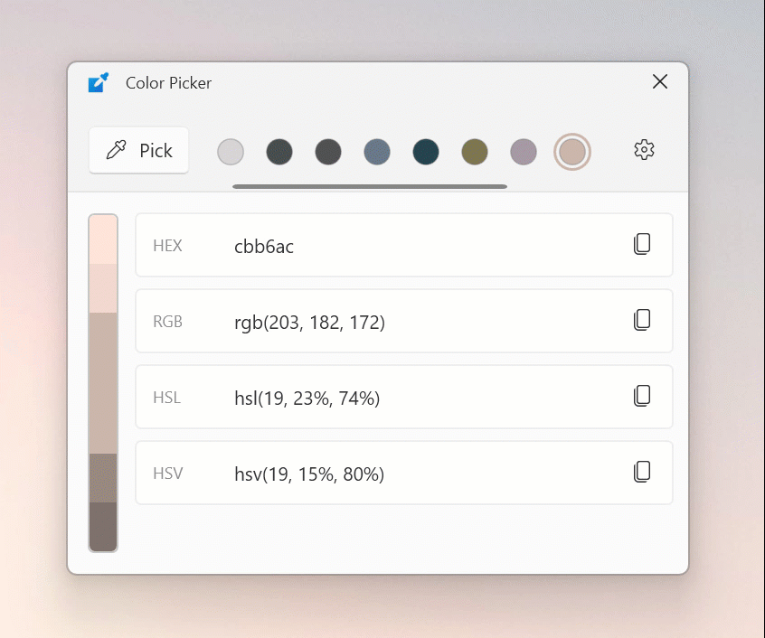
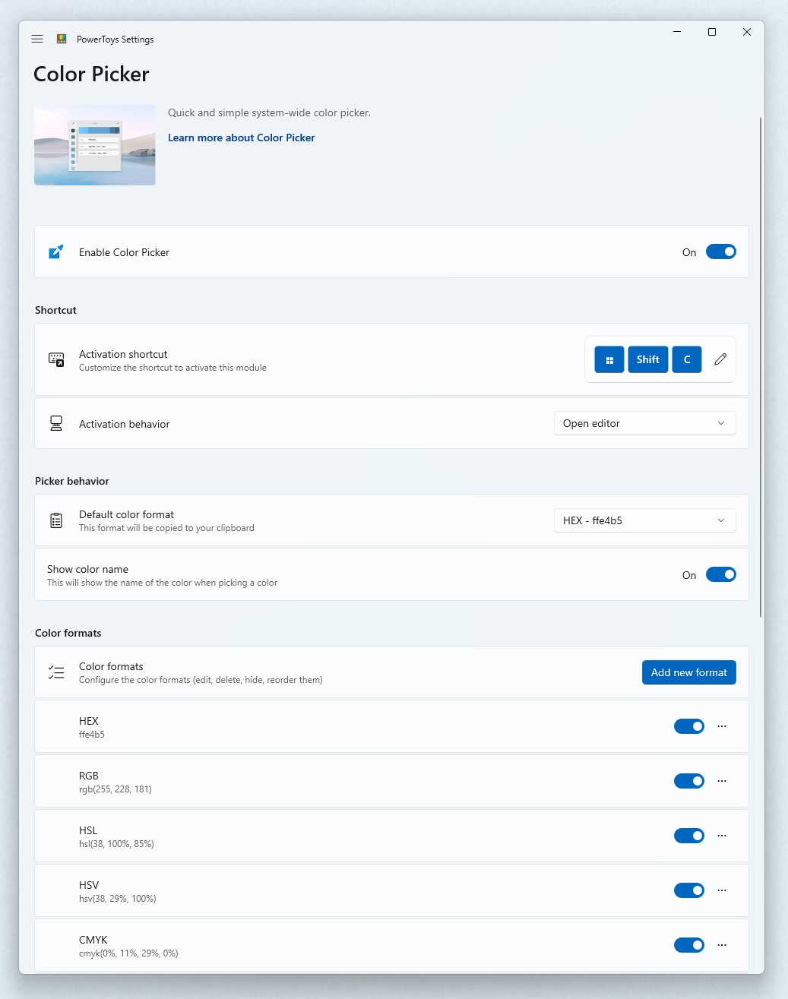

# Color Picker utility

Color Picker is a PowerToys utility for Windows that lets you pick colors from any screen and copy them to the clipboard in configurable formats. This tool helps designers and developers quickly capture exact colors for their projects.

## Get started with Color Picker

Getting started with Color Picker is easy. You can activate it using a keyboard shortcut, select a color from your screen, and copy it to the clipboard in the format of your choice.

### Enable Color Picker

You can enable the Color Picker in PowerToys Settings.

### Activate Color Picker

Choose what happens when you activate Color Picker (default: <kbd>Win</kbd>+<kbd>Shift</kbd>+<kbd>C</kbd>) by changing **Activation Behavior**:

:::image type="content" source="images/color-picker/activation.gif" alt-text="Screenshot of Color Picker activation behaviors showing different options for when the utility is activated.":::

- **Open editor** opens an editor that lets you choose a color from the colors history, fine-tune a selected color, or pick a new color.
- **Pick a color first** activates Color Picker. You can then take action on the selected color using the options described in the **Pick colors from your screen** section below.

### Pick colors from your screen

After activating Color Picker, select a color on your screen to pick that color. If you want to see the area under your cursor in more detail, scroll up to zoom in. You can assign different actions to each of the mouse buttons in Color Picker's settings. The default actions for each button are:

| Mouse button | Default action | Description |
| :--- | :--- | :--- |
| **Left click** | Pick a color and open editor | Copies the selected color to the clipboard, saves it to the color history, and opens the editor. |
| **Scroll wheel click** | Pick a color and close | Copies the selected color to the clipboard, saves it to the color history, and exits. |
| **Right click** | Close | Closes the Color Picker without copying the color. |

Color Picker copies the selected color to the clipboard in the **Default color format** you've chosen in Color Picker's settings (default: HEX).

> [!TIP]
> To select the color of the non-hover state of an element:
>
> 1. Move the mouse pointer close, but not over the element.
> 2. Zoom in by scrolling the mouse wheel up. Image will be frozen.
> 3. In the enlarged area, you can pick the color of the element.

## Use the Color Picker editor

The Color Picker editor stores a history of up to 20 picked colors and lets you copy them to the clipboard. You can choose which color formats are visible in the editor in **Color formats** in PowerToys Settings.

The colored bar at the top of the Color Picker editor lets you:

- Fine tune your chosen color
- Pick a similar color

To fine tune your chosen color, select the central color in the color bar. The fine-tuning control lets you change the color's **HSV**, **RGB**, and **HEX** values. **Select** adds the new color to the colors history.

To choose a similar color, select one of the segments on the top and bottom edges of the color bar. Selecting one of these similar colors adds it to the history.

To remove a color from the history, right-click a color and select **Remove**.

To export the colors history, right-click a color and select **Export**. You can group the values by colors or formats.

## Settings

Color Picker has the following settings:

| Setting | Description |
| :--- | :--- |
| **Activation shortcut** | The shortcut that activates Color Picker. |
| **Activation behavior** | Select what happens when you activate Color Picker. Read more about this setting in [Activate Color Picker](#activate-color-picker). |
| **Mouse actions** | Select what happens when you click each of the mouse buttons while Color Picker is active. The default actions for each button are:  **Left click**: Pick a color and open editor **Scroll wheel click**: Pick a color and close **Right click**: Close |
| **Default color format** | The color format that Color Picker uses when copying colors to the clipboard. |
| **Show color name** | Displays a high-level representation of the color. For example, 'Light Green', 'Green', or 'Dark Green'. |
| **Color formats** | Enable and add different color formats, and change the order of color formats in the Color Picker editor. Read more about color formats in [Manage color formats](#manage-color-formats). |

### Manage color formats

You can add, edit, delete, disable, and change the order of color formats in **Color formats**.

To change the order in which color formats appear in the Color Picker editor, select the **more** button (•••) next to a color format and select **Move up** or **Move down**.

To disable a color format, turn off the toggle next to that color format. Color Picker doesn't show disabled color formats in the editor.

To delete a color format, select the **more** button (•••) next to a color format and select **Delete**.

To add a new color format, select **Add custom color format**. Enter the color format's **Name** and **Format**. The syntax for color formats is described in the dialog.

To edit a color format, select it from the list. Edit the color format's **Name** and **Format** in the **Edit custom color format** dialog. The syntax for color formats is described in the dialog.

Define color formats with these parameters:

| Parameter | Meaning        |
|-----------|----------------|
| %Re  | red                 |
| %Gr  | green               |
| %Bl  | blue                |
| %Al  | alpha               |
| %Cy  | cyan                |
| %Ma  | magenta             |
| %Ye  | yellow              |
| %Bk  | Black key           |
| %Hu  | hue                 |
| %Si  | saturation (HSI)    |
| %Sl  | saturation (HSL)    |
| %Sb  | saturation (HSB)    |
| %Br  | brightness          |
| %In  | intensity           |
| %Hn  | hue (natural)       |
| %Ll  | lightness (natural) |
| %Lc  | lightness (CIE)     |
| %Va  | value               |
| %Wh  | whiteness           |
| %Bn  | blackness           |
| %Ca  | chromaticity A      |
| %Cb  | chromaticity B      |
| %Xv  | X value             |
| %Yv  | Y value             |
| %Zv  | Z value             |
| %Dv  | decimal value       |
| %Na  | color name          |

Format the red, green, blue, and alpha values to the following formats:

| Formatter | Meaning              |
|-----------|----------------------|
| b   | byte value (default)       |
| h   | hex lowercase one digit    |
| H   | hex uppercase one digit    |
| x   | hex lowercase two digits   |
| X   | hex uppercase two digits   |
| f   | float with leading zero    |
| F   | float without leading zero |

For example, `%ReX` means the red value in hex uppercase two-digit format.

Color formats can contain any words or characters you prefer. For example, the default color format that's displayed upon color format creation is: `_'new Color (R = %Re, G = %Gr, B = %Bl)'_`.

## Limitations

The Color Picker utility has the following limitations:

- Color Picker can't display on top of the Start menu or Action Center, but you can still pick a color.
- If you started the currently focused application with an administrator elevation (**Run as administrator**), the Color Picker activation shortcut won't work unless you also started PowerToys with administrator elevation.
- Wide Color Gamut (WCG) and High Dynamic Range (HDR) color formats aren't currently supported.

[!INCLUDE [install-powertoys.md](../includes/install-powertoys.md)]
